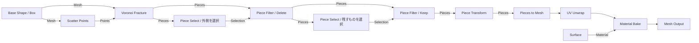

# Voronoi分割とピース操作の設計

作成日時: 2026-09-21 20:17
更新日時: 2026-09-21 22:01

状態: V1〜V4の初版を実装済み。V5（凹形状・空洞を含む一般メッシュ）は未着手。

## 初版の実装状況

V1〜V4の6ノードを実装した。操作例は [サンプル](../../examples/voronoi-pieces/README.md)。以下の仕様を基準とし、実装上は次のように具体化した。

- 幾何核は `geometry/Pieces`、型付きノード評価は `graph/PieceEvaluator`。点・片・選択は `RockEvaluation` の独立した共有参照で渡し、プレビューの最終段だけ表示メッシュを生成する。
- 正規化座標の倍精度クリップで、頂点を座標距離だけで溶接せず、辺IDの交点キャッシュと有向境界閉路を使う。境界判定は正規化距離 `1e-12`。微小片・float変換後の縮退は診断する。厳密述語ライブラリは未導入。
- 重いScatter/VoronoiとUVをキャッシュする。最大512片のSelect/Filter/Transformは軽量な走査と参照・行列の更新とし、分割を再実行しない。
- 非同期ジョブはグラフの写しと専用キャッシュを所有する。stop tokenと文書世代・プレビュー対象の照合を使い、最新の結果だけをメインスレッドで反映する。
- Groupの中心は選択された入力片の体積重心。個別変換とGroup変換の中心は入力時点から決める。ギズモの倍率は均等、XYZ別倍率は数値欄。
- Outerは軸方向に一致する元の面を追跡するため、初版UIの6面指定は軸に沿ったBox向け。一般凸形状の任意の外面グループ選択は後続。
- 同じコピー集合のVoronoiノードへの参照は新IDへ付け替える。生成世代が変わる場合は通常の無効化診断を使う。


## 目的と最初の完成形

ユーザー提示の「Box → Voronoi分割 → 外側のピースを削除 → 一部を取り出す」を再現する。岩専用の破断シミュレーションではなく、形状の分割・選別・配置を非破壊のグラフで行う。

Base Rockの表示名は **Base Shape** とする。Box / RoundedBox / Sphere / Ellipsoidと弱いノイズという現在の機能は維持する。保存名 `baseRock`、設定キー、内部の `NodeKind::BaseRock` は変更しない。旧シーンの移行を必要としない。

旧Joint Set / Crack / Fractureは復活させない。今回のVoronoi Fractureは別のノード名・保存名・新しい種類番号を持つ。撤去済みの番号35〜37を再利用しない。

初版の完成条件は、Boxを縦長のピースへ分割し、任意ピースを削除・抽出・個別操作した結果をUV UnwrapとMaterial Bakeへ渡せること。ピースごとのノード自動大量生成は行わず、集合を1本の接続で渡す。

## グラフ構成



途中のPieces出力は直接プレビューできる。Piece Selectをプレビューすると入力形状と選択箇所を表示する。型変換しなくても選別結果を確認できるようにする。

## ノード仕様

| 表示名 / 保存名 | 入力 → 出力 | 主な設定と動作 |
| --- | --- | --- |
| Scatter Points / `scatterPoints` | Mesh → Points | 個数、Seed。立体内部へ決定的に点を生成する。初版は一様分布 |
| Voronoi Fracture / `voronoiFracture` | Mesh + Points → Pieces | 分割方向の回転、X/Y/Z伸長比。切断面を塞いだピース集合を生成 |
| Piece Select / `pieceSelect` | Pieces → Selection | 手動ID指定、外周、位置領域、体積、ランダム割合から1方式を選択。反転可能 |
| Piece Filter / `pieceFilter` | Pieces + Selection → Pieces | Keep / Delete。Keepは選択だけを残し、Deleteは選択を除く |
| Piece Transform / `pieceTransform` | Pieces + Selection（任意）→ Pieces | 選択全体への変換と、IDごとの個別変換。未接続Selectionは全ピース |
| Pieces to Mesh / `piecesToMesh` | Pieces → Mesh | ピースの変換を頂点へ反映し、通常の1個のMeshにまとめる |

Scatter PointsとVoronoi Fractureは同じMesh出力から分岐して接続するのを標準とする。Pointsは生成元の形状指紋を持ち、別形状との組合せは初版ではエラーにする。空入力、重複点、境界上の点、立体外の点は診断し、黙って点を移動・削除しない。

初期設定案: 24点、Seed 1、伸長比(1,1,1)、回転0。画像用サンプルは縦長Box、16〜32点、伸長比(1,4,1)を出発点に実画面で調整する。形状の縦横比だけに依存せず、分割そのものの方向性を操作できるようにする。

## 選別とビューポート

- ピースはID由来の色で色分けする。色分けは表示設定で、Surface材質を上書き保存しない。
- Piece Selectでクリックを選択、Shift+クリックを追加/解除、空白クリックを解除とする。モデル選択・グラフのノード選択とモードを区別する。
- 「選択編集」を開始したときだけクリックをノード設定へ保存する。通常のホバー・確認用選択を勝手にノードへ書き込まない。
- 手動選択はピースID集合として保存する。方式の変更時も手動ID集合を保持し、Undoで戻せるようにする。
- 自動選択は現在の入力へ条件を適用して評価する。ランダム選択はピースIDと専用Seedから決め、配列順に依存しない。
- 位置領域は初版ではBox領域とピース重心の包含判定。領域に少しでも接するかという厳密交差判定は後続。
- 体積選択は変換後の体積に対する最小/最大値。負の倍率・ゼロ倍率は初版では許可しない。
- Piece Selectの選択結果から「Keepを追加」「Deleteを追加」を実行すると、対象PiecesとSelectionの2本を自動接続する。個別抽出もこのKeepで実現する。
- Keep / Deleteを別ノードに分けず、同じPiece Filterのモードにする。分岐した片方はKeep、もう片方はDeleteとして元の集合を分けられる。
- 空のSelectionは有効。Keepは0片、Deleteは入力維持。0片のPiecesは有効な結果として表示し、入力エラーと区別する。UV Unwrap等で処理できない場合だけ下流で理由を示す。

「外側」は単に外面へ触れるかだけでは指定しにくい。初版のBoxでは、元の6面に由来する外面タグを保持し、+X / −X / +Y / −Y / +Z / −Zのどこへ接するピースか選べるようにする。複数面指定はORで判定する。側面だけを対象にして上下端を残す操作ができる。

全外面への接触を選ぶと、薄い形状では全ピースが対象になり得る。削除前に選択色と「選択数 / 全数」を表示する。体積ゼロの点・辺の接触は外面接触に数えず、元の面に由来する正の面積で判定する。画像と同じ見た目の自動保証はせず、手動選択と併用する。

## 個別操作と識別

Piece Transformの通常モードは、選択した集合を共通ピボットで変換する。個別モードは各ピースの体積重心をピボットとして、同じ操作量を個別適用する。さらにクリックしたピースの変換をID別に保存できる。

グループ操作はノード設定、個別操作は `PieceKey → Transform` の表として保持する。適用順は個別変換の後にグループ変換。XYZ正の倍率→回転→移動とし、各ピボットはノード入力の形状から求める。ギズモ中に重心を再計算してピボットを動かさない。

拡大・移動によってピース同士が重なることは許可する。自動ブーリアンや衝突解決は行わない。プレビュー用の分解表示（Exploded View）は後続とし、初版は実際のPiece Transformで離して確認する。

## データと型の境界

新しい `Points` / `Pieces` / `Selection` 型を追加する。既存Meshの頂点属性に暗黙のピースIDを詰める設計にはしない。

| データ | 保持する情報 |
| --- | --- |
| PointSet | 生成ノード、生成方式の版、Seed、入力形状指紋、PointIdと位置 |
| PieceCollection | 分割の名前空間、生成指紋、結果指紋、Pieceの配列 |
| Piece | PieceKey、共有された不変のローカルMesh、配置変換、体積重心・体積・AABB、各面の由来 |
| PieceSelection | 対象PieceCollectionの結果指紋と、選択されたPieceKey集合 |
| FaceOrigin | 元の外面か新しい切断面か。Box面タグまたは対となる分割点のID |

初版のPieceKeyは「分割ノードID + 生成指紋 + PointId」。入力を凸立体に限定するため、1セルから複数の独立片は生じない。表示用の連番は配列の位置であり、保存キーには使わない。

同じ形状・点生成設定・点ID・算法版なら、再評価と再読み込みでも同じキーにする。Keep/Deleteや配置変更ではPieceKeyを保持する。手動の点編集が必要になる段階ではPointIdを明示的に維持する点編集ノードを設計する。

Seed・個数・元形状・分割比率等の変更で分割の生成指紋が変わると、既存の手動選択や個別変換は「対応付けの再設定が必要」とする。古い設定は保持し、別ピースへ番号で勝手に割り当てない。該当ノードは現在結果を確定出力せず、再選択/変換リセットとUndoを提供する。

Selectionは入力集合の結果指紋へ束縛する。同じ分割由来でも、異なるフィルタ・変換結果へそのまま接続した場合は不一致を診断する。自動選択も上流の結果が変われば再計算する。フィルタと選択の2本を同じ出力から分岐することで一致を保証する。

ノード複製では新しい分割名前空間を与える。サブグラフの複製で明確に対応が取れる内部参照だけ再マップし、外部Selection等は自動流用しない。キーや64bit値のJSON保存は文字列を使い、数値丸めを避ける。

## 計算方式

CPUでVoronoiセルを求め、入力立体と交差させてメッシュを生成する。SDFへの変換・再サンプリングはこの処理では行わない。平面の角を格子解像度に依存させず、切断面を直接作る。

初版は閉じた凸多面体の半空間クリップに限定する。導入サンプルと最初の受入対象はノイズなしBox。凸性・閉包・面の向き・有限値を検証し、凹形状を凸包に置き換えて処理しない。

分割の座標系を `q = D^-1 R^T (x - origin)` とする。Dは正の伸長比、Rは回転。点も入力形状も同じ変換で扱う。この空間で点iの領域は、すべてのjについて次の半空間の共通部分になる。

```text
2 (p_j - p_i) · q <= |p_j|² - |p_i|²
```

比率(1,4,1)ではY方向の距離を小さく評価し、Y方向に伸びたセルを作る。点だけを動かす方式と混同しない。計算後は元の座標系へ戻し、元形状そのものの寸法は変えない。

点の各組の分割平面を一度だけ計算して両側で共有する。各セルを凸ポリゴン面の集合としてクリップし、断面の輪郭を閉じ、最後に三角形化する。面の由来はこの段階で記録する。初版の点数なら全点対の平面を使用し、Delaunay等による隣接候補の削減は必要になってから導入する。

処理中はdoubleと正規化座標を使い、距離・面積・体積の許容誤差を分ける。頂点は可能な範囲で支持平面のIDから再利用し、近傍座標の雑な丸めだけに頼らない。floatへの出力変換後も各片の閉包・向き・正の体積を検査する。

共有境界には両ピースの面がそれぞれ必要なので、接触した別ピース間では頂点を溶接しない。断面の位置・面積・逆向き法線を検証する。極小片や数値的な失敗を黙って捨てず、ノード・点ID・原因を診断する。対策は点数・Seed・伸長比を変えるか、後段で明示的に小片を選別する。

初期限界案は1入力立体、2〜512点、伸長比の最大/最小比16以内、入力2万三角形、出力合計25万三角形。製品上限の確定値ではなく、実測後に見直す。上限超過時は部分結果を完成品として返さない。

Scatterは固定仕様の乱数列から、入力AABB内の候補を発生させ、凸立体内部の点だけを採用する。境界距離・最小点間隔を満たさない候補は再試行し、有限回で要求数を満たせなければ診断する。分布が再現できるよう乱数器・変換方法と生成アルゴリズム版を固定する。

## SDF・UV・材質との関係

- 初版では任意のSDF由来メッシュに対応したとは扱わない。Volume to Meshの出力は一般に凹形状や空洞を含み、単純な凸クリップでは正しく分割できない。
- 次段階で閉じた一般メッシュと凸セルの交差を実装する。複数の断面ループ、穴、複数連結成分、自己交差の診断が検証関門になる。外部の堅牢なブーリアン実装の採用もこの段階で比較する。
- その対応後に `Volume to Mesh → Scatter / Voronoi Fracture` を正式な経路とする。1セルから複数片が出る場合のキーは、成分の対応を含む別設計が必要。単純な配列番号を永続IDにしない。
- Pieces to Meshは配置済みの全ピースを1個のMeshへ連結する。溶接・和集合・接触面削除は行わない。元のピース情報は上流に残るが、変換後のMeshではピース選別をしない。
- これにより既存の `GeneratedRock.source` だけによるMergeの重複排除へ、同じsourceを持つ複数片を流して欠落する問題を避ける。PiecesをMergeのAny型へ暗黙に接続可能にはしない。
- UVは分割で破棄する。最終的な選別・配置の後に、既存のUV UnwrapとMaterial Bakeを使う。切断面にも同じSurfaceのTriplanarを適用できる。
- 外面/切断面の材質分けはFaceOriginを用いた後続拡張。初版はPieces to Mesh後に1つのSurface材質を適用する。UV境界、平面切断の硬い法線を実画面で確認する。
- Pieces to Mesh → To VolumeでSDFへ戻せる。離れたピースや接触するセルも扱う。格子解像度より細い隙間・形状は近似される。

## 評価・保存・応答性

幾何計算はUI/DX12から独立した純粋なCPU処理にする。PointSet・PieceCollectionは共有する不変データとし、選別は参照の絞り込み、Transformは行列の変更で処理する。クリックやギズモでVoronoi分割を再実行しない。

キャッシュはノードIDだけでなく入力内容・設定・算法版で判定する。生成点、分割、選別、変換を段階ごとにキャッシュし、材質・カメラ変更では分割キャッシュを無効化しない。

ScatterとVoronoiはワーカーで計算し、世代番号とキャンセル要求を持つ。最新要求と一致した結果だけをUIスレッドで採用し、GPU転送もUI側で行う。古い結果を表示する間は「更新中」と明示し、ピース編集と下流ベイクは確定まで無効にする。ノード削除・Undo・文書切替時も古い結果を採用しない。

保存するのはノード設定、接続、Seed、算法版、手動選択キー、個別変換。生成メッシュやキャッシュは保存しない。再現性を保てない算法更新は版変更として扱い、黙って旧シーンの別のピースへ操作を移さない。Undoは1回のクリック操作または1回のギズモドラッグを単位にする。

## 実装箇所

| 層 | 変更予定 |
| --- | --- |
| geometry | `PointSet`、`PieceCollection`、凸クリップ、Scatter、Voronoi、検査。DX12を参照しない |
| graph | 新しいValueType / NodeKind / 設定 / 定義テーブル、接続検証。新しいピース評価器を追加 |
| RockEvaluator | Pieces to Meshを既存Mesh評価へ接続。既存Volumeキャッシュを維持 |
| renderer | 各ピースを表示用メッシュとして描画。描画添字とPieceKeyの対応表、色分けと強調 |
| Application | ポイント/Pieces/Selectionの途中プレビュー、選択編集モード、フィルタ追加、ギズモ、非同期結果の採用 |
| ProjectIo / Undo | 新設定とキーを保存、複製時の参照再対応、算法版の確認 |

既存のMeshハイライトは描画配列の添字を使っているため、それを永続選択として保存しない。新しい評価器は既存RockEvaluationへ全型を無理に混在させず、共通の評価コンテキストからMesh入力を取得する。キャッシュ・循環診断・型検証の境界を明確にする。

## 実装順序と受入条件

| 段階 | 内容 | 受入条件 |
| --- | --- | --- |
| V1 幾何核 | 点・ピースのデータ、Box内のScatter、等方/異方Voronoi | 同じ入力で同じ結果。全片が閉じて外向き、体積和が元Boxと一致。共有断面が一致し、内部の体積重複がない |
| V2 グラフと表示 | Scatter / Voronoi / Pieces to Mesh、保存、非同期評価 | 点と色分けした片を途中表示。取消・Undo・再読込で最新結果だけを採用。材質変更で再分割しない |
| V3 選別 | Piece Select / Filter、手動・外周・領域・体積・ランダム | KeepとDeleteが元集合を過不足なく分ける。空選択、不一致Selection、消滅IDを正しく扱う。外側除去と抽出を画像で確認 |
| V4 個別操作と仕上げ | Piece Transform、ギズモ、UV/Bake接続、サンプル | 一部だけ移動・回転・拡大でき、他の片と上流は不変。保存/Undo/Redoと再ベイク判定が成立 |
| V5 一般メッシュ | 凹形状・空洞・SDF由来メッシュのクリップ | 凹形状、穴付き断面、1セル複数成分を含む検証を通してから対応を公開 |

V1〜V4を画像の工程を試せる初版とする。まずV1の閉包・断面一致を確認してからUI機能を積む。数値試験は頂点/辺上の平面、ほぼ共面、点の重複、薄いBox、伸長比上下限、複数Seedを含める。体積和だけでは重複を検出できないので、片間の内部交差と元形状への包含も独立して検査する。

画像による受入は縦長Boxの「元形状 / 色分け分割 / 外側削除 / 抽出後」の4段階を並べ、細長い面と鋭い角、欠落や穴がないことを確認する。最終段はUVチェックとベイク後の見え方も確認する。岩らしい外観の完成とは別の評価とする。

## 参考

- [SideFX Voronoi Fracture](https://www.sidefx.com/docs/houdini/nodes/sop/voronoifracture): メッシュと点の入力構成の参考。
- [SideFX 日本語ドキュメント](https://www.sidefx.com/ja/docs/houdini/nodes/sop/voronoifracture.html): ピース識別と内外面の区別の参考。
- [CGALの半空間交差](https://doc.cgal.org/latest/Convex_hull_3/group__PkgConvexHull3Functions.html): 凸多面体を半空間の共通部分として扱う方式の参考。ライブラリ採用を決定したものではない。
