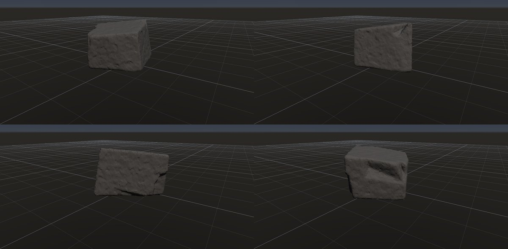
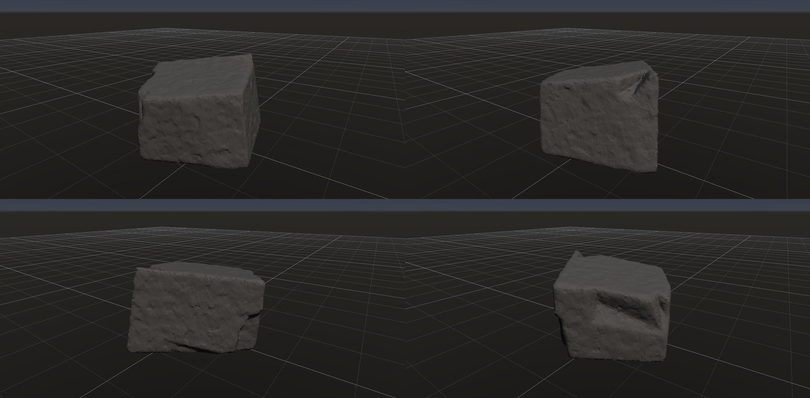

# 塊状・節理で割れた岩

作成日時: 2026-10-01 12:50
更新日時: 2026-10-02 21:51

## 概要

節理（岩体の割れ目）に沿って、岩が角張った塊に区切られた姿を扱う。岩石の種類を限定する名前ではなく、広い平面、鋭い稜線、方向のそろった割れ目が見た目の特徴になる。この研究では、大小の塊がつながった輪郭と、欠けずに残る大きな面を重視する。

[岩の研究ページ](../rocks.md) の 1 項目。分類: 形の骨格（成因・節理）。レシピは [`blocky`](../../../examples/ai-recipes/blocky.rockgraph)（アプリの「テンプレートから作成」から複製して開ける）。

## 今の状態

- 状態: ○
- レシピ: [`blocky`](../../../examples/ai-recipes/blocky.rockgraph)
- 作り方: Random Boxes の塊を Plane Cuts（主方向 3 系統）で切って節理面を作り、Volume Clip の接地で据える。小面のノイズと Edge Wear。
- 課題: 節理面が大きく平らで大味。面の数が少なく、角の欠けが乏しい。

## 今の形

4 方向（左上から 35°・125°・215°・305°、見下ろし 20°）を 2×2 にまとめたもの。`python tools/rock_research_shots.py blocky` で撮り直す（latest.jpg を更新し、日時付きの経過の画像も残す）。

## 経過

何を変えて何が効いたか（効かなかったことも）。古い順。

- 2026-10-01 初版。最初は Random Boxes が原点中心のまま高さ 0 で切って半分が消え、平たい板になった（→ Volume Clip に接地モードを足した）。

## 経過の画像

撮った順。コミットの日時と件名（Git の履歴から取り出したもの）。

### 2026-10-01 12:47 docs: 岩の研究ページを作り、種類ごとのスクリーンショットと改善の履歴を載せる

### 2026-10-01 15:01 fix: To Volume で重なった立体の内部の距離を測り直し、Volume Noise の内部の値の跳びをなくす

### 2026-10-01 17:53 fix: 全体表示で原点ではなくメッシュの範囲の中心を見る

