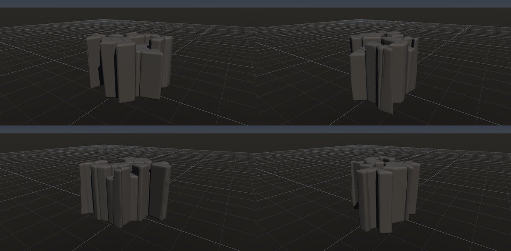
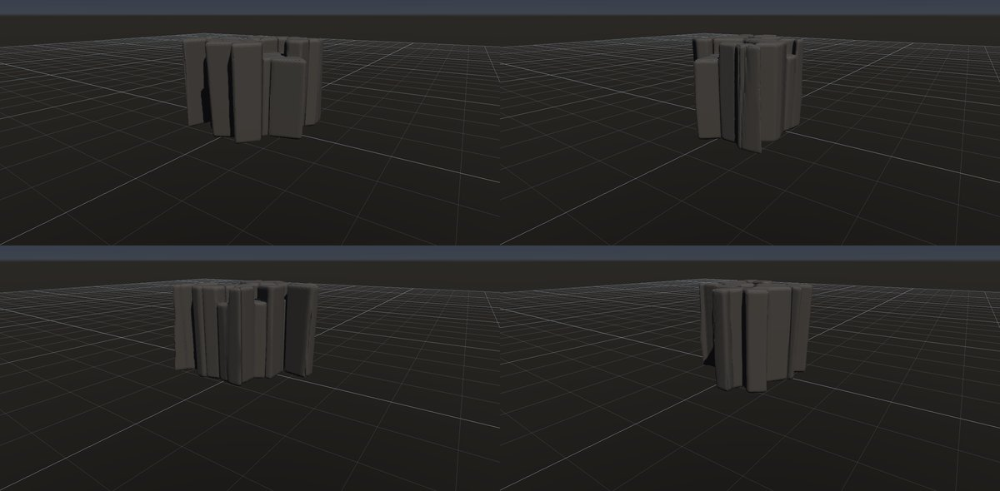

# 柱状節理（玄武岩）

作成日時: 2026-10-01 12:50
更新日時: 2026-10-02 21:51

## 概要

溶岩などが冷えて収縮するときに割れ目が発達し、多角柱の集まりになる構造。玄武岩によく見られるが、玄武岩だけの特徴ではない。断面は六角形を中心に不ぞろいで、柱の太さ・向き・残る高さにも変化がある。この研究では、柱がまとまって立つ姿と、柱の頭や途中の欠けを捉える。[参考：NPSの柱状節理](https://www.nps.gov/subjects/volcanoes/columnar-jointing.htm)。

[岩の研究ページ](../rocks.md) の 1 項目。分類: 形の骨格（成因・節理）。レシピは [`columnar`](../../../examples/ai-recipes/columnar.rockgraph)（アプリの「テンプレートから作成」から複製して開ける）。

## 今の状態

- 状態: ○
- レシピ: [`columnar`](../../../examples/ai-recipes/columnar.rockgraph)
- 作り方: Box を縦（Y）に 16 倍伸ばした Voronoi で多角柱に割り、外面に接する片を除いて断面の多角形を外周に出す。柱を細らせて隙間（節理）を作り、一部の柱を下げて高さをばらつかせる。
- 課題: 柱の頭が平らで新しすぎる。柱の側面に横方向の割れ目（柱の節）が無い。

## 今の形

4 方向（左上から 35°・125°・215°・305°、見下ろし 20°）を 2×2 にまとめたもの。`python tools/rock_research_shots.py columnar` で撮り直す（latest.jpg を更新し、日時付きの経過の画像も残す）。

## 経過

何を変えて何が効いたか（効かなかったことも）。古い順。

- 2026-10-01 初版。既存のノードの組み合わせだけで作れた。

## 経過の画像

撮った順。コミットの日時と件名（Git の履歴から取り出したもの）。

### 2026-10-01 12:47 docs: 岩の研究ページを作り、種類ごとのスクリーンショットと改善の履歴を載せる

### 2026-10-01 17:53 fix: 全体表示で原点ではなくメッシュの範囲の中心を見る

