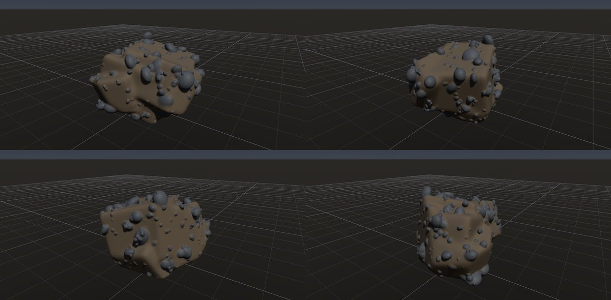
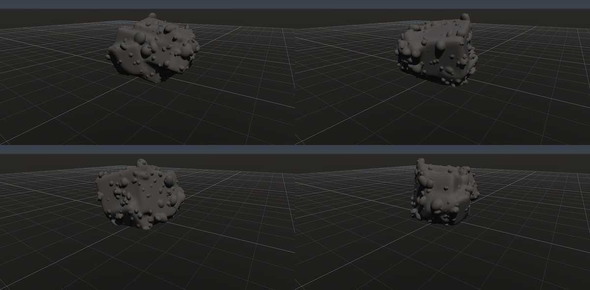
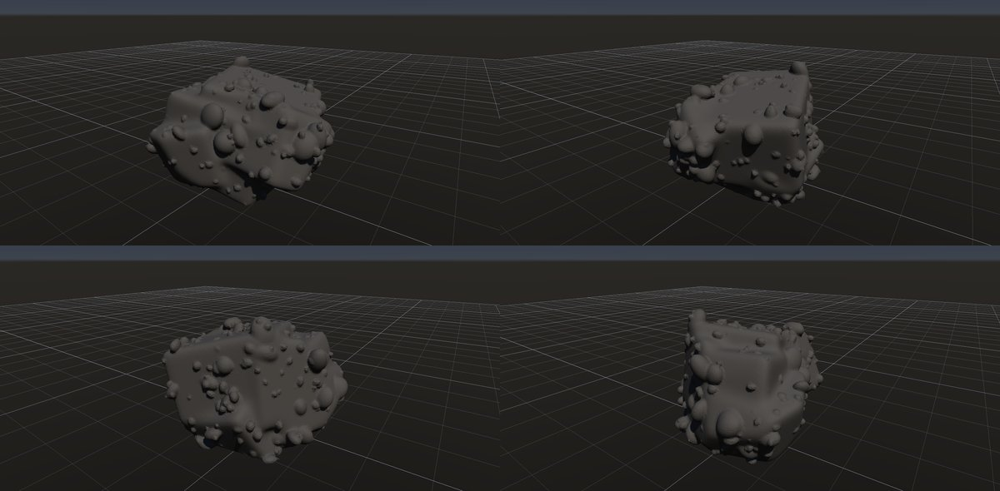

# 礫岩

作成日時: 2026-10-01 12:50
更新日時: 2026-10-03 04:00

[岩の研究ページ](../rocks.md) の 1 項目。分類: 堆積・火山の組織。レシピは [`conglomerate`](../../../examples/ai-recipes/conglomerate.rockgraph)（アプリの「テンプレートから作成」から複製して開ける）。

## 今の状態

- 状態: ○
- レシピ: [`conglomerate`](../../../examples/ai-recipes/conglomerate.rockgraph)
- 作り方: 丸めた塊を接地してから Volume Scatter（楕円体・和）で大小の礫を半分ほど埋める。UV Unwrap の後、基質（砂色）を塗り、Volume Diff Mask（足した所。Before に接地後・礫を足す前の Volume、しきい値 0.008）で突き出た礫だけを灰色で塗る（Surface の定数色）。
- 課題: 礫が少しイボのように見える。

## 今の形

4 方向（左上から 35°・125°・215°・305°、見下ろし 20°）を 2×2 にまとめたもの。`python tools/rock_research_shots.py conglomerate` で撮り直す（latest.jpg を更新し、日時付きの経過の画像も残す）。

## 経過

何を変えて何が効いたか（効かなかったことも）。古い順。

- 2026-10-01 初版（G7 で Volume Scatter を足した）。
- 2026-10-02 礫と基質の色分けを Volume Diff Mask で付けた（新しいノードは不要だった）。接地を礫の前に移し、Before とメッシュの位置をそろえた。しきい値は小さい礫の突き出し（1.5 cm ほど）より小さくする。

## 経過の画像

撮った順。コミットの日時と件名（Git の履歴から取り出したもの）。

### 2026-10-01 12:47 docs: 岩の研究ページを作り、種類ごとのスクリーンショットと改善の履歴を載せる

### 2026-10-01 15:01 fix: To Volume で重なった立体の内部の距離を測り直し、Volume Noise の内部の値の跳びをなくす

### 2026-10-01 17:53 fix: 全体表示で原点ではなくメッシュの範囲の中心を見る

### 2026-10-02 19:50 feat: Flow Mask を足し、Noise / Undercut に向きに集中を足し、礫を Diff Mask で色分けする

