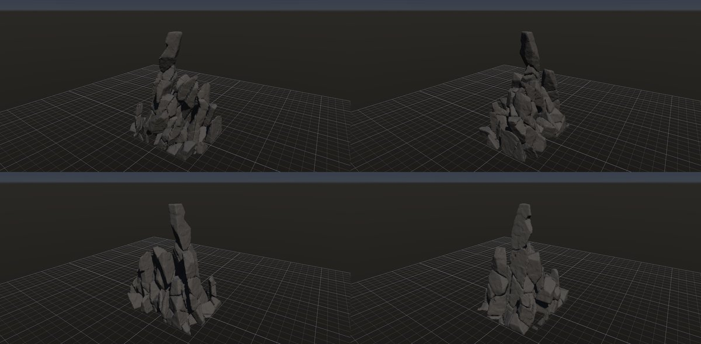
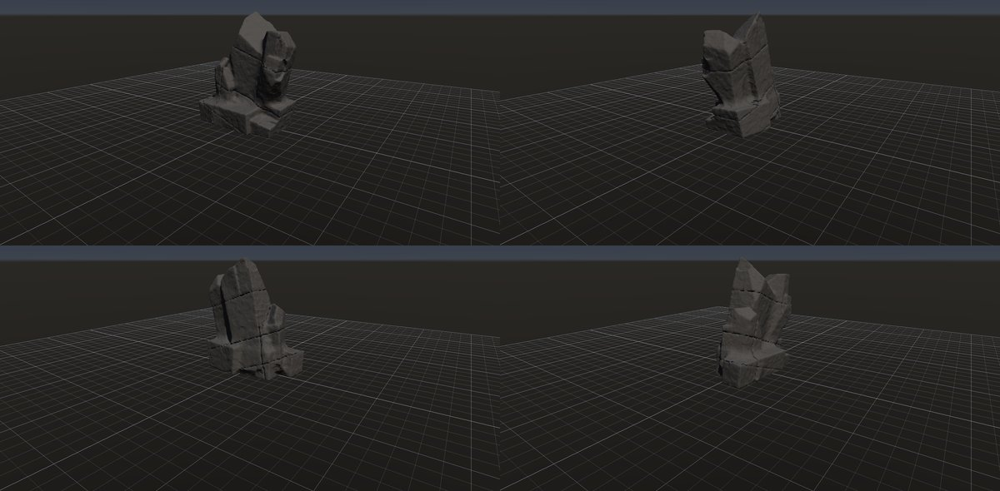
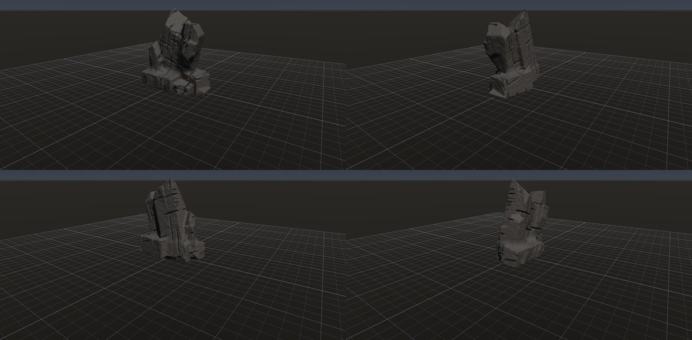
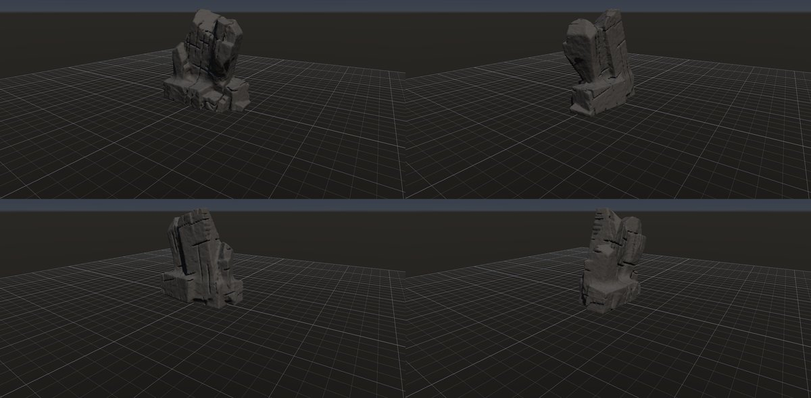
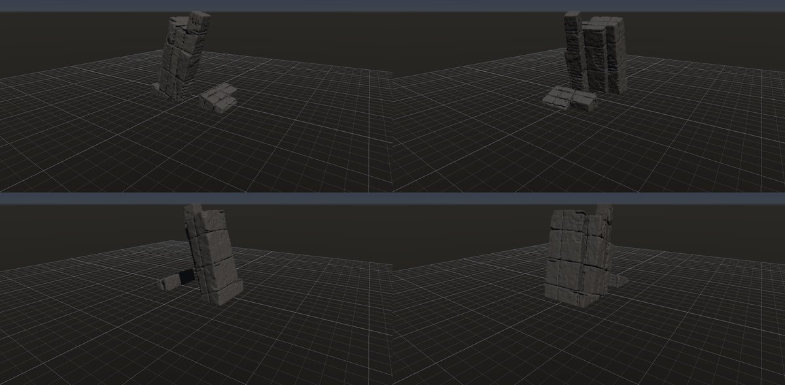
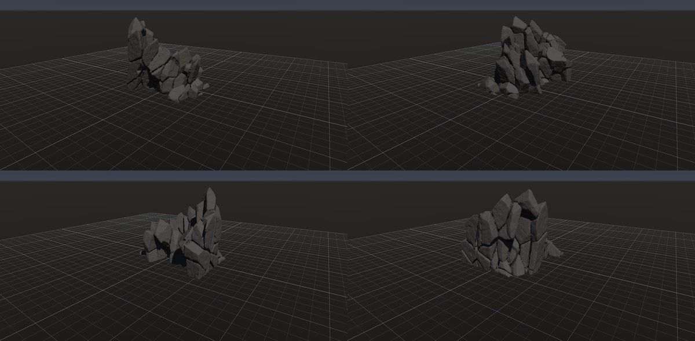
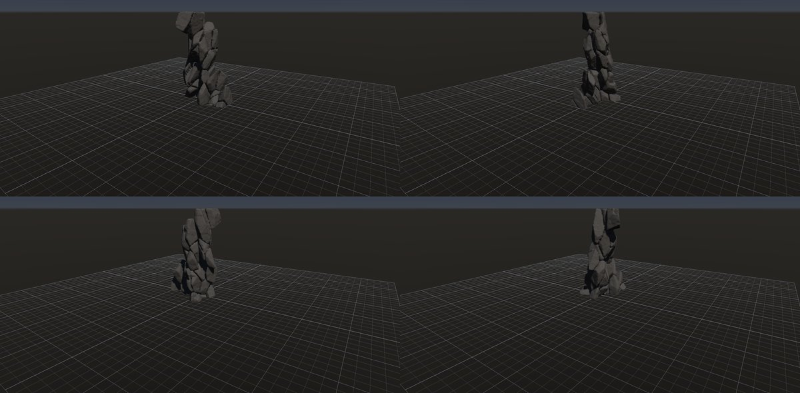
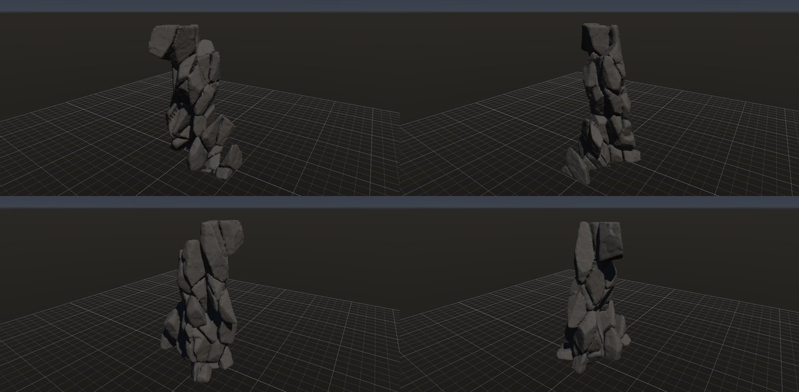
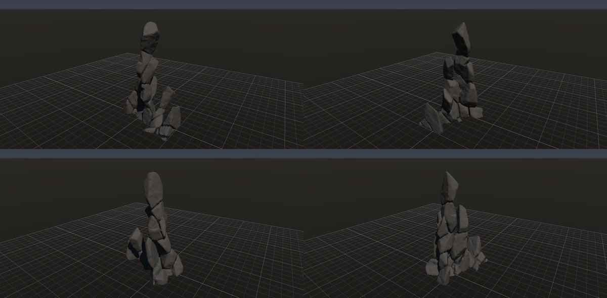
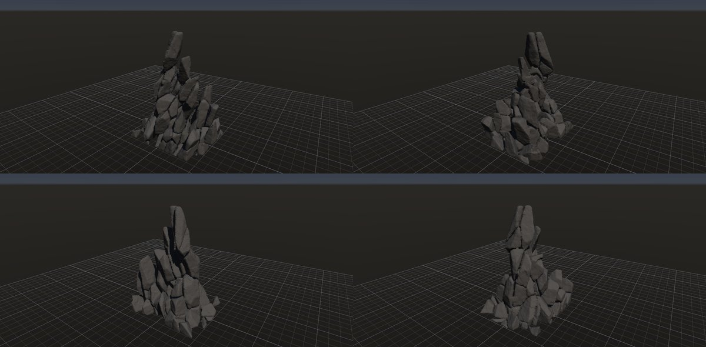

# 花崗岩の岩峰

作成日時: 2026-10-01 12:50
更新日時: 2026-10-03 04:00

[岩の研究ページ](../rocks.md) の 1 項目。分類: 形の骨格（成因・節理）。レシピは [`granite-buttress`](../../../examples/ai-recipes/granite-buttress.rockgraph)（アプリの「テンプレートから作成」から複製して開ける）。

## 今の状態

- 状態: △
- レシピ: [`granite-buttress`](../../../examples/ai-recipes/granite-buttress.rockgraph)
- 手本: 木曽駒ケ岳（宝剣岳〜千畳敷）の花崗岩の岩峰。ユーザーが撮った写真（`docs/references/DSC08761`・`DSC08749`。Git の対象外）。急傾斜の節理で縦長の塔に割れ、凍結破砕で尖る。塔は同じ向きに傾き、根元でつながる。
- 作り方: 成因どおりに組む。大きめの岩体（Base Shape の箱）を、点の Voronoi で不規則な多面体のブロックに割る。Parallel Planes（主な節理 76°、間隔 2.4 m、ばらつき 0.8）を Voronoi Fracture の Planes に繋ぎ、「節理面への吸着」で板 ∩ Voronoi にする（節理面は複数のブロックにまたがる一枚の面、板の中は不規則な多面体）。分割の座標系を主な節理の向き（76°）に回し、伸長 [2.5, 1, 1.6] で節理面の方向に細長くする。Scatter Points の密度のむらで割れの多い帯と割れの少ない芯を作り、Piece Select の Peel（接地・大きさの効き）で外周の小さなブロックから抜き取る（凍結破砕。底からは欠かず、下のブロックに載っていない片は落ちる）。Piece Transform のばらつきでブロックを少しずつずらして傾け、To Volume でまとめる（ずれた隙間が段違いの継ぎ目になる）。局所の欠け・小面のノイズ・角の摩耗。割れの少ない芯が 1 本の塔として残る。Peel の「安定」で頭でっかちのブロックを落とす。上ほど細くするのは、Scatter Points の高さの勾配（上ほど節理が密で、頂が小さなブロックに割れる）と、Peel の側面の後退（上ほど長く側面から削られる。横へ削れる深さを頂で 4 m、底で 0 まで）。進行は 1 で、後退の上限まで削る。岩体は縦長の箱（10 × 15 × 8 m）、塔は高さ約 12.5 m で裾が広い。山グラフで斜面に撒く部品として使う想定。
- 課題: 節理面はそろったが、まだブロックの積み重なりが目立つ（ブロックのずれの隙間、板の中の横の割れ目が多い）。頂の 1 枚の板が立っているだけに見える所がある。裾に元の箱の四角い外周が残る所がある。塔は 1 本でよい（ユーザー判断）。

## 今の形

4 方向（左上から 35°・125°・215°・305°、見下ろし 20°）を 2×2 にまとめたもの。`python tools/rock_research_shots.py granite-buttress` で撮り直す（latest.jpg を更新し、日時付きの経過の画像も残す）。

## 経過

何を変えて何が効いたか（効かなかったことも）。古い順。

- 2026-10-01 初版。縦長の塊 1 つを割れ目で塔に分ける案は、溝が格子に並んでレンガの柱になった（上が細らない）。全体を大きな平面で切ると高さが半分に縮んだ（水平に近い面が頂を削る）。塔を別々に作って和にする案に変えた。根元の塊を無くすと塔どうしが溶けて 1 つの塊になり、残して埋める形にした。割れ目は noise を上げると点線に途切れ、variation を下げると石積みの格子になるので、主な節理だけ幅を持たせ、横の節理は細く浅くした。
- 2026-10-01 Volume Crack に有限の割れ目（長さ・割合・段違い）を足して使った。節理が途中で止まって段違いにずれ、格子の感じが減った。主な節理は間隔 1.1 → 0.7 m・長さ 0.3・割合 0.55・段違い 0.8、横の節理は長さ 0.15・割合 0.35。
- 2026-10-01 ユーザーの指摘（ひびが後付けに見える、構造から割れた感じが欲しい）で、組み方を作り直した。ひびを彫るのをやめ、節理で岩体をブロックに割って外側から抜き取る形にした。そのために Voronoi Fracture に Planes 入力（構造面で割る）、Parallel Planes に系統の連結、Peel に接地（底から欠かない・支えを失った片は落ちる）を足した。最初の Peel は底からも欠いて頭でっかちになり、次は頂のブロックが横の接触だけでぶら下がった。下のブロックに載っていることを支えの条件にして直した。
- 2026-10-01 ユーザーの指摘（ブロックがそろいすぎて不自然。直方体ではなく、Voronoi のような多面体がずれている感じにしたい）で、構造面の分割を点の Voronoi に替えた。座標系を節理の向きに回して伸長し、節理の向きに細長い多面体にした。Piece Transform にばらつき（片ごとのずれ・傾き）を足してブロックをずらした。最初は元の箱の天面と側面が平らに残り石垣のように見えたので、岩体を奥行きも大きくして侵食を進めた。構造面で割る組み方（Voronoi Fracture の Planes 入力）は、層理・板状節理など規則的な割れ方の岩に使う。
- 2026-10-01 ユーザーの指摘（塔のようなひと塊にまとまっていない）で、Scatter Points に密度のむら、Peel に大きさの効きを足した（割れの少ない所が硬い芯として残る、という成因）。最初は元の箱の天面が平らに残って箱に見えたので、岩体を縦長にし、大きさの効きを弱めて上からの侵食を進めた。進行を上げすぎると石を積んだケルンのように細くなった。楕円体の岩体は、メッシュが凸の判定（許容差 2e-7）を通らず使えなかった。
- 2026-10-01 ユーザーの指摘（上に大きな塊が乗っていて重力に反して見える。上ほど細く鋭く尖るのが自然）で、Peel の接地に「安定」を足した。安定 0.3〜0.45 で細い尖塔、0.6 では裾の広いピラミッド形で高さ 9 m に下がった。0.45 を使った。
- 2026-10-02 ユーザーの指摘（岩峰は上ほど細くなる。Voronoi の点を上ほど細かくしては）で、Scatter Points に高さの勾配を足した。勾配だけでは逆効果で、上の小さな片が大きさの効きで先に崩れて背が下がり（11.5 → 9〜10 m）、底の大きな片が箱型の裾に残った。Peel に「高さの効き」（上の片ほど横向きの露出面から先に欠く）を試したが、上の段が芯まで横に食われ背が 6〜7 m になり、取り消した。横へ削れる深さを高さに比例させる「側面の後退」で、裾が広く上ほど細い形になった（後退 3.5 m で 10.7 m）。高さの勾配 0.4 を足すと頂が小さな片で細く残り 12.5 m になった。後退があると進行は効かなくなる（上限で止まる）。
- 2026-10-03 ユーザー依頼（精度を上げたい）で手本の写真と見比べ、「石を積んだ」感じの原因を探った。効いたこと: To Volume の後に Volume Close（幅 0.005）でブロックのずれで開いた細い継ぎ目を閉じ、ずれを 0.06 → 0.02 m・傾きを 2.5 → 1° に、角の摩耗を半分にして、一枚岩に少し寄せた。効かなかったこと（全て取り消し）: Peel に「底の後退」を足して裾の箱の角を削る案は、0.15 でも裾の支えが欠けて塔が別の塊に分かれ、0.4 では全体が 6.6 m に縮んだ（機能は既定 0 で残した）。ブロックを減らして大きく（260〜300 個、伸長 3）すると Peel で細い尖塔と瓦礫に分かれた。ずれ・欠け・摩耗を全て外した素の形でも石積みに見えたので、原因はブロックの面の向きがばらばらなこと。塊優先（箱を節理の向きの大きな Plane Cuts で削ぎ、Volume Crack で節理の線）は「ひびが後付け」の見え方に戻った。構造面 3 系統（間隔のばらつき 1.0）の Voronoi は石積みで 8 m に縮んだ。次に要るのは、点の Voronoi の面を近くの節理面に沿わせる（複数ブロックにまたがる一枚の面ができる）割り方。
- 2026-10-03 ユーザー判断で、Voronoi Fracture に「節理面への吸着」（板 ∩ Voronoi）を足して使った。最初に試した「2 点の二等分面を近い構造面に置き換える」案は 3 片の接点に隙間（体積の 6〜8%）ができて捨て、最初の系統の面で板に分けて板の中を Voronoi で割る形にした（隙間なし。板の面を挟んだ隣接は面の交差面積から）。間隔 1.6 m では薄い板が並びすぎ、2.4 m・ばらつき 0.8 にした。ブロックの面が 76° の節理面にそろい、「傾いた板が並ぶ」写真の見え方に近づいた。

## 経過の画像

撮った順。コミットの日時と件名（Git の履歴から取り出したもの）。

### 2026-10-01 13:33 feat: 花崗岩の岩峰のレシピ granite-buttress を足す

### 2026-10-01 13:55 feat: Volume Crack に途中で止まる有限の割れ目を足す

### 2026-10-01 15:01 fix: To Volume で重なった立体の内部の距離を測り直し、Volume Noise の内部の値の跳びをなくす

### 2026-10-01 17:06 feat: 節理の系統で岩体をブロックに割り、接地した岩を外周から欠けるようにする

### 2026-10-01 17:16 feat: 岩峰のブロックを節理の向きの Voronoi 多面体にし、Piece Transform にばらつきを足す

### 2026-10-01 17:44 feat: 割れの少ない芯を残す密度のむらと大きさの効きを足し、岩峰を 1 本の塔にまとめる

### 2026-10-01 17:53 fix: 全体表示で原点ではなくメッシュの範囲の中心を見る

### 2026-10-01 18:08 feat: Peel の接地に安定を足し、岩峰を上ほど細く尖らせる

### 2026-10-02 02:00 feat: 岩峰を上ほど細くする（Scatter Points の高さの勾配、Peel の側面の後退）

### 2026-10-02 20:21 feat: Voronoi Fracture に節理面への吸着（板 ∩ Voronoi）を足し、花崗岩の岩峰の面をそろえる

