# 花崗岩の岩峰：節理面の連続範囲の比較

作成日時: 2026-10-02 21:05
更新日時: 2026-10-02 23:50

[花崗岩の岩峰の研究](README.md)からの追加実験。目的は「面を先に作ると石積み感が消えるか」「板ごとの独立分割と、数枚の板をまたぐ分割はどう違うか」を確かめること。

## 今回の結論

**節理面から割ると広い面は作れるが、横の節理を板ごとに止めるだけでは自然な岩峰にはならない。** 全貫通・板1枚・板3枚のいずれにも、棚状の段差と柱の規則性が残った。現時点では既存テンプレートを置き換えない。

もう一つ、**接触するピースの内部面がボリューム変換後に筋として現れる問題**を再現した。削除・変形・摩耗を一切しない分割済みの箱でも、To Volume → Volume to Mesh 後に筋が出る。これを自然の節理や分割方式の特徴として評価してはいけない。

## 試作した処理

Voronoi Fracture の Planes 入力に `pieces.jointSpan`（節理の連続枚数、既定0）を追加した。

- 0：既存の全系統貫通。従来の計算をそのまま使う。
- 1：第1系統の面で板に分け、第2系統以降は板ごとに異なる位置で切る。
- 2〜16：第1系統の板を指定枚数ずつ束ね、第2系統以降をその束の中で連続させる。束の境界で止まる。

束は第1系統の法線方向の低い側から順に作る。面の向きは各系統で共通、位置のずれと間隔の乱数は束ごとに決める。第3系統を第2系統の個々のブロックで止める処理ではない。板枚数を混在させる機能、有限亀裂の成長、Rock Bridge、物理的な崩落も含まない。**DFN 全体の実装ではなく、面の連続範囲を調べるための凸立体分割**である。

各切断の両側を同じ面から作る。切断面の番号と表裏を保持し、最後に同一面上の凸多角形の交差面積から隣接を再構成する。T字で接しても Peel に接触面積を渡せる。既存の吸着の多角形交差計算を共用した。

## 比較条件

母岩は全て10 × 15 × 8 m。Peel は既存レシピの設定（接地、安定0.45、大きさの効き0.4、側面後退4 m、進行1、Seed 3）。変換・Close・Plane Cuts・Noise・Edge Wear は外した。To Volume は128、Volume Clip は接地・埋め込み0.16、Volume to Mesh は Dual Contouring。

平面方式3案で共通の系統：

| 系統 | 回転 XYZ（度） | 間隔（m） | ばらつき | Seed |
| --- | --- | --- | --- | --- |
| 第1 | 0, 0, 76 | 2.4 | 0.8 | 5 |
| 第2 | 0, 0, -12 | 1.6 | 0.8 | 13 |
| 第3 | 78, 18, 0 | 1.8 | 0.8 | 17 |

比較画像は同じ yaw 35°・125°・215°・305°、pitch 20°、各方向で同じ相対照明。カメラ距離は各形状の全体表示に合わせるため、画像内の大きさの比較には寸法値を使う。分割前の体積はいずれも1200 m³。

| 方式／保存グラフ | 分割数 | Peel後の片数 | Peel後体積（m³） | 接地後体積（m³） | 高さ（m） | 塊／空洞 |
| --- | ---: | ---: | ---: | ---: | ---: | --- |
| [板 ∩ Voronoi、仕上げなし](joint-study-20261002/baseline-raw.rockgraph) | 420 | 116 | 415.97 | 224.47 | 12.50 | 4／0 |
| [全系統貫通](joint-study-20261002/span-0.rockgraph) | 310 | 87 | 446.82 | 279.07 | 10.76 | 1／0 |
| [板1枚で止める](joint-study-20261002/span-1.rockgraph) | 316 | 91 | 455.56 | 281.50 | 11.07 | 1／0 |
| [板3枚で止める](joint-study-20261002/span-3.rockgraph) | 290 | 80 | 465.86 | 311.48 | 9.83 | 1／0 |

全て閉じたメッシュ。既存方式の最大塊の体積比は0.99806で、4塊のうち3つは小片。平面3案は1.0。[詳細数値](joint-study-20261002/measurements.json)を保存した。

平面3案の分割数とPeel後体積は近いが完全一致ではない。既存方式は点数・セル形状・密度分布も違う。高さ依存のPeelと接地で、最終的な体積差が拡大する。この比較から「連続枚数だけで改善した」「3枚が最適」とは結論しない。

### 既存の板 ∩ Voronoi（仕上げなし）

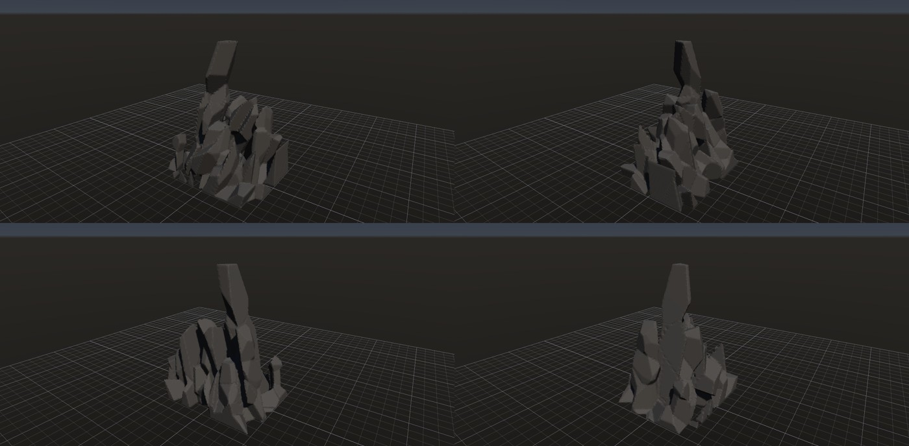

細い頂、独立した石のような側面の突起が目立つ。主方向の面はそろっているが、横方向の面と段差が細かい。

### 全系統貫通

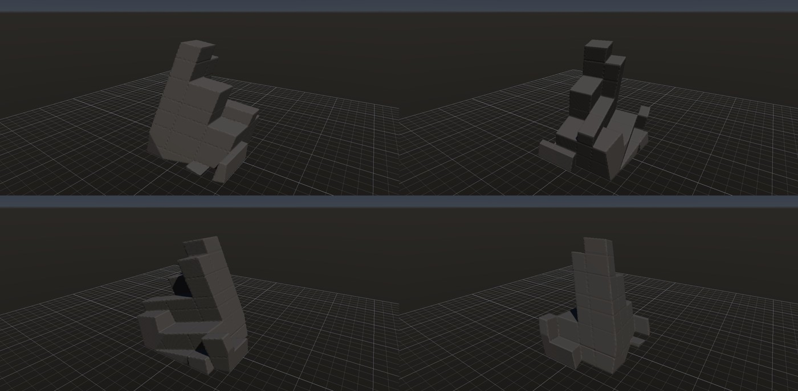

広い面は得られるが、棚が規則的に続く。横の筋には後述のボリューム変換の影響も含まれる。

### 板1枚で止める

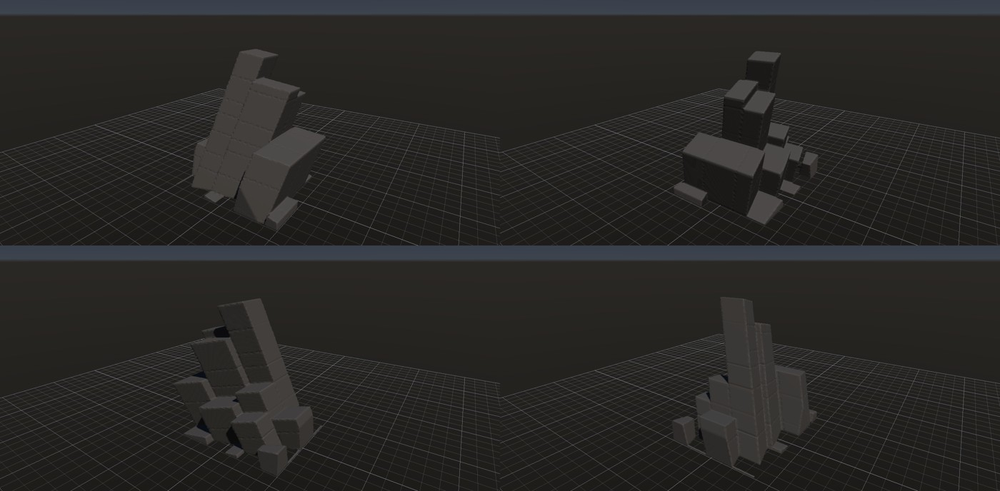

棚の高さが隣の板とずれる。しかし、段違いだけで自然になるわけではなく、柱や加工した石のような規則性が残る。

### 板3枚で止める

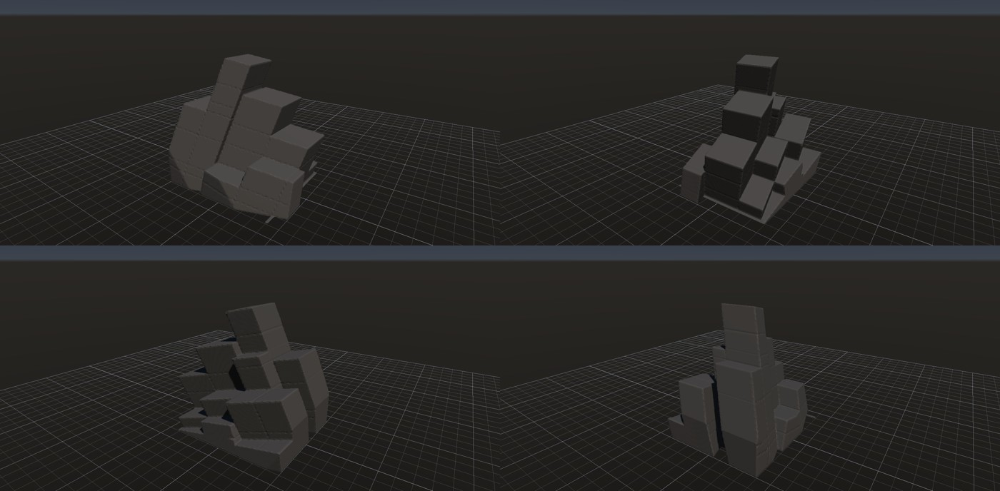

面の共通性は保てるが、この設定では横に広く背が低い。側面・背面も人工的で、1枚方式よりよいとは判定しない。

## Seedを変えた数値確認

第2系統を13・23・33・43・53、第3系統をそれぞれ+4にして、3方式×5組を評価した。15例とも評価成功、最終形状は1塊・空洞0・最大塊比1.0。[全結果](joint-study-20261002/sweep-summary.json)。追加Seedは数値確認のみで、画像の外観を全15例確認したわけではない。

| 連続枚数 | 分割数の範囲 | Peel後体積（m³） | 接地後体積（m³） |
| --- | --- | --- | --- |
| 0 | 291〜331 | 414.3〜466.3 | 260.9〜309.5 |
| 1 | 304〜320 | 441.4〜491.7 | 264.2〜349.8 |
| 3 | 290〜326 | 450.4〜495.5 | 293.2〜328.1 |

Seedによる体積差も大きい。今後の方式比較では、同じPeel値だけでなく残存体積を合わせた比較が必要。

## 横の面を斜めにする試行

第2系統を24°・間隔2.2 m、第3系統を[60,18,0]°・間隔2.6 mにすると、棚状の輪郭から斜めに尖る板へ変わる。ただし面が長く平らな楔になり、自然な岩峰にはまだ不足。角度と間隔を同時に変えた探索例で、連続枚数だけの比較とは分けて扱う。

| [板1枚の試行](joint-study-20261002/oblique-1.rockgraph) | [板3枚の試行](joint-study-20261002/oblique-3.rockgraph) |
| --- | --- |
| 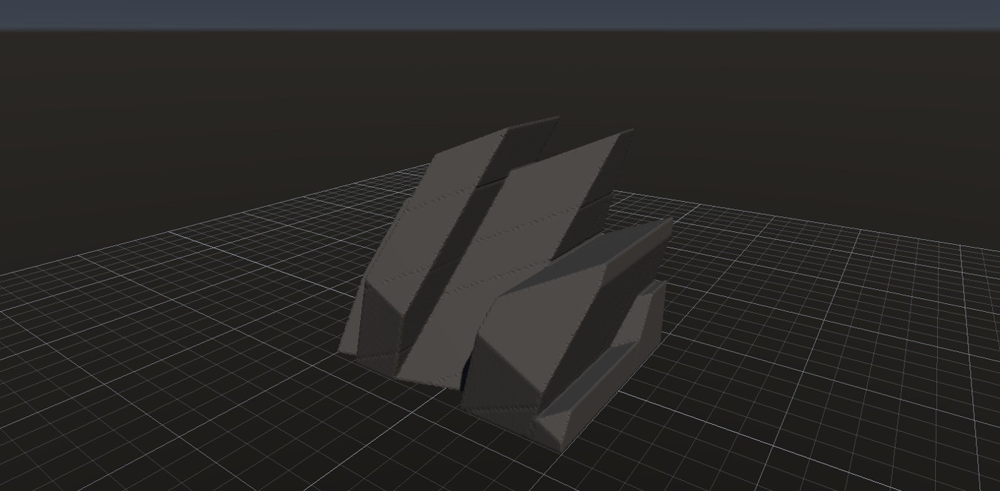 | 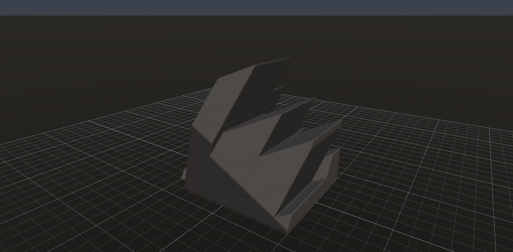 |

## ボリューム変換で生じる筋の再現

同じ箱を、未分割のままと、316片に割って全片をそのまま残した状態でボリューム化した。移動・回転・Peel・摩耗は作用させていない。両方とも同じ接地処理を通した。

| [未分割の箱](joint-study-20261002/intact-box.rockgraph) | [分割した箱](joint-study-20261002/intact-split.rockgraph) |
| --- | --- |
| 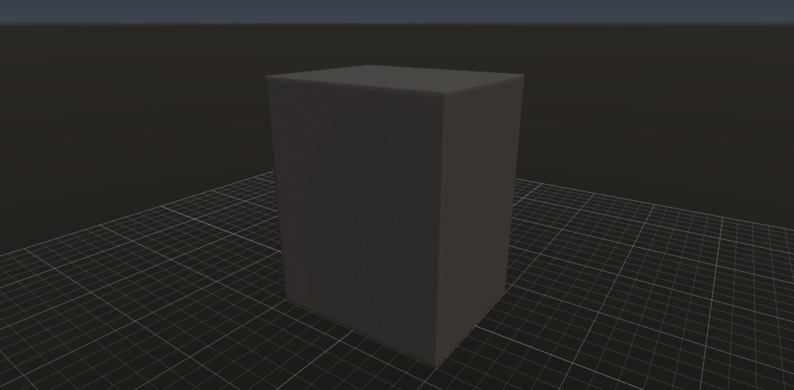 | 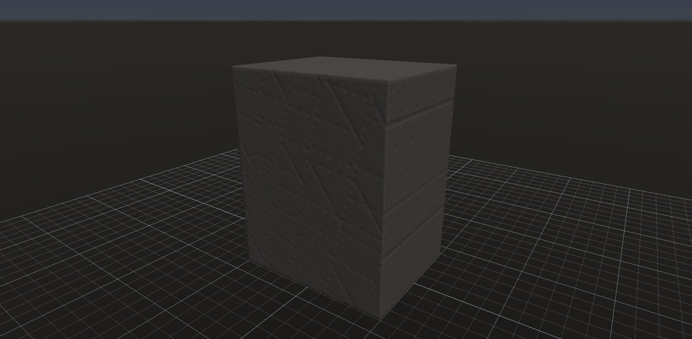 |

本来は同じ外形だが、分割済みの方だけに節理位置の筋が出る。接地後の体積も999.871 m³と999.198 m³に分かれた。分割済みの箱を **Pieces to Mesh（ノード8）の段階で撮ると、この筋はない**。この途中表示は接地前なので箱の下半分が地面より下にある。

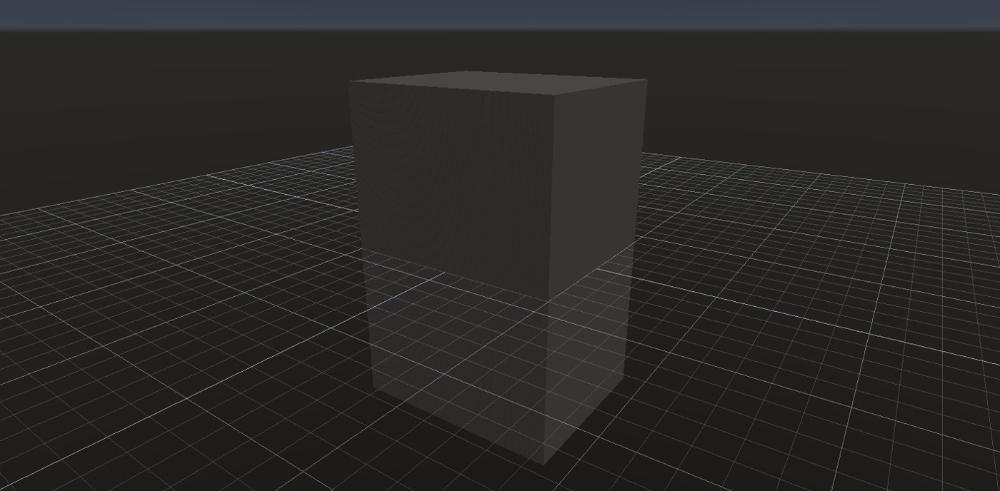

`MeshVolume.cpp` は内外を巻き数で判定する一方、距離は全三角形への最近距離で求める。重なった立体には内部の再距離化を行うが、隙間なく接触する面では巻き数の相殺が起こり、内部面までの浅い距離が残り得る。外面と内部面の交わる近傍で距離・勾配が乱れる、という説明がコードと再現画像に整合する。修正は今回未実施。

[Volume Close（幅0.005）を入れた試行](joint-study-20261002/span-1-close.rockgraph)では、この筋は解消せず、最終体積もほぼ変わらなかった。実際の隙間を閉じる処理と、隠れた接触面を距離計算から除く処理は区別する必要がある。

## 凸多面体を先に作る追加試作

比較中のユーザー提案「最初に岩峰らしい凸多面体を作り、そこからVoronoiで割る」を試した。**輪郭の設計と、局所の欠けを分離する方向は有望**。Base Shapeに`convexPeak`（凸岩峰）を追加した。[設定と仕様](../../reference/convex-peak.md)。

裾・肩・頂の輪郭点から凸包を取り、凸性を維持したまま頂の偏りや肩の高さを調整する。Mesh出力をScatter PointsとVoronoiへ直接接続できる。寸法9 × 15 × 7 m、90点、板 ∩ Voronoi、Peel進行0.15、側面後退0・安定0・大きさの効き0・芯保護あり、埋め込み0.08を出発点とした。移動・摩耗・細部ノイズは使っていない。

### 母岩の凸多面体

[母岩だけのグラフ](joint-study-20261002/peak-intact.rockgraph)。この画像は母岩をボリューム化して接地したもので、分割はしていない。元のメッシュはノード1で直接見られる。

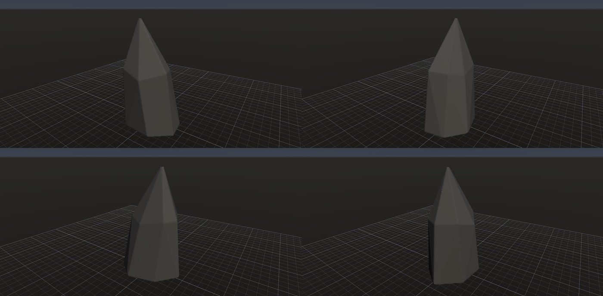

### 分割して少量を欠いた形

[Seed 12の試作グラフ](joint-study-20261002/peak-12.rockgraph)。片を抜く量を抑え、輪郭と広い面を残す。原点中心の箱を強く侵食する場合に比べ、大きなシルエットを設定で決めやすい。裏側には大きく抜けた箇所があり、頂もまだ鉛筆状に尖る。完成形ではない。

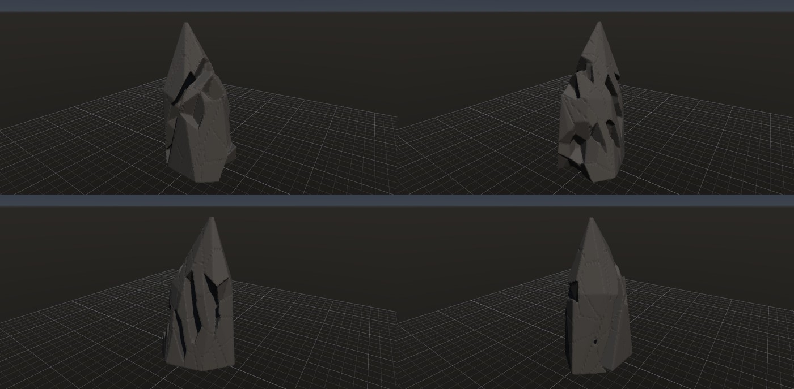

| 母岩Seed／グラフ | 最終寸法 XYZ（m） | 最終体積（m³） | 塊／空洞 | 最大塊比 |
| --- | --- | ---: | --- | ---: |
| [3](joint-study-20261002/peak-3.rockgraph) | 8.009 × 13.698 × 6.775 | 258.68 | 1／0 | 1.0 |
| [7](joint-study-20261002/peak-7.rockgraph) | 8.387 × 13.697 × 6.533 | 201.29 | 1／0 | 1.0 |
| [12](joint-study-20261002/peak-12.rockgraph) | 8.186 × 13.697 × 6.654 | 239.10 | 1／0 | 1.0 |

[全数値](joint-study-20261002/peak-measurements.json)。3つとも閉じた1塊・空洞なし。通常のVoronoi（吸着なし）にも接続できるが、[吸着なしの試行](joint-study-20261002/peak-voronoi.rockgraph)では1つの閉じた空洞（約2.90 m³）が生じたため、仕上げ例には採用しない。

頂の幅と肩の高さの比較も保存した。

| [高い肩・頂幅0.16](joint-study-20261002/peak-shoulder.rockgraph) | [頂幅0.32](joint-study-20261002/peak-wide.rockgraph) |
| --- | --- |
| 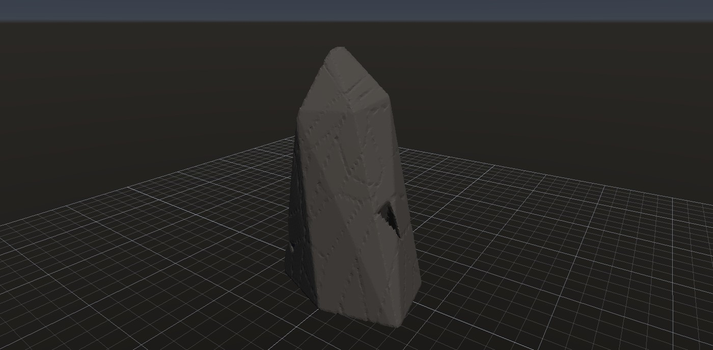 | 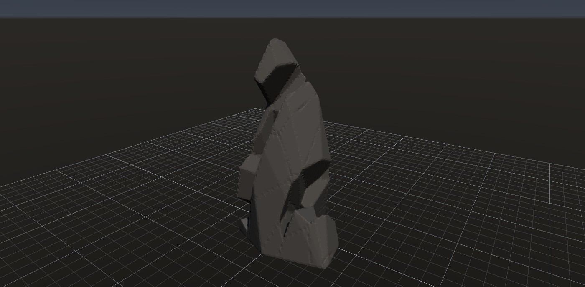 |

高い肩の例は大きな壁を残しやすいが、最終メッシュに約1.6e-7 m³の微小な別片が1つある。広い頂の例は1塊・空洞なしだが、局所の大きな抜け方に改善の余地がある。比較中に肩・頂幅・Peelも変えているため、各設定の単独効果の評価ではない。内部接触面から生じるボリュームの筋は両方に残っている。

この方向では、まず凸岩峰のシルエットを整え、分割を二次的な処理にする。節理の連続枚数を増やす研究だけを先行させない。

## 頂を稜線にし、節理面で切る（2026-10-02 23:10 追加）

ユーザーの指摘（頂が一点で尖っているのが気になる）で、凸岩峰に `peakRidgeLength`（頂の稜線の長さ）、`peakStrike`（走向）、`peakSlabThickness` / `peakSlabDip`（節理面の間隔と傾き）を足した。[仕様](../../reference/convex-peak.md)。手本の写真では、傾いた一枚の節理面が広い壁を作り、頂は「のみの刃」の線で、全体が同じ向きに傾く。頂の点を走向に沿った線分に並べ、分割に使う節理（Parallel Planes の回転 [0,0,76]）と同じ向きの平行な 2 面で凸包の両側を切ると、母岩の広い面と吸着で割る面が平行になる。

### 母岩（稜線 0.55、節理面の間隔 0.5、傾き 76°、偏り X 0.22）

[母岩だけのグラフ](joint-study-20261002/peak-ridge-intact.rockgraph)。ボリューム化して接地したもの。

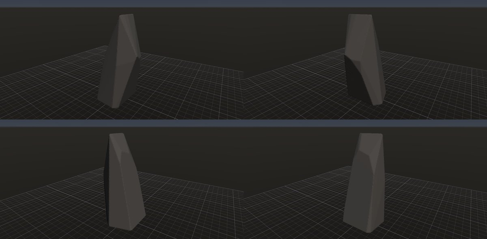

頂は線になり、両側の広い面が同じ向きに傾いた板になった。ただし輪郭が整いすぎて碑（オベリスク）に見える。

### 分割して少量を欠いた形

[peak-12 と同じ分割・Peel（進行 0.15）](joint-study-20261002/peak-ridge.rockgraph)と、[輪郭を崩した変種](joint-study-20261002/peak-ridge-b.rockgraph)（ばらつき 0.45、肩 0.62、稜線 0.7、間隔 0.42、偏り X 0.3、Seed 5、Peel 進行 0.1）。

| peak-ridge | peak-ridge-b |
| --- | --- |
| 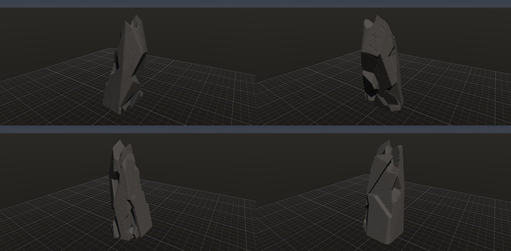 | 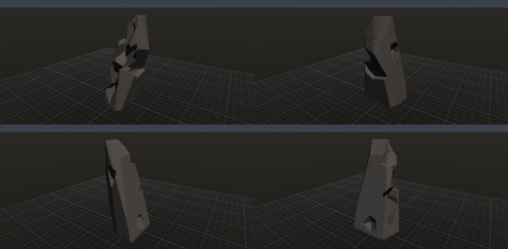 |

| グラフ | 最終寸法 XYZ（m） | 最終体積（m³） | 塊／空洞 |
| --- | --- | ---: | --- |
| peak-ridge-intact | 6.68 × 13.69 × 6.69 | 252.3 | 1／0 |
| peak-ridge | 6.40 × 13.70 × 6.70 | 189.1 | 2／0（別片 4.9e-7 m³） |
| peak-ridge-b | 6.13 × 13.70 × 6.66 | 182.5 | 1／3（空洞の合計 7e-5 m³） |

頂が一点の鉛筆状ではなく、刻まれた稜線になった。変種は輪郭が崩れて岩らしい。残る問題は変わらず、面の途中に歯が抜けたような穴が開くこと（Peel が面の中央の片を抜く。写真では欠けるのは稜・頂・張り出した縁）と、接触面由来のボリュームの筋。微小な別片と空洞はボリューム化の段階のもので、母岩と分割は閉じている。

### 稜の効きで面の中央に穴を開けない（2026-10-02 23:50 追加）

ユーザー依頼（穴の対応）で、Peel に「稜の効き」（`peelEdge`）を足した。[仕様](../../reference/piece-erosion.md#稜の効き2026-10-02-追加)。元の外面が 2 方向以上を向く片（稜・角・張り出した縁）ほど先に欠け、一つの平面しか向かない片（面の中央）は後回しにする。peak-ridge-b に稜の効き 1 を足し、進行 0.1 と 0.2 を比べた。

| [進行 0.1](joint-study-20261002/peak-ridge-edge.rockgraph) | [進行 0.2](joint-study-20261002/peak-ridge-edge-20.rockgraph) |
| --- | --- |
| 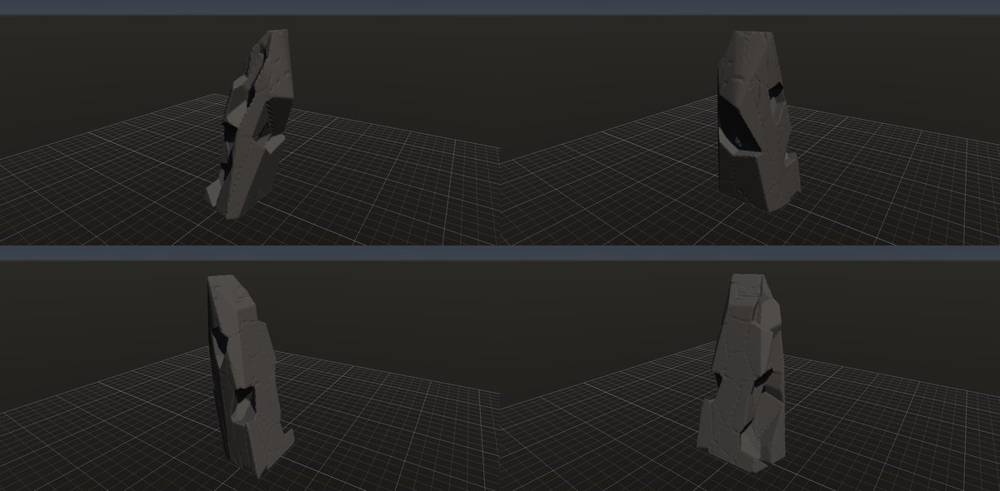 | 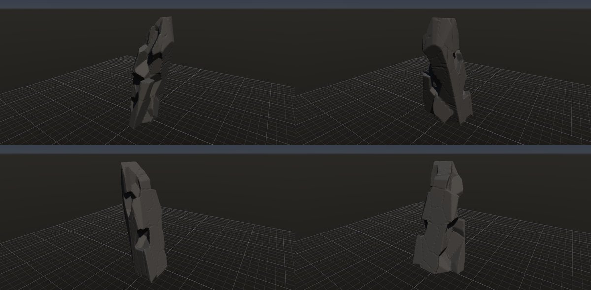 |

| グラフ | 最終寸法 XYZ（m） | 最終体積（m³） | 塊／空洞 |
| --- | --- | ---: | --- |
| peak-ridge-b（稜の効き 0、進行 0.1） | 6.13 × 13.70 × 6.66 | 182.5 | 1／3 |
| peak-ridge-edge（稜の効き 1、進行 0.1） | 6.14 × 13.70 × 6.66 | 175.6 | 1／0 |
| peak-ridge-edge-20（稜の効き 1、進行 0.2） | 5.65 × 13.70 × 6.57 | 142.8 | 1／0 |

面の途中の歯抜けの穴は減り、欠けが稜・頂・裾の縁に寄った。微小な空洞も消えた。進行 0.2 では縁が崩れて積み木のように見えるので、0.1 前後が目安。まだ残る暗いくぼみは、支えを失って落ちる片（接地の判定。稜の効きの対象外）と、傾きの浅い面どうしの境界に接する片によるものと見ている。角張りは分割時の外面から決める静的な値なので、欠けた後に新しくできた稜は数えない。これを動的にする案は、面の中央が連鎖して食われる危険があるので、まず静的で様子を見る。

実装で潰した問題: 面のすぐ外の点を内側と見なすと、その点から出る辺の交点が外挿されて母岩の外に点ができた（高さが 15 m を超えた）。近い 2 頂点（1〜4 cm）を結ぶ細長い側面は、単精度で面の向きが 1e-5 rad ほど狂い、Voronoi / Scatter Points の凸の判定（2e-7）を通らなかった。近い頂点の統合と判定の許容差の緩和（1e-5）で解決した。

## 次に優先すること

1. 接触面が距離場を乱す問題を修正する。未分割の箱と分割済みの箱について、体積だけでなく表面近傍の距離・法線・再メッシュ形状が一致することを受入条件にする。回転した面、T字接触、本物の空洞・隙間を含める。
2. 凸岩峰で肩・頂・裾の輪郭を先に整え、弱い侵食で残す形を調べる。稜線と節理面は足した。次は Peel の抜き方を「稜・頂・張り出した縁に接する片だけ」「節理面に沿った板ごとの剥離」に変え、面の途中に穴を開けないようにする。その上で残存体積を合わせて分割を再比較する。横の節理を全部独立にするのではなく、長い面と短い面の混在、切らない領域を試す。現試作の束の境界は規則的なので、その限界も評価する。
3. 主塊と輪郭が成立してから局所欠け・弱い表面加工を戻す。各ピースのランダム回転で面の連続性を壊して人工性を隠すことはしない。

## 再現と検証

検証結果: `cmake --build --preset x64-debug` と `ctest --test-dir build -C Debug --output-on-failure` は成功（1/1、377秒）。既存の共有一時フォルダへの保存失敗を避け、TEMP / TMPは `build/research/granite-joints/test-temp` へ分離した。Research出力のRelease全テストも成功。保存した16グラフはすべて `rock_cli check` 成功。凸岩峰は24条件で凸性・閉包・寸法・再現性と、実際のVoronoi分割による体積保存を検証した。

保存グラフはこの文書と同じフォルダの `joint-study-20261002/`。`rock_cli check`、`rock_cli eval <graph> --node 15`、`tools/rock_shot.py <graph> <image> --views 4` で再評価できる。途中メッシュは `--node 8`。Seedの追加比較は `span-*.rockgraph` のノード20・21のSeedだけを上記の値に変更する。

撮影用のReleaseアプリは、起動中の通常版を保持するため `build/bin/Research/` に別出力した。撮影には `--config Research` を使った。通常のReleaseへビルドした場合はこの指定は不要。

自動テストは直交2系統・斜め3系統について、閉包、体積、全表面積と接触面積の収支、隣接の対称性、再現、Peel、0の互換性、範囲外、取消、保存復元、キャッシュ更新を検証する。直交系では内部標本点の所属数も調べ、体積保存だけでは見逃す空隙・重複を確認した。
