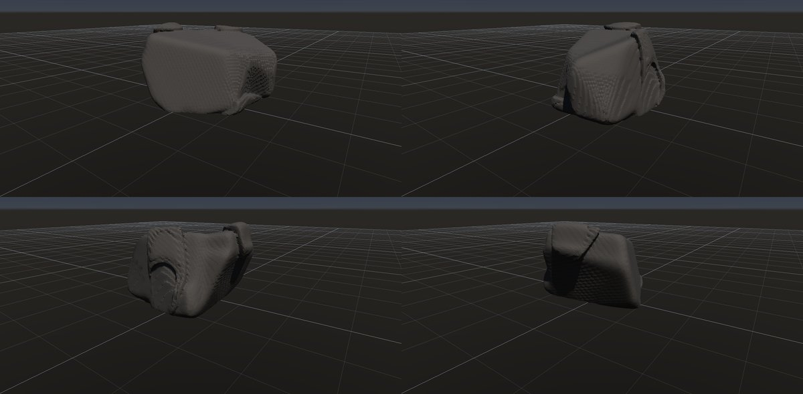
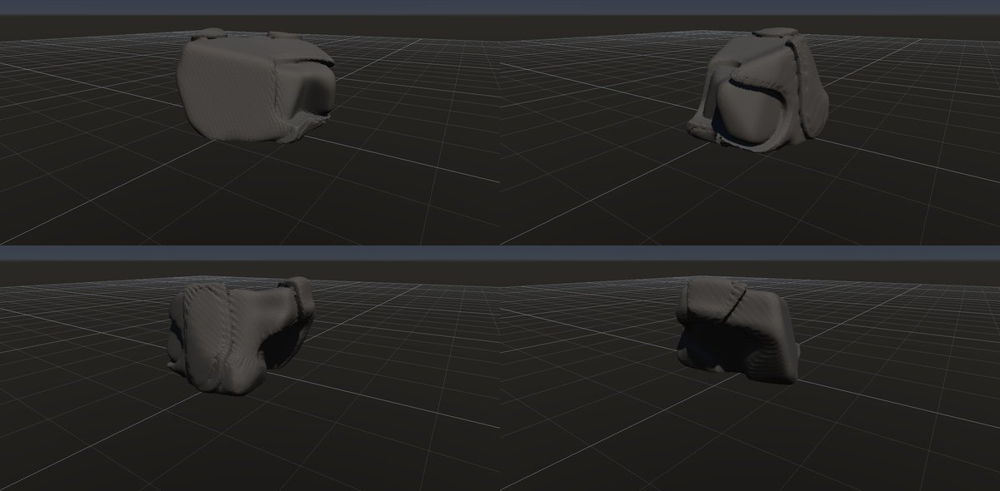
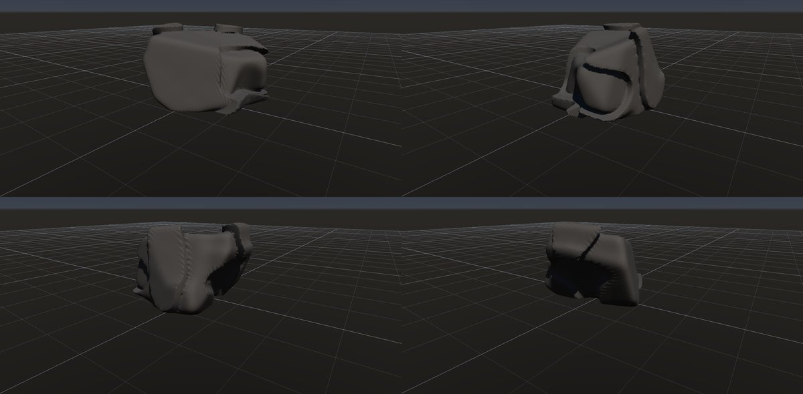

# 花崗岩のシーティング

作成日時: 2026-10-01 12:50
更新日時: 2026-10-02 21:40

[岩の研究ページ](../rocks.md) の 1 項目。分類: 形の骨格（成因・節理）。レシピは [`granite-sheeting`](../../../examples/ai-recipes/granite-sheeting.rockgraph)（アプリの「テンプレートから作成」から複製して開ける）。

## 概要

花崗岩などに、地表の形におおむね沿った割れ目が発達し、厚い板や殻のように剥がれる構造。平行な平板の積層とは異なり、岩体を包む曲面と、剥離した縁の段差が目立つ。この研究では、大きな曲面を残しながら一部だけが剥がれ、内側の面が露出した姿を扱う。[参考：NPSの剥離節理とドーム](https://www.nps.gov/yose/learn/nature/geology-exhibits.htm)。

## 今の状態

- 状態: △
- レシピ: [`granite-sheeting`](../../../examples/ai-recipes/granite-sheeting.rockgraph)
- 作り方: 角張った塊に Volume Crack の割り方「表面に沿う殻」。外側の板がまだらに剥がれ落ちた段を作る。
- 課題: 段がもう少し厚く、縁が欠けているとよい。剥がれた跡の面は内部の距離場の等値面なので、後段に Edge Wear を置くとわずかな粗さが強まり細かい縞になる（Edge Wear は殻より前に置く）。

## 今の形

4 方向（左上から 35°・125°・215°・305°、見下ろし 20°）を 2×2 にまとめたもの。`python tools/rock_research_shots.py granite-sheeting` で撮り直す（latest.jpg を更新し、日時付きの経過の画像も残す）。

## 経過

何を変えて何が効いたか（効かなかったことも）。古い順。

- 2026-10-01 初版。最初の案（ならした距離場の等値面を殻にする）は、凸な形では殻が表面と交わらず、何も彫れなかった（体積が前後で同じだったことで気付いた）。外側の板の剥がれで見せる案に変えた。
- 2026-10-01 Volume Crack の殻の不具合（内側の殻が剥がれない・剥がれた底の段）を直したら、内側の殻まで剥がれて深くえぐれたので、殻の枚数を 4 → 2 に減らした。格子模様のうち段の分は消えたが、斜めの縞が残った。
- 2026-10-01 縞の原因を 3 つ直した。To Volume の重なった箱の内部の距離（箱の距離の最小で浅く歪む）を表面から測り直すようにし、Volume Noise の帯の境の値の跳びをなくし、Edge Wear を殻より前に移した（Edge Wear が剥がれた跡のわずかな粗さを強めていた）。縞はほぼ消えた。

## 経過の画像

撮った順。コミットの日時と件名（Git の履歴から取り出したもの）。

### 2026-10-01 12:47 docs: 岩の研究ページを作り、種類ごとのスクリーンショットと改善の履歴を載せる

### 2026-10-01 14:29 fix: Volume Crack の殻の剥がれが縞になる・内側の殻が剥がれない不具合を直す

### 2026-10-01 15:01 fix: To Volume で重なった立体の内部の距離を測り直し、Volume Noise の内部の値の跳びをなくす

### 2026-10-01 17:53 fix: 全体表示で原点ではなくメッシュの範囲の中心を見る

