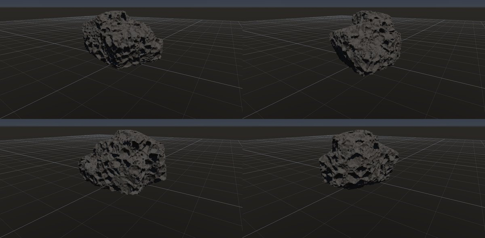
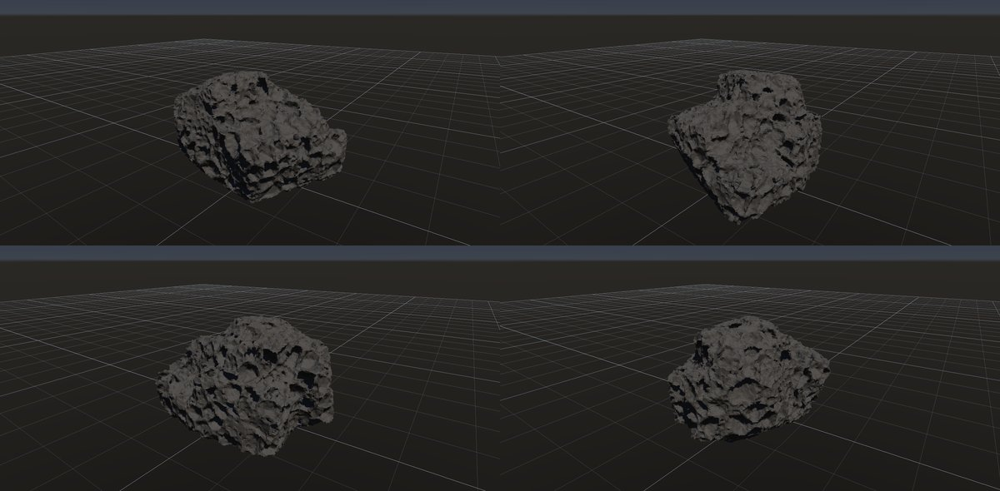
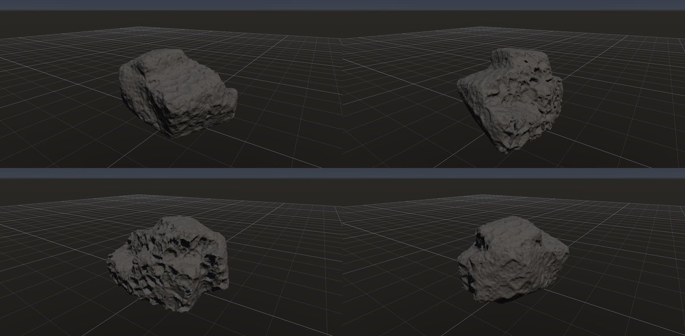

# 蜂の巣状の風化（タフォニ）

作成日時: 2026-10-01 12:50
更新日時: 2026-10-02 21:51

## 概要

岩の表面に丸みのあるくぼみが集まり、蜂の巣のように見える風化形態。岩石名ではなく、砂岩などに見られる表面の形を指す。ここでは小さな穴の集合を中心に、穴どうしを隔てる薄い壁、大きさのばらつき、穴が集中する面と滑らかな面の違いを扱う。[参考：NPSのタフォニ](https://www.nps.gov/articles/tafoni.htm)。

[岩の研究ページ](../rocks.md) の 1 項目。分類: 風化・侵食の形。レシピは [`honeycomb`](../../../examples/ai-recipes/honeycomb.rockgraph)（アプリの「テンプレートから作成」から複製して開ける）。

## 今の状態

- 状態: ○
- レシピ: [`honeycomb`](../../../examples/ai-recipes/honeycomb.rockgraph)
- 作り方: 丸めた塊に Volume Noise の種類「くぼみ」を粗・細の 2 段。「向きに集中」で陰の面（-Z、やや下向き）に集め、日の当たる上面には付けない。
- 課題: —

## 今の形

4 方向（左上から 35°・125°・215°・305°、見下ろし 20°）を 2×2 にまとめたもの。`python tools/rock_research_shots.py honeycomb` で撮り直す（latest.jpg を更新し、日時付きの経過の画像も残す）。

## 経過

何を変えて何が効いたか（効かなかったことも）。古い順。

- 2026-10-01 初版。最初は Volume Noise のセル状で、くぼみではなく泡状の膨らみになった（→ G1 で「くぼみ」を足した）。
- 2026-10-02 Volume Noise に「向きに集中」を足し、陰の面にくぼみを集めた。上面は平滑なまま、片側だけが蜂の巣状になり、実物の分布に近づいた。

## 経過の画像

撮った順。コミットの日時と件名（Git の履歴から取り出したもの）。

### 2026-10-01 12:47 docs: 岩の研究ページを作り、種類ごとのスクリーンショットと改善の履歴を載せる

### 2026-10-01 15:01 fix: To Volume で重なった立体の内部の距離を測り直し、Volume Noise の内部の値の跳びをなくす

### 2026-10-01 17:53 fix: 全体表示で原点ではなくメッシュの範囲の中心を見る

### 2026-10-02 19:50 feat: Flow Mask を足し、Noise / Undercut に向きに集中を足し、礫を Diff Mask で色分けする

