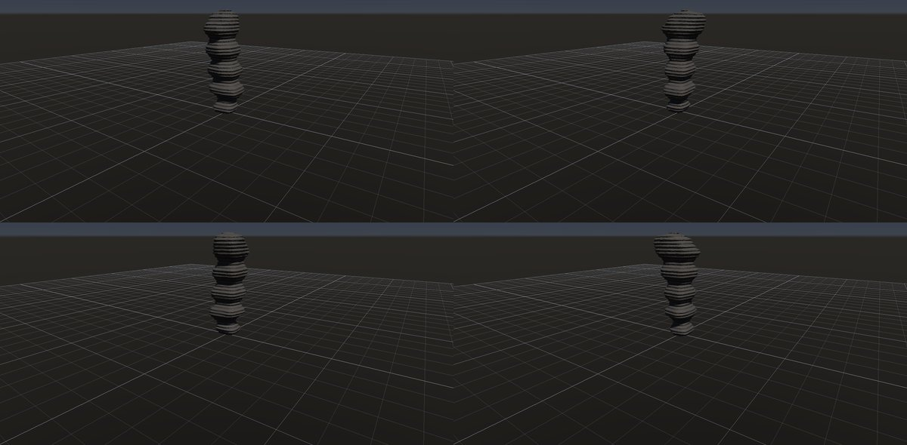
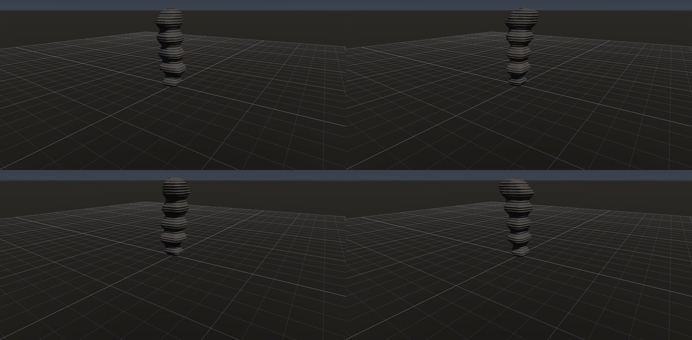
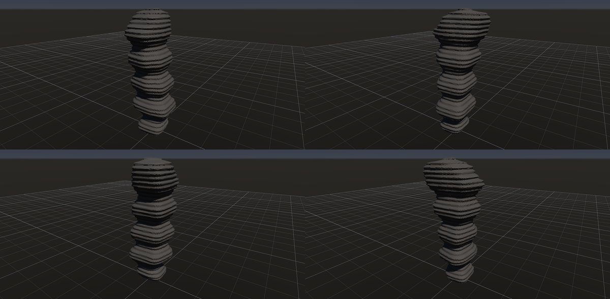

# フードゥー

作成日時: 2026-10-01 12:50
更新日時: 2026-10-02 21:51

## 概要

周囲の岩が風化・侵食で失われ、細長い柱として残った地形。層ごとの侵食されやすさの違いによって、くびれや張り出しができる。ここでは、単調な円柱ではなく、太さが高さとともに変わり、層の段や頂の張り出しを持つ岩塔を目標とする。[参考：NPSのフードゥー](https://www.nps.gov/brca/learn/nature/hoodoos.htm/index.htm)。

[岩の研究ページ](../rocks.md) の 1 項目。分類: 風化・侵食の形。レシピは [`hoodoo`](../../../examples/ai-recipes/hoodoo.rockgraph)（アプリの「テンプレートから作成」から複製して開ける）。

## 今の状態

- 状態: ○
- レシピ: [`hoodoo`](../../../examples/ai-recipes/hoodoo.rockgraph)
- 作り方: 縦長の塊に Volume Undercut の帯を 4 段重ね、Volume Terrace で層の筋。
- 課題: 頂に硬い帽子岩（キャップロック）が無い。

## 今の形

4 方向（左上から 35°・125°・215°・305°、見下ろし 20°）を 2×2 にまとめたもの。`python tools/rock_research_shots.py hoodoo` で撮り直す（latest.jpg を更新し、日時付きの経過の画像も残す）。

## 経過

何を変えて何が効いたか（効かなかったことも）。古い順。

- 2026-10-01 初版。

## 経過の画像

撮った順。コミットの日時と件名（Git の履歴から取り出したもの）。

### 2026-10-01 12:47 docs: 岩の研究ページを作り、種類ごとのスクリーンショットと改善の履歴を載せる

### 2026-10-01 15:01 fix: To Volume で重なった立体の内部の距離を測り直し、Volume Noise の内部の値の跳びをなくす

### 2026-10-01 17:53 fix: 全体表示で原点ではなくメッシュの範囲の中心を見る

