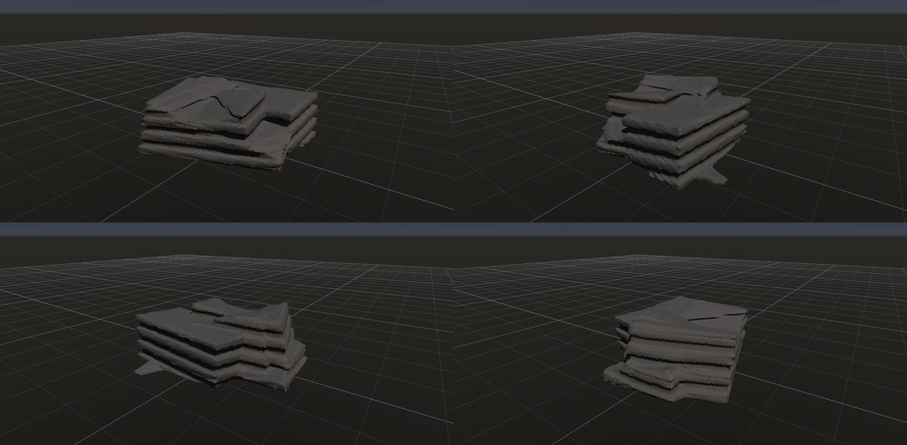
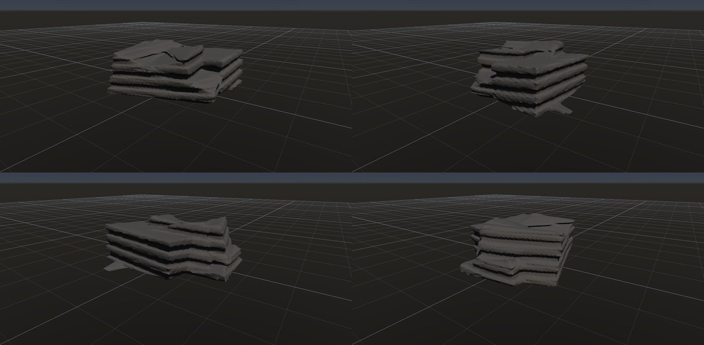
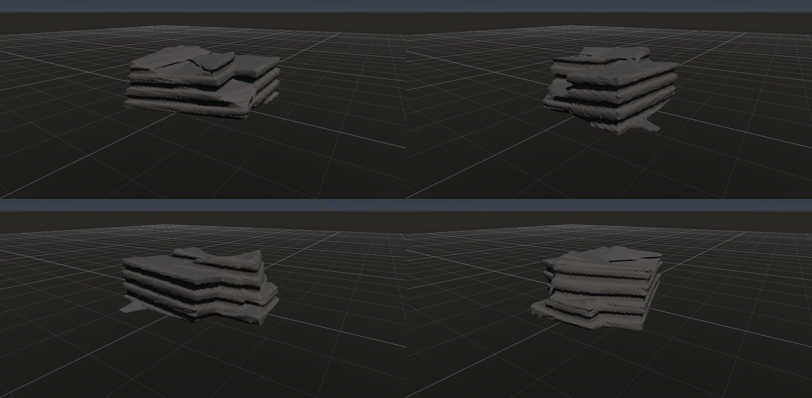

# 層理の段

作成日時: 2026-10-01 12:50
更新日時: 2026-10-02 21:51

## 概要

堆積岩の層に沿って、張り出した棚と奥へ引っ込んだ部分が繰り返す露頭。層ごとの風化・侵食への抵抗の違いなどが段差を生む。この研究では、ほぼ水平な層が岩体を横切り、厚さの違う棚や局所的に欠けた縁として見える形を扱う。[参考：NPSの層による侵食の違い](https://www.nps.gov/brca/learn/nature/hoodoos.htm/index.htm)。

[岩の研究ページ](../rocks.md) の 1 項目。分類: 形の骨格（成因・節理）。レシピは [`layered-ledges`](../../../examples/ai-recipes/layered-ledges.rockgraph)（アプリの「テンプレートから作成」から複製して開ける）。

## 今の状態

- 状態: ○
- レシピ: [`layered-ledges`](../../../examples/ai-recipes/layered-ledges.rockgraph)
- 作り方: Random Boxes の塊に Volume Terrace で水平に近い層の段。
- 課題: —

## 今の形

4 方向（左上から 35°・125°・215°・305°、見下ろし 20°）を 2×2 にまとめたもの。`python tools/rock_research_shots.py layered-ledges` で撮り直す（latest.jpg を更新し、日時付きの経過の画像も残す）。

## 経過

何を変えて何が効いたか（効かなかったことも）。古い順。

- 2026-10-01 初版。

## 経過の画像

撮った順。コミットの日時と件名（Git の履歴から取り出したもの）。

### 2026-10-01 12:47 docs: 岩の研究ページを作り、種類ごとのスクリーンショットと改善の履歴を載せる

### 2026-10-01 15:01 fix: To Volume で重なった立体の内部の距離を測り直し、Volume Noise の内部の値の跳びをなくす

### 2026-10-01 17:53 fix: 全体表示で原点ではなくメッシュの範囲の中心を見る

