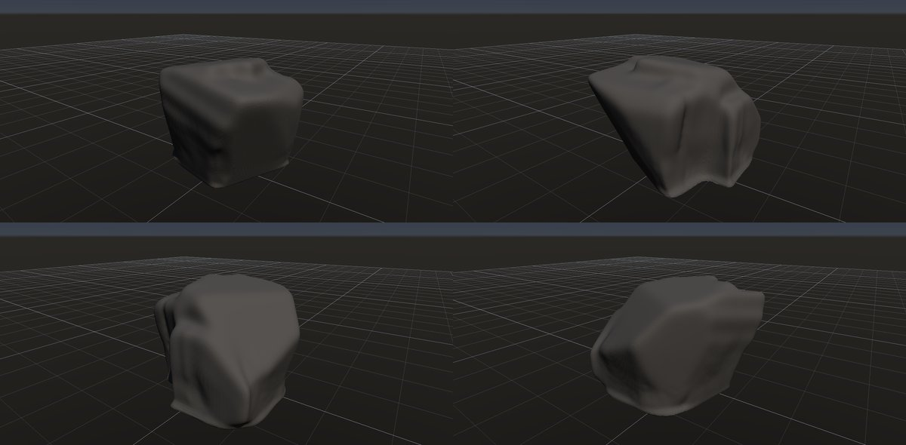
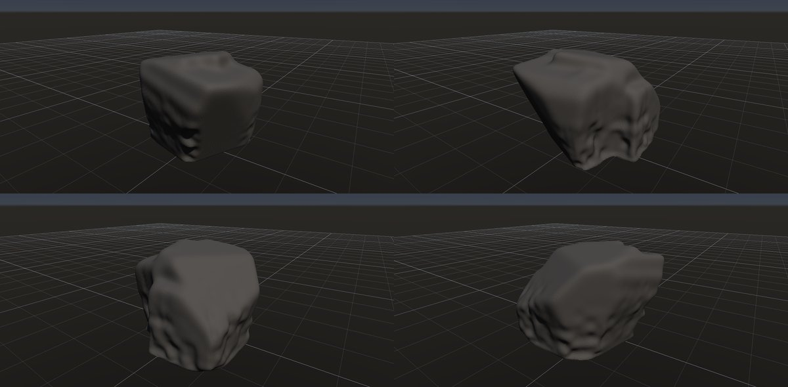

# 石灰岩の溶食（縦溝）

作成日時: 2026-10-01 12:50
更新日時: 2026-10-02 21:51

## 概要

石灰岩の表面が弱い酸性の水に溶かされ、流れに沿う細い溝や溝の間の稜ができた姿。ここでは、露出した傾斜面を下る細かな溶食溝を中心に扱う。広い岩の面を保ちつつ、溝が近い方向に並び、場所によって合流したり途切れたりする見え方を重視する。[参考：NPSの溶解による風化](https://www.nps.gov/subjects/erosion/weathering.htm)。

[岩の研究ページ](../rocks.md) の 1 項目。分類: 風化・侵食の形。レシピは [`limestone-rills`](../../../examples/ai-recipes/limestone-rills.rockgraph)（アプリの「テンプレートから作成」から複製して開ける）。

## 今の状態

- 状態: △
- レシピ: [`limestone-rills`](../../../examples/ai-recipes/limestone-rills.rockgraph)
- 作り方: Random Boxes を Plane Cuts で割って傾いた大きな面を作り、丸めて接地。Volume Erode（流下。量 0.06、集中 4、筋の長さ 0.6、溝の幅 0.01、5 回、ばらつき 0.6・細かさ 16）で、表面を雨水が流れ下る筋を追って流れが集まる所を溝に彫る。細かいばらつきが筋を分けるきっかけになる。
- 課題: 溝が布のひだのように太くうねり、リレンカレンの細く平行な溝にならない。流れが集まる所を広く削るので、Plane Cuts の平らな面がなまって溶けたように見える。頂の尖り（ピナクル）は無い。

## 今の形

4 方向（左上から 35°・125°・215°・305°、見下ろし 20°）を 2×2 にまとめたもの。`python tools/rock_research_shots.py limestone-rills` で撮り直す（latest.jpg を更新し、日時付きの経過の画像も残す）。

## 経過

何を変えて何が効いたか（効かなかったことも）。古い順。

- 2026-10-01 鉛直の Parallel Planes の浅い割れ目で試作し、溝がほとんど見えなかった。
- 2026-10-02 Volume Erode（流下）を足して溝を彫った。最初は底の縁に流れが溜まって段差になった（形の底で筋を終えるようにした）。集中 2 では全面が削れたので 3 にした。
- 2026-10-02 集中 4・溝の幅 0.01・5 回・細かいばらつき（0.6、細かさ 16）にして、溝が少し細く縦に通るようになった。まだひだ状。

## 経過の画像

撮った順。コミットの日時と件名（Git の履歴から取り出したもの）。

### 2026-10-02 18:54 feat: 向きで削る量を変える侵食 Volume Erode を足す（G5）

### 2026-10-02 19:08 feat: Volume Erode のさらされた面を、横向きにも効く重みと風上側の円錐の開放度にする

