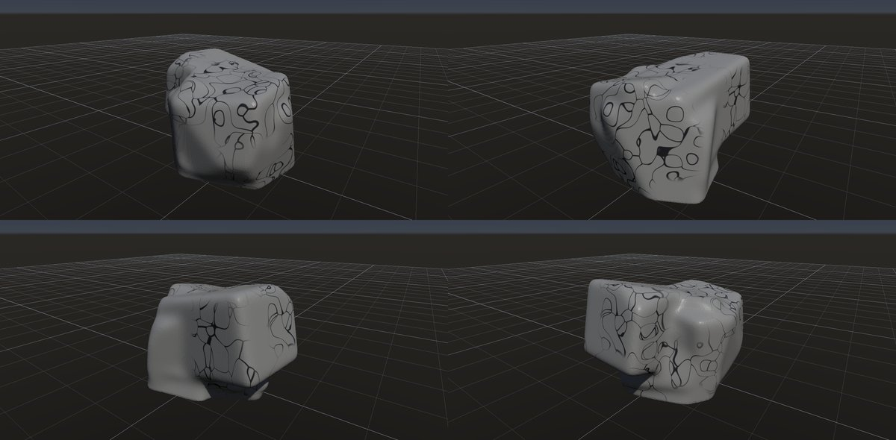
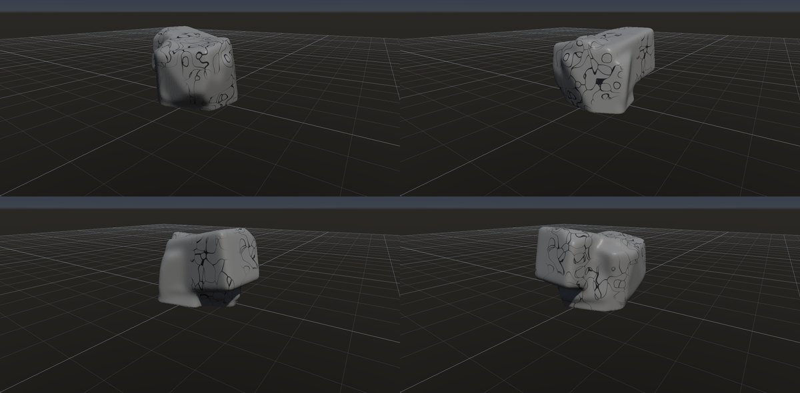

# 大理石

作成日時: 2026-10-01 12:50
更新日時: 2026-10-02 21:40

[岩の研究ページ](../rocks.md) の 1 項目。分類: 表面・色（素材）。レシピは [`marble`](../../../examples/ai-recipes/marble.rockgraph)（アプリの「テンプレートから作成」から複製して開ける）。

## 概要

石灰岩などの炭酸塩岩が変成し、鉱物が再結晶した岩。白いものだけでなくさまざまな色があり、脈や帯の入り方にも違いがある。この研究では白地に暗い脈のある外観を対象に、脈の太さの変化、分岐、途切れと、岩体の面をまたぐつながりを扱う。[参考：BGSの大理石](https://www.bgs.ac.uk/discovering-geology/rocks-and-minerals/)。

## 今の状態

- 状態: △
- レシピ: [`marble`](../../../examples/ai-recipes/marble.rockgraph)
- 作り方: 丸めた塊の白い下地に、Structure Mask の脈で暗い線を塗る。
- 課題: 網目（Voronoi の境界）の感じが残る。実物の脈は枝分かれし、太さが変わり、流れる向きがある。

## 今の形

4 方向（左上から 35°・125°・215°・305°、見下ろし 20°）を 2×2 にまとめたもの。`python tools/rock_research_shots.py marble` で撮り直す（latest.jpg を更新し、日時付きの経過の画像も残す）。

## 経過

何を変えて何が効いたか（効かなかったことも）。古い順。

- 2026-10-01 初版。最初は閉じた多角形の亀甲模様になった。ノイズで網目の一部だけを残すようにしたが、判定を逆に渡して「残す割合を上げると減る」不具合を作り、撮影で気付いて直した。

## 経過の画像

撮った順。コミットの日時と件名（Git の履歴から取り出したもの）。

### 2026-10-01 12:47 docs: 岩の研究ページを作り、種類ごとのスクリーンショットと改善の履歴を載せる

### 2026-10-01 15:01 fix: To Volume で重なった立体の内部の距離を測り直し、Volume Noise の内部の値の跳びをなくす

### 2026-10-01 17:53 fix: 全体表示で原点ではなくメッシュの範囲の中心を見る

