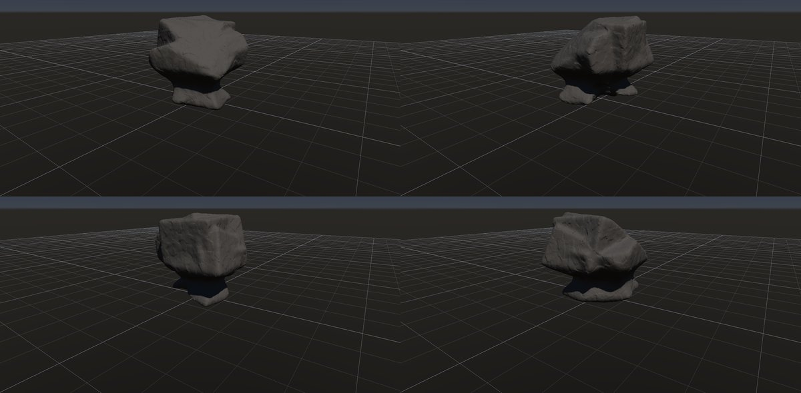
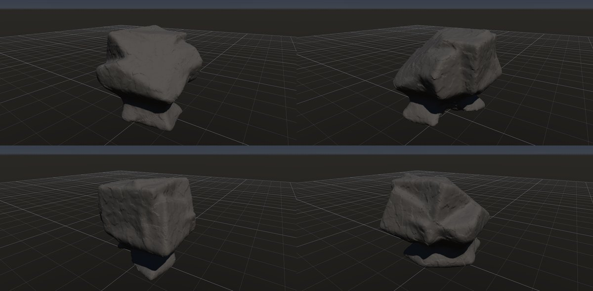

# きのこ岩

作成日時: 2026-10-01 12:50
更新日時: 2026-10-02 21:40

[岩の研究ページ](../rocks.md) の 1 項目。分類: 風化・侵食の形。レシピは [`mushroom-rock`](../../../examples/ai-recipes/mushroom-rock.rockgraph)（アプリの「テンプレートから作成」から複製して開ける）。

## 概要

大きな上部を細い台座が支え、きのこのように見える岩。形の名前であり、岩質の違いや下部に集中する侵食など、でき方は一つに限られない。この研究では、上部の張り出し、足元のくびれ、地面へつながる支えのバランスを対象とする。

## 今の状態

- 状態: ○
- レシピ: [`mushroom-rock`](../../../examples/ai-recipes/mushroom-rock.rockgraph)
- 作り方: 接地させた塊の底の近くを Volume Undercut で削り、細い台座にする。
- 課題: —

## 今の形

4 方向（左上から 35°・125°・215°・305°、見下ろし 20°）を 2×2 にまとめたもの。`python tools/rock_research_shots.py mushroom-rock` で撮り直す（latest.jpg を更新し、日時付きの経過の画像も残す）。

## 経過

何を変えて何が効いたか（効かなかったことも）。古い順。

- 2026-10-01 初版（G2 で Volume Undercut を足した）。最初は台座が断面ごと削り切られ、傘が宙に浮いたまま評価が成功した（→ 浮き・切り離しをエラーにした）。

## 経過の画像

撮った順。コミットの日時と件名（Git の履歴から取り出したもの）。

### 2026-10-01 12:47 docs: 岩の研究ページを作り、種類ごとのスクリーンショットと改善の履歴を載せる

### 2026-10-01 15:01 fix: To Volume で重なった立体の内部の距離を測り直し、Volume Noise の内部の値の跳びをなくす

### 2026-10-01 17:53 fix: 全体表示で原点ではなくメッシュの範囲の中心を見る

