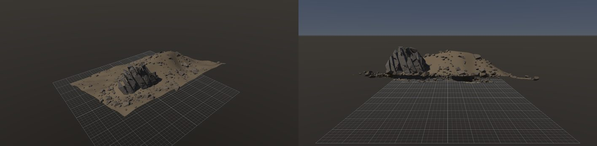
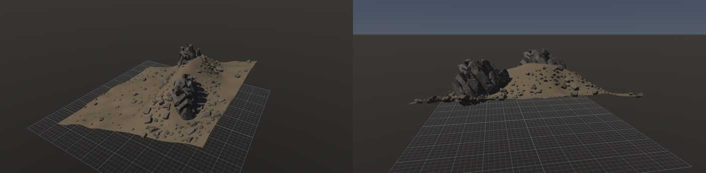
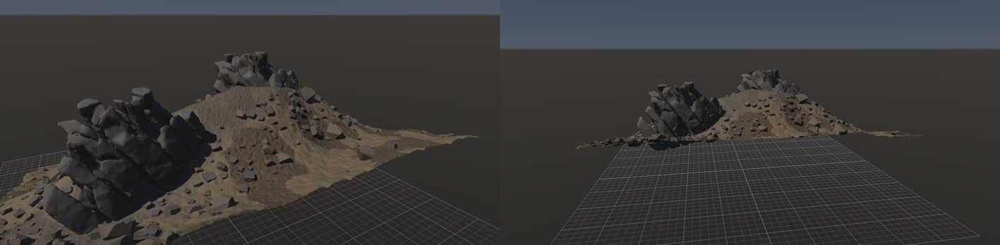
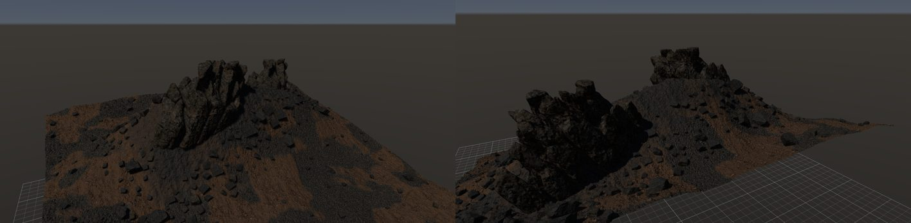
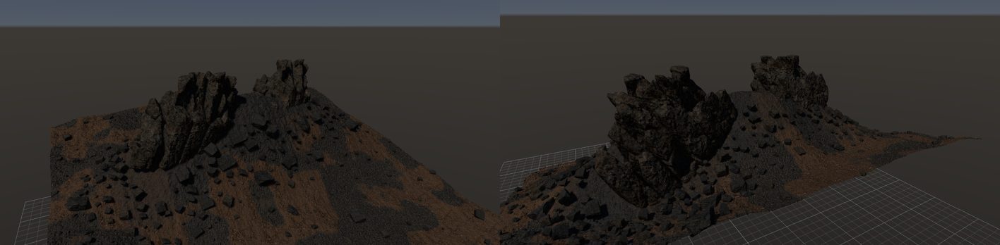
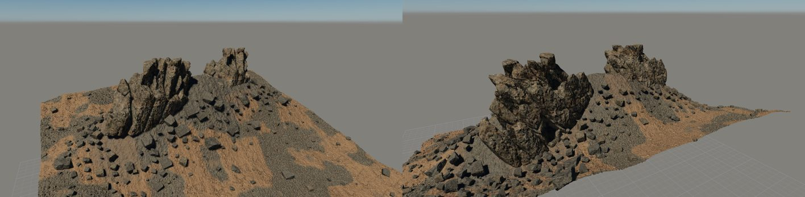
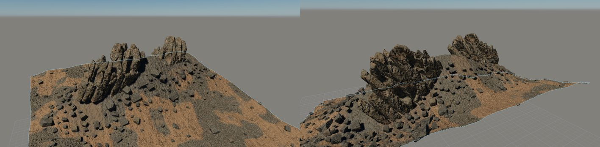

# 那須朝日岳の岩場（山グラフのユニット）

作成日時: 2026-10-03 07:15
更新日時: 2026-10-03 11:00

## 今の状態

- 状態: △（構成はできた。見た目はまだ写真から遠い）
- グラフ: [examples/nasu-asahidake/nasu.mountaingraph](../../../examples/nasu-asahidake/nasu.mountaingraph)（岩グラフは同じフォルダの `blades` / `talus` / `chips`）
- 手本: `docs/references/nasu-asahidake/DSC00363`（主）・`DSC00362`・`DSC00365`（ユーザーの写真。Git の対象外）。65° に傾いた板状節理の刃の列（1 枚 3〜6 m）、褐色の風化土の斜面、拳大〜1 m の破片が刃の根元に密、草の塊。幅 15〜20 m。
- 作り方: 40 m 四方のハイトマップ（奥ほど高い斜面 + 中央の尾根）を Terrain Erode（安息角 34°・80 回の崩れ、流路 0.5 m）で侵食し、高さの Shape Mask で尾根の頂だけに [nasu-blades](../nasu-blades/README.md) を 2 個（大きさの間隔 0.7 で食い込む、向き 20° ± 12° で走向をそろえる、沈める量 0.25 + 浮きの補正 0.2 まで）。大の Coverage を「広げる」6 m と反転の min で崖錐の範囲にし、崖錐の破片（`talus-fragment` の 1 倍と 0.45 倍、`blocky` の 0.3 倍、間隔 0.8 m、倍率 0.3〜1.4、沈める量 0.35 ± 70%）を密に撒く。地面は Terrain Deform で刃の根元（Coverage を 4 m 広げたマスク）を 0.4 m えぐってから素材と Displace を掛ける。傾斜のマスクを薄くして斜面全体にまばらな転石。
- 課題:
  - 刃の列は 2 群が走向をそろえて立つようになったが、写真の「刃が並んで立つ」感じはまだ弱い（[nasu-blades](../nasu-blades/README.md) の課題）。
  - 浮きの補正の上限が大きい（0.6）と、斜面に置いた刃の列が高さの 0.85 まで沈んでほぼ埋まった。斜面の大岩は上限 0.2 程度にする。
  - 破片は 3 種類 × 倍率で形が増え、沈み方のばらつきで埋まった破片と転がった破片が混ざるようになった。まだ全部が同じ灰色で、写真の「土に半分埋まって縁が土に馴染む」感じは無い（地面の素材と、破片の根元の土の盛り上がりが要る）。
  - 素材は Megascans（土 rocky-soil、礫 beach-gravell、岩屑 gouged-rock-cliff、刃 mine-rock-wall）にした。テクスチャは Git の対象外（`examples/**/textures/`）で、`data/textures/` から写す。
  - （解消）暗さの原因は、シーンが作業用 IBL だったことと、露出が物理カメラ（EV 16）のままだったこと。シーンの空（大気散乱、太陽 54°・120000 lux）に切り替え、手動 EV 14 にして昼の直射日光になった。
  - 草の塊は対象外（植生）。
  - 写真の視点（斜面の下から見上げる）で撮ると地面が暗く沈む。光の向きとカメラの高さを整える。

## 今の形

## 経過

- 2026-10-03 07:15: 初版。岩グラフ 2 つを `tools/rock_bake.py` で焼き、山グラフを書きやすい表記で組んだ。途中で 3 つ直した: 同じ岩グラフを倍率違いの Rock で 2 回つなぐと 2 つ目が描かれない（Rock Scatter が岩グラフごとに 1 組にまとめ、Rock の倍率をインスタンスに畳むようにした）、Mask Filter に「広げる」を足した（崖錐の範囲）、`rock_cli eval` に置いた位置を出した（刃が地形の縁に落ちていたのを見つけるため。斜面の上端が尾根より高かったので、ハイトマップで尾根を最も高くした）。大 2・崖錐 350・まばら 170。

- 2026-10-03 08:45: 刃の列に深さの勾配を入れて焼き直し、大の Rock Scatter に「向き 20° ± 12°」（新しい設定）で 2 群の走向をそろえた。浮きの補正の上限 0.6 で 2 群目がほぼ埋まっていたので 0.2 に下げた。大 2・崖錐 291・まばら 174。

- 2026-10-03 08:55: 崖錐に角張った破片（`blocky` の 0.3 倍）を 3 種類目として足し、Rock Scatter の「沈める量のばらつき」（新しい設定、0.7）で埋まった破片と転がった破片を混ぜた。崖錐 291（talus 218 + chips 73）・まばら 172。近くから撮ると、節理の露岩と大きさの混ざった破片の崖錐に見える。

- 2026-10-03 10:05: 地面の荒れ。Heightmap に Apply Material を 3 段（土の下地、Noise Mask 3 m で暗い土をまだらに、刃の Coverage を 4 m 広げた範囲に岩屑を薄く）、Subdivide 1 段 → Displace 0.3 m で素材のハイトを起伏にした。岩屑のハイトを低く（0.2）して根元を 0.1 m ほどえぐる。Displace は GPU が要るので、`rock_cli eval` は `--node 20` のように Rock Scatter を指して数える。最初は岩屑を青灰色にして斑に浮いたので、土に近い色で不透明度 0.6 にした。

- 2026-10-03 10:08: 刃の列（溝 0.4 m、弱い Smooth、1 塊）を焼き直して置き直した。

- 2026-10-03 10:14: ユーザー指示で Megascans の素材を使った。土 rocky-soil、礫 beach-gravell（Noise Mask でまだら）、刃の根元の岩屑 gouged-rock-cliff、刃と角張った破片 mine-rock-wall（褐色の岩）、崖錐の破片 gouged-rock-cliff。素材の明るさ（brightness）を 1.2〜1.35 に上げても全体は暗く、光の当たる側から撮ると褐色の土と岩が出る。写真の明るい直射日光の感じには、光の仰角と露出の調整が要る。

- 2026-10-03 10:28: ユーザー判断で地形の侵食を足した。Terrain Erode（熱侵食: 安息角 34°・80 回、流路: 0.5 m・幅 1.5 m）を Heightmap の直後に置き、岩の配置も地面もこの出力から。Terrain Deform（Coverage を 4 m 広げたマスクで -0.4 m）を地面側だけに。尾根が崩れて裾が安息角の斜面になり、盛り土らしさが減った。流路の溝は 0.5 m では目立たない。[仕様](../../reference/terrain-erode.md)。

- 2026-10-03 10:41: ユーザー指摘（撮影の光・露出・環境光を整える。IBL ではなく大気で）。シーンを `lightingMode: atmospheric`（太陽 方位 2.3 rad・仰角 0.95 rad・120000 lux）にし、露出を手動 EV 14 に。アプリに撮影用の引数 `--lighting ibl|atmospheric`、`--light-elevation`、`--light-illuminance`、`--exposure`（自動露出なら補正、手動なら EV に足す）、`--skylight` を足し、`rock_shot.py` からも渡せる。昼の直射日光で褐色の土と岩が出て、写真の雰囲気に近づいた。残る差: 刃の列の形（写真はもっと薄く鋭い）、破片の根元の土、草。
- 2026-10-03 11:00: 刃の列を薄く鋭く（[nasu-blades](../nasu-blades/README.md) の板の間隔 1.1 m、溝 0.5 m・頂 3.4 m）して焼き直した。尾根に薄い板の列が立ち、写真の中央の群に近い。残る差: 破片の根元の土、流路の溝が目立たない、草。

## 経過の画像

- 
- 
- 
- 
- 
- 
- 
- 
- 
