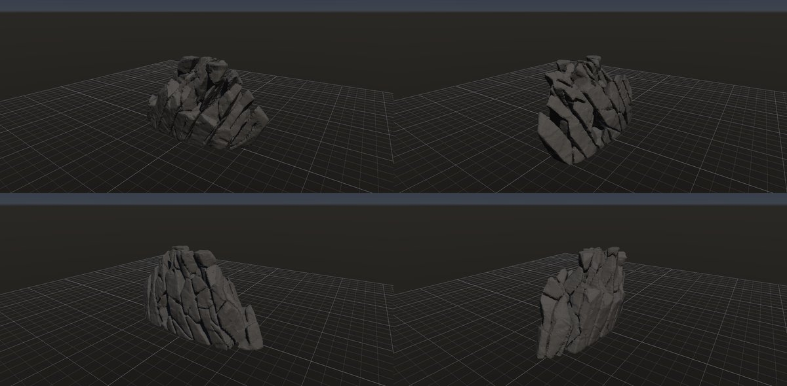

# 那須朝日岳の刃の列（安山岩の露岩）

作成日時: 2026-10-03 06:55
更新日時: 2026-10-03 06:55

## 概要

安山岩の岩盤が、65° ほどに傾いた板状の節理で 1〜2 m 厚の板に割れ、板の中が横の割れ目で 1〜2 m のブロックに分かれたまま尾根に露出した形。頂は板ごとに高さの違う「刃」になり、板の間は暗い溝。裾は褐色の風化土で、同じ岩の破片が散る。

[岩の研究ページ](../rocks.md) の 1 項目。分類: 形の骨格（成因・節理）。レシピは [`nasu-blades`](../../../examples/ai-recipes/nasu-blades.rockgraph)。目標の風景（刃 + 土の斜面 + 破片）は [岩の集合体](../rock-cluster/README.md) で組む。

## 今の状態

- 状態: △
- レシピ: [`nasu-blades`](../../../examples/ai-recipes/nasu-blades.rockgraph)
- 手本: 那須朝日岳。ユーザーが撮った写真（`docs/references/nasu-asahidake/DSC00363`（主）・`DSC00362`・`DSC00365`。Git の対象外）。
- 作り方: Base Shape の凸岩峰を横長で低い尾根（14 × 8 × 6 m、頂の幅 0.6、肩の幅 1.0、稜線 0.85）にし、節理面では切らない。Parallel Planes（傾き 65°、間隔 1.6 m、ばらつき 0.4）に吸着した点の Voronoi（200 点、上ほど密 0.9、傾き方向に 2.2 倍伸長）で割り、Peel（進行 0.32、小さな片から 0.9、稜の効き 0.5、接地、支えの角度 80°）で頂を刃に刻む。Piece Transform のずれは小さく（0.008 m）、節理の線は To Volume の後に Volume Crack（Planes 入力、幅 0.3 m、深さ 0.85 m）で彫る。局所の欠け・小面のノイズ・角の摩耗・接地 10%。
- 課題:
  - 刃の間の溝が浅く、頂の刃が「分かれて立つ」までは行かない（写真の右側の、暗い隙間で分かれた板）。溝を頂だけ深くする手段（Volume Crack の深さを高さで変える）が要る。
  - 板の面がやや平板。写真の板の面は風化で丸みと凹みがある。
  - 全体が 1 つの尾根で、写真の「右の群と左の群」のような 2 つの群に分かれていない。山グラフで 2 個置くか、母岩を 2 つの丘にする。
  - 最終形が 4 塊（136 / 12 / 8 m³ + 微小）。頂の刃が本体から離れた小塊として残る。岩アセットとしては 1 塊が望ましい（Volume Close で根元をつなぐか、Peel を弱める）。

## 今の形

## 経過

- 2026-10-03 06:55: 初版。v1（Volume Crack なし）は節理のある丸い塊。v2 で Volume Crack（Planes）を足すと板の線が出たが、幅 14 m の母岩が 8 m に縮んだ。原因は 2 つ: Piece Transform のずれ 0.02 m で板が離れて To Volume で 3 塊になること、Volume Noise の「最大の塊だけ残す」が加工で分かれた半分を黙って捨てること。前者はずれを 0.008 に、後者は `KeepLargestComponents` を「最大の塊の 5% 以上の塊は残す」に直した（[Plane Cuts](../../reference/plane-cuts.md) の規則）。v5 で幅 13 m の傾いた板の列になり、頂が刃に刻まれた。

## 経過の画像

- 
