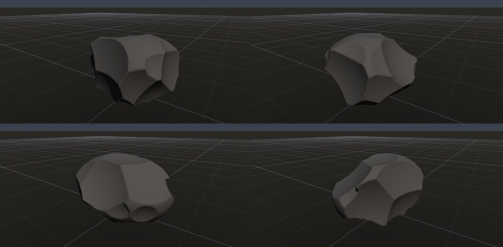
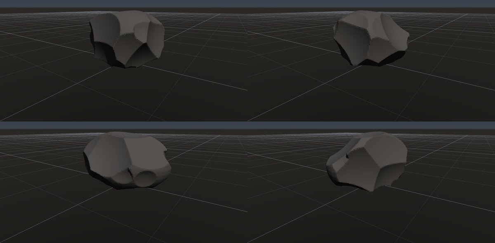

# 黒曜石・フリント

作成日時: 2026-10-01 12:50
更新日時: 2026-10-02 21:51

## 概要

黒曜石は火山ガラス、フリントは微細な石英からなる岩で、成り立ちも材質も異なる。ここでは両者に見られる、貝殻の内側のように湾曲した破断面を共通の形として扱う。滑らかなえぐれ、重なる剥離痕、鋭い縁が特徴で、黒曜石らしい光沢は形とは別に素材で表す。

[岩の研究ページ](../rocks.md) の 1 項目。分類: 形の骨格（成因・節理）。レシピは [`obsidian`](../../../examples/ai-recipes/obsidian.rockgraph)（アプリの「テンプレートから作成」から複製して開ける）。

## 今の状態

- 状態: ○（形）
- レシピ: [`obsidian`](../../../examples/ai-recipes/obsidian.rockgraph)
- 作り方: 楕円体を Plane Cuts の「曲がり」で切り、えぐれた貝殻状の剥離痕を重ねる。縁に局所の小さな剥離痕。
- 課題: ガラス質の見た目（素材）。剥離痕の同心円状のうねり（波紋）が無い。

## 今の形

4 方向（左上から 35°・125°・215°・305°、見下ろし 20°）を 2×2 にまとめたもの。`python tools/rock_research_shots.py obsidian` で撮り直す（latest.jpg を更新し、日時付きの経過の画像も残す）。

## 経過

何を変えて何が効いたか（効かなかったことも）。古い順。

- 2026-10-01 初版（G4 で Plane Cuts に曲がりを足した）。

## 経過の画像

撮った順。コミットの日時と件名（Git の履歴から取り出したもの）。

### 2026-10-01 12:47 docs: 岩の研究ページを作り、種類ごとのスクリーンショットと改善の履歴を載せる

### 2026-10-01 17:53 fix: 全体表示で原点ではなくメッシュの範囲の中心を見る

