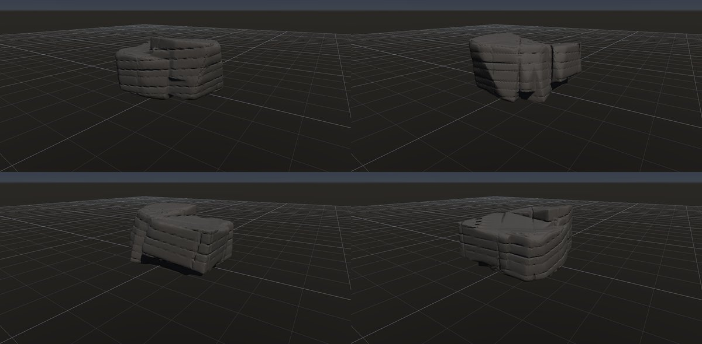
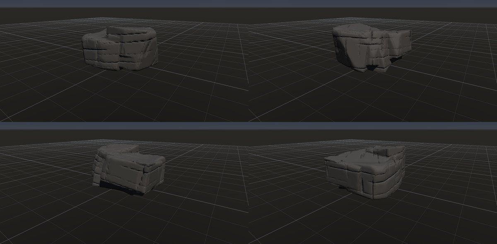
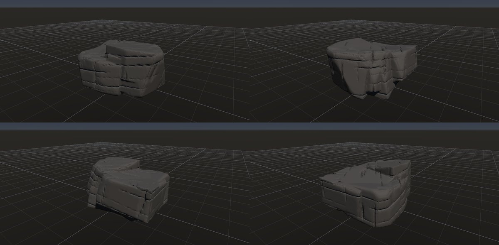
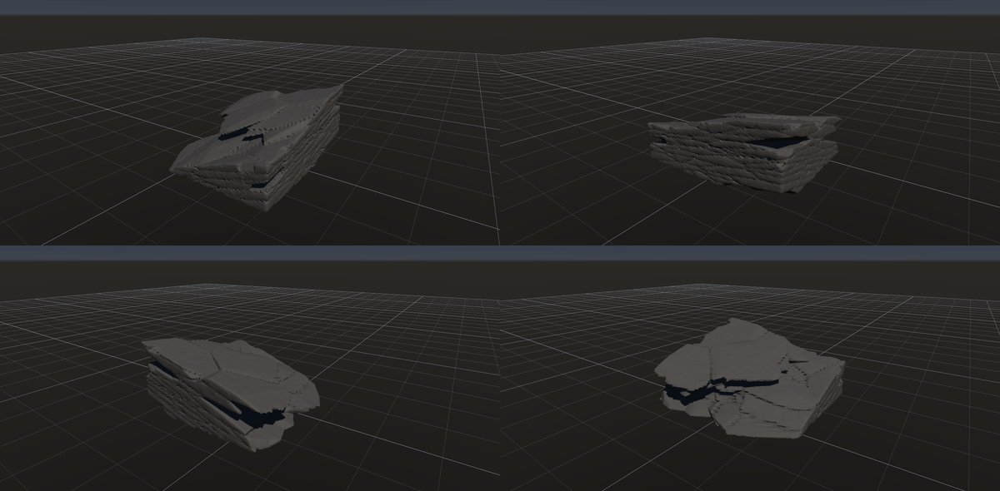

# 板状節理

作成日時: 2026-10-01 12:50
更新日時: 2026-10-03 04:00

[岩の研究ページ](../rocks.md) の 1 項目。分類: 形の骨格（成因・節理）。レシピは [`platy-joints`](../../../examples/ai-recipes/platy-joints.rockgraph)（アプリの「テンプレートから作成」から複製して開ける）。

## 今の状態

- 状態: △
- レシピ: [`platy-joints`](../../../examples/ai-recipes/platy-joints.rockgraph)
- 作り方: 割ってから欠く（`granite-buttress` と同じ考え方）。箱の岩体を、扁平に伸ばした点の Voronoi（伸長 [4, 0.45, 4]、座標系を 30° 傾ける）で不規則な板に割る。Scatter Points の密度のむらで割れの多い所と少ない芯を作り、接地の Peel（大きさの効き 0.5・安定 0.4）で外周から板を抜き取る。To Volume でまとめ、継ぎ目の隙間を Volume Close（幅）で埋め、局所の欠け・小面のノイズ・角の摩耗。薄い板の重なりは三角形が多い（約 70 万）ので Decimate で 12 万に減らす。
- 課題: 元の箱の面が一部に残る（芯が箱の端に寄った側。点の seed で変わる）。板の縁と継ぎ目がのこぎり状に見える所がある（傾いた薄い板と格子の段）。Peel の欠ける順序は Voronoi Fracture のノード ID にもよるので、ノードの ID を振り直すと形が変わる（ID を変えただけで全ての板が崩れたことがある）。

## 今の形

4 方向（左上から 35°・125°・215°・305°、見下ろし 20°）を 2×2 にまとめたもの。`python tools/rock_research_shots.py platy-joints` で撮り直す（latest.jpg を更新し、日時付きの経過の画像も残す）。

## 経過

何を変えて何が効いたか（効かなかったことも）。古い順。

- 2026-10-01 初版。最初は Box から始めて直方体が透けて見えたので、不規則な塊に変えた。
- 2026-10-01 Volume Crack の有限の割れ目を使った。以前は全面に同じ溝が通って土嚢を積んだように見えた。割れ目が途中で止まり、縦の節理が段違いになって石らしくなった。縦の節理の間隔は 0.9 → 0.5 m に詰めた。
- 2026-10-02 溝を彫る組み方をやめ、割ってから欠く組み方に作り直した。構造面（Parallel Planes の板と縦の節理）で割る案は、板が煉瓦のように揃ってまた石積みに見えた。扁平な点の Voronoi で割ると不規則な板が段になって張り出した。効いたのは密度のむら・Peel の大きさの効き・板の傾き。効かなかったこと: Peel に試作した「横からの侵食」（側面の露出で欠く順を決める）は、縁から内側へ横に食い込んで板が骨組みのように残り、取り消した。大きさの効きを下げると上から削れて平たくなった（高さ 1.8 → 0.8 m）。岩体を大きくすると箱の面がかえって広く残った。大きな波長のなめらかなノイズは薄い板を削り切った。板をずらす（Piece Transform のばらつき）と、傾いた板の継ぎ目が格子 1 つ分の隙間になって縁がのこぎり状になった。

## 経過の画像

撮った順。コミットの日時と件名（Git の履歴から取り出したもの）。

### 2026-10-01 12:47 docs: 岩の研究ページを作り、種類ごとのスクリーンショットと改善の履歴を載せる

### 2026-10-01 13:55 feat: Volume Crack に途中で止まる有限の割れ目を足す

### 2026-10-01 15:01 fix: To Volume で重なった立体の内部の距離を測り直し、Volume Noise の内部の値の跳びをなくす

### 2026-10-01 17:53 fix: 全体表示で原点ではなくメッシュの範囲の中心を見る

### 2026-10-02 00:37 feat: 板状節理を扁平な Voronoi の板に割ってから欠く形に作り直す

