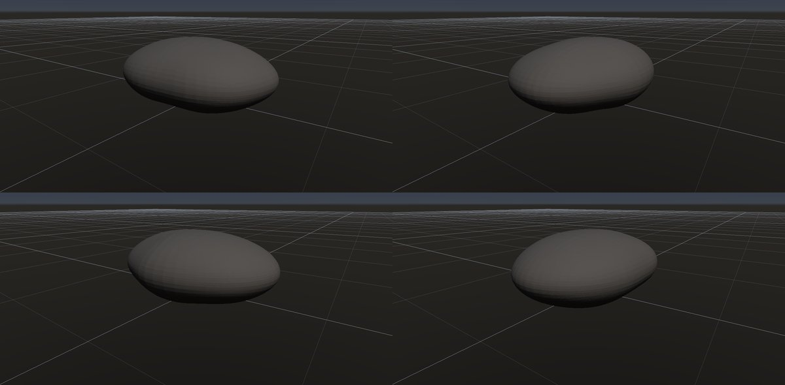

# 河原の丸石

作成日時: 2026-10-01 12:50
更新日時: 2026-10-02 21:51

## 概要

川で運ばれたり転がったりする間に角が摩耗した丸石。岩石の種類を表す名前ではなく、元の割れ方や岩質によって、扁平・細長い・いびつな形も残る。この研究では、なめらかな輪郭の中に弱い非対称性や平たい面を持つ、一個の河原の石を扱う。

[岩の研究ページ](../rocks.md) の 1 項目。分類: 形の骨格（成因・節理）。レシピは [`river-pebble`](../../../examples/ai-recipes/river-pebble.rockgraph)（アプリの「テンプレートから作成」から複製して開ける）。

## 今の状態

- 状態: ○
- レシピ: [`river-pebble`](../../../examples/ai-recipes/river-pebble.rockgraph)
- 作り方: 平たい楕円体（Base Shape）を弱いノイズで歪ませ、Marching Tetrahedra でなめらかに。
- 課題: 形が楕円体に近く単調。

## 今の形

4 方向（左上から 35°・125°・215°・305°、見下ろし 20°）を 2×2 にまとめたもの。`python tools/rock_research_shots.py river-pebble` で撮り直す（latest.jpg を更新し、日時付きの経過の画像も残す）。

## 経過

何を変えて何が効いたか（効かなかったことも）。古い順。

- 2026-10-01 初版。

## 経過の画像

撮った順。コミットの日時と件名（Git の履歴から取り出したもの）。

### 2026-10-01 12:47 docs: 岩の研究ページを作り、種類ごとのスクリーンショットと改善の履歴を載せる

### 2026-10-01 17:53 fix: 全体表示で原点ではなくメッシュの範囲の中心を見る

