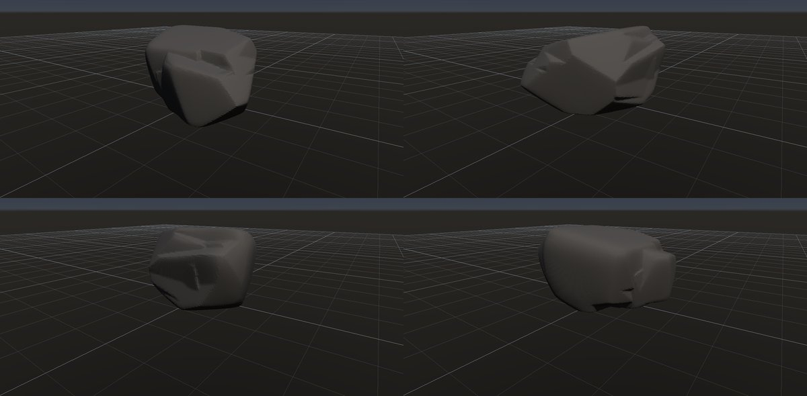
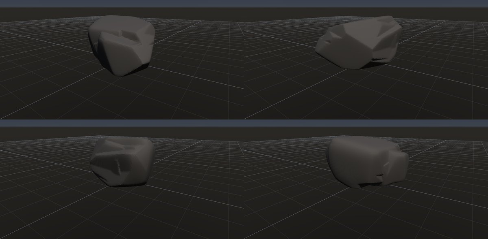
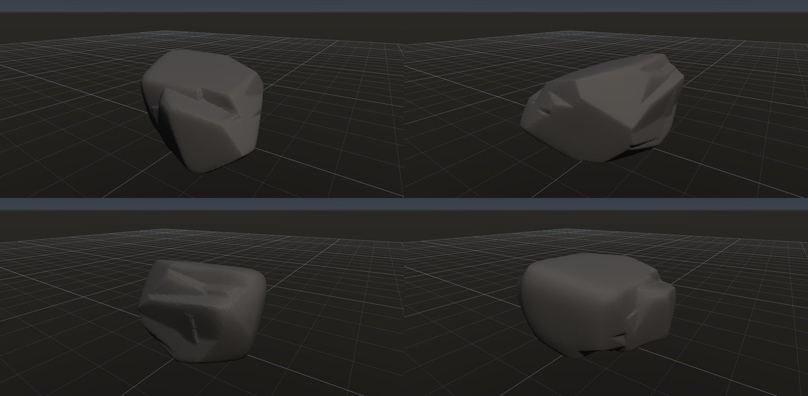

# 羊背岩

作成日時: 2026-10-01 12:50
更新日時: 2026-10-02 21:40

[岩の研究ページ](../rocks.md) の 1 項目。分類: 風化・侵食の形。レシピは [`roche-moutonnee`](../../../examples/ai-recipes/roche-moutonnee.rockgraph)（アプリの「テンプレートから作成」から複製して開ける）。

## 概要

氷河が岩盤の上を通り、擦って磨く作用と岩を剥ぎ取る作用によってできる非対称な岩の隆起。氷河が来る側はなだらかで滑らかになり、去る側には急で粗い面が残る。この研究では、この前後の形の違いと、表面を同じ方向に走る擦痕を特徴として捉える。[参考：NPSの氷河による侵食](https://www.nps.gov/features/romo/feat0001/GlcBasics.html)。

## 今の状態

- 状態: ○
- レシピ: [`roche-moutonnee`](../../../examples/ai-recipes/roche-moutonnee.rockgraph)
- 作り方: 角張った塊の上流側（-X と上）だけを、Volume Smooth と Edge Wear の「集中する向き」で丸める。
- 課題: 氷河の擦痕（細い平行な溝）。ボクセルのセルより細いので素材のハイトで表す必要がある。

## 今の形

4 方向（左上から 35°・125°・215°・305°、見下ろし 20°）を 2×2 にまとめたもの。`python tools/rock_research_shots.py roche-moutonnee` で撮り直す（latest.jpg を更新し、日時付きの経過の画像も残す）。

## 経過

何を変えて何が効いたか（効かなかったことも）。古い順。

- 2026-10-01 初版（G5 で集中する向きを足した）。丸めた面の縁に薄いヒレが出ていたので、向きの重みをぼかした場の法線で決めるように直した。

## 経過の画像

撮った順。コミットの日時と件名（Git の履歴から取り出したもの）。

### 2026-10-01 12:47 docs: 岩の研究ページを作り、種類ごとのスクリーンショットと改善の履歴を載せる

### 2026-10-01 15:01 fix: To Volume で重なった立体の内部の距離を測り直し、Volume Noise の内部の値の跳びをなくす

### 2026-10-01 17:53 fix: 全体表示で原点ではなくメッシュの範囲の中心を見る

