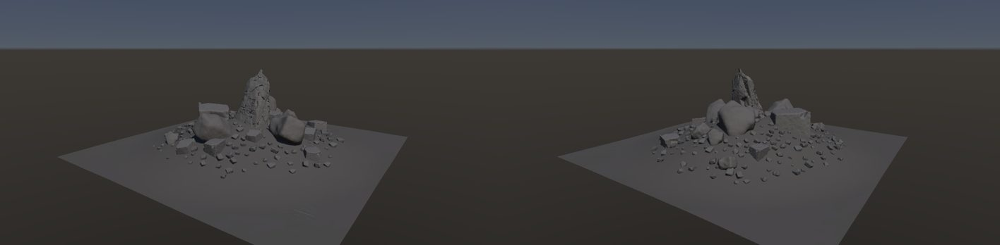

# 岩の集合体（rock cluster）

作成日時: 2026-10-03 07:45
更新日時: 2026-10-03 08:00

## 今の状態

- 状態: △（構成はできた。見た目はまだ岩場らしくない）
- グラフ: [examples/rock-cluster/cluster.mountaingraph](../../../examples/rock-cluster/cluster.mountaingraph)（山グラフ。岩グラフは同じフォルダの 4 つ）
- 手本: `docs/references/megascans/` の 2 枚（Git の対象外。2026-10-03 07:55 に画像を確認）。
  - `wd4icipcb_Thumb_HighPoly_thumb.jpg`（Megascans の露岩のアセット、長さ 10〜15 m・高さ 3〜5 m ほど）: **別々の岩が重なっているのではなく、1 つの岩盤が節理で割れたまま地面から露出している**。大きなブロック（1〜3 m）は向きがそろって互いに接し、まだ母岩についている。苔と草の地面が岩を包み、岩は地面に半分埋まる。ブロックの周りの窪みと裾に、同じ岩の破片（数 cm〜50 cm、角張った）が溜まる。
  - `Unreal+Engine_blog_…OneUnrealEngine…jpg`（Unreal Engine 5 の溶岩の岩場、幅 30〜50 m）: 角張ったブロック（1〜3 m）が節理に沿って積み重なった岩盤の塊（高さ 10 m ほど）、その手前に平らな岩の棚、斜面に転石、黒い土の地面。ブロックは同じ岩で、密に接し、互いに乗っている。手前は細かい砕石。
  - 同じフォルダの `taDvf`（長い尾根状の露岩と裾の破片）、`xetmcci`（苔の転石 2 個）、`felipe-pesantez-*`（砕石の地面の接写）も同じ系統。
- 手本から読めること（今の例との差）:
  1. 「大岩が数個重なる」の正体は**節理で割れた 1 つの岩盤**。別々の岩アセットを足元で食い込ませても、向きがばらばらで接触も無いので「置いた岩」に見える。核は 1 つの岩グラフ（幅広く低い母岩を 2 系統の節理で割り、弱い Peel で欠く。`granite-buttress` の横長版）で作り、Rock 1 個として深く沈めるのが筋。
  2. 地面が岩を包む。沈める量が大きい（0.3〜0.5）、地面に起伏と素材（土・苔・草）が要る。
  3. 破片は岩盤の**窪みと裾に密に**溜まり、離れると急に減る。大きさは数 cm〜50 cm と幅広い。被覆マスクを距離で広げるフィルタ（崖錐）と、小石の段の大きさの幅（倍率 0.1〜1）が要る。
  4. 大きさ: 1 ユニットは 10〜50 m。ブロック 1 個は 1〜3 m。今の例の岩峰（14 m）と丸い岩（8 m）は 1 個が大きすぎる。
- 作り方: 60 m 四方の中央が高い丘（Heightmap）に、高さの Shape Mask で大岩 5 個（岩峰 14 m、角張った岩 10 m、丸い岩 8 m）を頂へ寄せ、「大きさの間隔」0.45 で足元の円を食い込ませて重ねる。大の Coverage を反転し、丘の広い範囲のマスクと合わせて中（数 m）を周りに、さらに中の Coverage も避けて小石（1 m）を裾に散らす。
- 課題:
  - 大岩どうしは足元が食い込むだけで、互いに寄りかかる・乗り上げる形にはならない（置く点は地形の上で、岩の上には置けない）。
  - 中・小を「大岩からの距離」で寄せる手段が無く、高さのマスクで代用している。Mask Filter のぼかしは最大 1 m（表面の 3D 距離）なので、被覆マスクを数 m〜十数 m 広げられない。被覆を距離で広げるフィルタ（崖錐）が要る。
  - `blocky` の岩は 4 倍にするとサイコロに見える。十数 m 級の岩は岩峰のように専用のレシピが要る（丸い岩は 4 倍でも通る）。
  - 定数色の素材で灰色一色。地面は平らな板に見える（起伏と素材が要る）。
  - 岩峰を 1 個だけ置くと「岩峰 + 転石」で、手本の「岩盤が割れて露出している」感じとは違う。次は露岩（outcrop）のレシピ: 幅 12〜15 m・高さ 4〜6 m の横長の母岩を 2 系統の節理（吸着）で 1〜3 m のブロックに割り、Peel を弱く、Edge Wear で角を落とす。それを Rock 1 個として深く沈め、周りに崖錐を撒く。

## 今の形

## 経過

- 2026-10-03 07:45: 初版。`examples/rock-cluster/` に岩グラフ 4 つ（レシピ + Rock Asset の鎖）と山グラフを作り、`tools/rock_bake.py` で焼いて撮った。最初は高さのマスクが弱く（丘の peak 0.5、low 0.3）大岩が地面全体に散り、小石も一様だった。丘を 1 つの山（peak 0.9、高さ 8 m）にし、大は頂だけ（low 0.55）、中・小は丘の広い範囲（low 0.15）に寄せると、中央の塊と裾の小石に分かれた。大 5・中 14・小 213。

## 経過の画像

- 
