# 岩の研究ページ

作成日時: 2026-10-01 12:50
更新日時: 2026-10-01 13:40

「あらゆる種類の岩を作れること」を目標に、岩の種類ごとに今の出来・作り方・課題・改善の履歴を残すページ。一つずつ改善していく。足りないノードの整理（G 番号）は [岩の種類の網羅](../reference/rock-catalog.md)、組み方の手順は [skill](../../.claude/skills/rock-graph/SKILL.md)。

## 改善の進め方

1. 下の一覧から 1 種類を選ぶ（△ や × を優先）。
2. レシピ（`examples/ai-recipes/<名前>.rockgraph`）を直す。足りないノードがあれば、ノードを足すか直す。
3. `rock_cli eval` で数値（寸法・塊・空洞）を確かめ、`python tools/rock_research_shots.py <名前>` で画像を撮り直す。新しい種類のレシピを足したら、`examples/ai-recipes/templates.json` にも足す（アプリの「テンプレートから作成」に出る。テストが一覧とレシピ・画像の食い違いを検出する）。
4. この節の「状態」「課題」を書き換え、「履歴」に日付と何を変えたか（効いたこと・効かなかったこと）を追記する。[網羅](../reference/rock-catalog.md) の表の状態も合わせる。

レシピはどれも、アプリの「ファイル」→「テンプレートから作成…」（アセット欄の右クリックにもある）から複製して開ける。サムネイルはこのページの画像の左上の 1 方向。

画像はどれも 4 方向（左上から 35°・125°・215°・305°、見下ろし 20°）を 2×2 にまとめたもの。素材は付けていない（`gneiss` / `marble` だけ Surface の定数色）。

状態: ○ それらしく作れる / △ 作れるが不満が残る / × まだ作れない / 未 まだ試していない

## 一覧

| 岩 | 状態 | レシピ | 次に直したいこと |
| --- | --- | --- | --- |
| [塊状・節理で割れた岩](#塊状節理で割れた岩) | ○ | `blocky` | 節理面が大味 |
| [板状節理](#板状節理) | △ | `platy-joints` | 石積みの壁に見える・板の張り出しが無い |
| [柱状節理](#柱状節理玄武岩) | ○ | `columnar` | 柱の頭の形・風化 |
| [片理（結晶片岩）](#片理結晶片岩) | ○ | `schist` | 斜めの細溝のボクセルの段差 |
| [スレート・頁岩](#スレート頁岩) | ○ | `slate` | 板が浮いて見える所 |
| [層理の段](#層理の段) | ○ | `layered-ledges` | — |
| [崖錐の角張った岩片](#崖錐の角張った岩片) | ○ | `talus-fragment` | — |
| [河原の丸石](#河原の丸石) | ○ | `river-pebble` | 形が単調 |
| [丸い転石](#丸い転石) | ○ | `rounded-boulder` | — |
| [花崗岩のシーティング](#花崗岩のシーティング) | △ | `granite-sheeting` | 平らな面のボクセルの格子模様 |
| [花崗岩の岩峰](#花崗岩の岩峰) | △ | `granite-buttress` | 根元の塊が台座に見える・面が平らすぎる |
| [黒曜石・フリント](#黒曜石フリント) | ○ | `obsidian` | ガラス質の素材 |
| [礫岩](#礫岩) | ○ | `conglomerate` | 礫と基質の色の違い |
| [角礫岩](#角礫岩) | △ | `breccia` | 礫と基質の色の違い |
| [多孔質の溶岩](#多孔質の溶岩) | ○ | `vesicular-basalt` | — |
| [蜂の巣状の風化（タフォニ）](#蜂の巣状の風化タフォニ) | ○ | `honeycomb` | 陰の面に集中させる |
| [きのこ岩](#きのこ岩) | ○ | `mushroom-rock` | — |
| [フードゥー](#フードゥー) | ○ | `hoodoo` | 頂の硬い帽子岩 |
| [羊背岩](#羊背岩) | ○ | `roche-moutonnee` | 擦痕（素材のハイト） |
| [片麻岩](#片麻岩) | ○ | `gneiss` | 縞のシマウマ感 |
| [大理石](#大理石) | △ | `marble` | 網目の感じ |
| [玉ねぎ状風化・剥離ドーム](#玉ねぎ状風化剥離ドーム) | 未 | — | 丸い形に表面に沿う殻 |
| [石灰岩の溶食（縦溝）](#石灰岩の溶食縦溝) | × | — | 流下の溝のノード |
| [風食](#風食) | 未 | — | 集中する向きを風上へ |
| [枕状溶岩](#枕状溶岩) | 未 | — | — |
| [波食ノッチ](#波食ノッチ) | 未 | — | ワールドの高さで帯を指定 |
| [鉄錆・汚れの流れた筋](#鉄錆汚れの流れた筋) | × | — | 流れの方向のマスク |

---

## 形の骨格（成因・節理）

### 塊状・節理で割れた岩

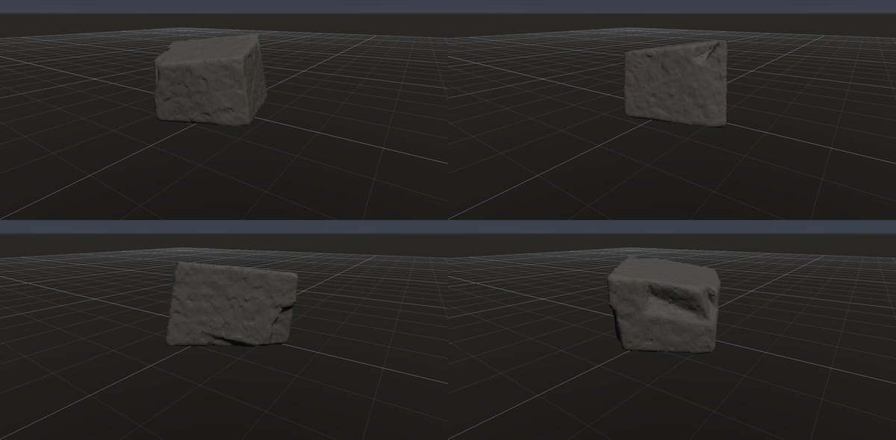

- 状態: ○
- レシピ: [`blocky`](../../examples/ai-recipes/blocky.rockgraph)
- 作り方: Random Boxes の塊を Plane Cuts（主方向 3 系統）で切って節理面を作り、Volume Clip の接地で据える。小面のノイズと Edge Wear。
- 課題: 節理面が大きく平らで大味。面の数が少なく、角の欠けが乏しい。
- 履歴:
  - 2026-10-01 初版。最初は Random Boxes が原点中心のまま高さ 0 で切って半分が消え、平たい板になった（→ Volume Clip に接地モードを足した）。

### 板状節理

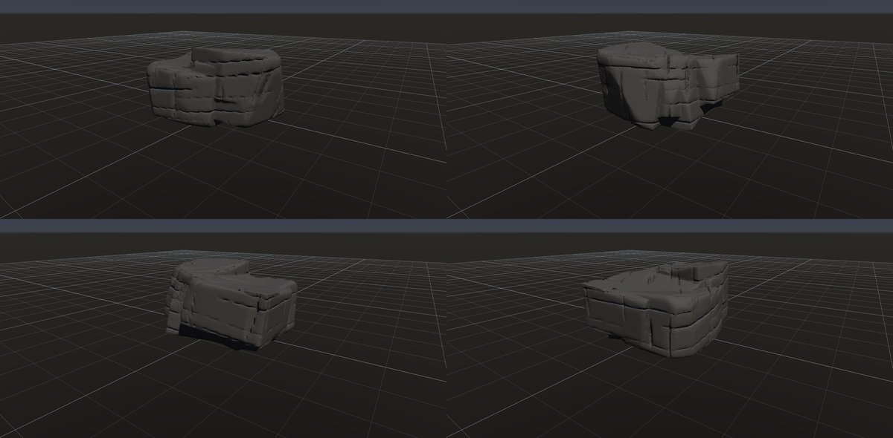

- 状態: △
- レシピ: [`platy-joints`](../../examples/ai-recipes/platy-joints.rockgraph)
- 作り方: 不規則な塊（Random Boxes）を緩く傾いた Parallel Planes の Volume Crack で浅く彫り、直交する縦の節理を足す。どちらも有限の割れ目（板の割れ目は長く途切れがち、縦の節理は短く段違い）。Volume Close で繋ぎ直す。
- 課題: 割れ目が途切れて土嚢のような縞は消えたが、まだ石積みの壁のように見える。板ごとの張り出し・欠けが無い。
- 履歴:
  - 2026-10-01 初版。最初は Box から始めて直方体が透けて見えたので、不規則な塊に変えた。
  - 2026-10-01 Volume Crack の有限の割れ目を使った。以前は全面に同じ溝が通って土嚢を積んだように見えた。割れ目が途中で止まり、縦の節理が段違いになって石らしくなった。縦の節理の間隔は 0.9 → 0.5 m に詰めた。

### 柱状節理（玄武岩）

- 状態: ○
- レシピ: [`columnar`](../../examples/ai-recipes/columnar.rockgraph)
- 作り方: Box を縦（Y）に 16 倍伸ばした Voronoi で多角柱に割り、外面に接する片を除いて断面の多角形を外周に出す。柱を細らせて隙間（節理）を作り、一部の柱を下げて高さをばらつかせる。
- 課題: 柱の頭が平らで新しすぎる。柱の側面に横方向の割れ目（柱の節）が無い。
- 履歴:
  - 2026-10-01 初版。既存のノードの組み合わせだけで作れた。

### 片理（結晶片岩）

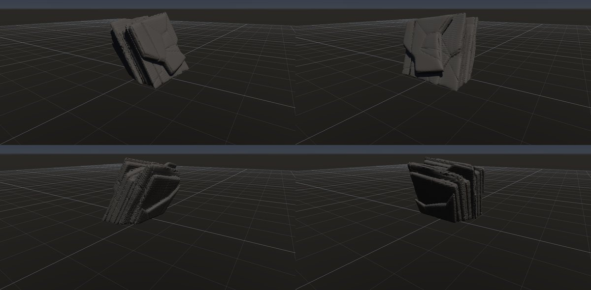

- 状態: ○
- レシピ: [`schist`](../../examples/ai-recipes/schist.rockgraph)
- 作り方: 薄い Layered Boxes を急傾斜に積み、同じ向きに伸ばした Voronoi で割って Peel で縁を欠く。同じ向きの Parallel Planes で浅い細溝、直交する面で節理。Volume Close で繋いでから Edge Wear。
- 課題: 斜めの細溝にボクセルの段差が出る（裏側で目立つ）。
- 履歴:
  - 2026-10-01 初版（`rock_flat_2` を参考に、最初に LLM が組んだ岩）。細溝で岩が 16 個の塊に分かれ、Edge Wear が最大の塊だけを残していた（→ 分かれた大きな塊を消さないように直した）。

### スレート・頁岩

- 状態: ○
- レシピ: [`slate`](../../examples/ai-recipes/slate.rockgraph)
- 作り方: 水平に近い薄い Layered Boxes（板厚 7 cm）を Peel で欠き、Volume Close で繋ぐ。
- 課題: 一部の板が浮いて見える。板の表面が平らすぎる。
- 履歴:
  - 2026-10-01 初版。

### 層理の段

- 状態: ○
- レシピ: [`layered-ledges`](../../examples/ai-recipes/layered-ledges.rockgraph)
- 作り方: Random Boxes の塊に Volume Terrace で水平に近い層の段。
- 課題: —
- 履歴:
  - 2026-10-01 初版。

### 崖錐の角張った岩片

- 状態: ○
- レシピ: [`talus-fragment`](../../examples/ai-recipes/talus-fragment.rockgraph)
- 作り方: 箱を大きな平面で強く切り（Plane Cuts）、局所の小さな欠けを多数。
- 課題: —
- 履歴:
  - 2026-10-01 初版。

### 河原の丸石

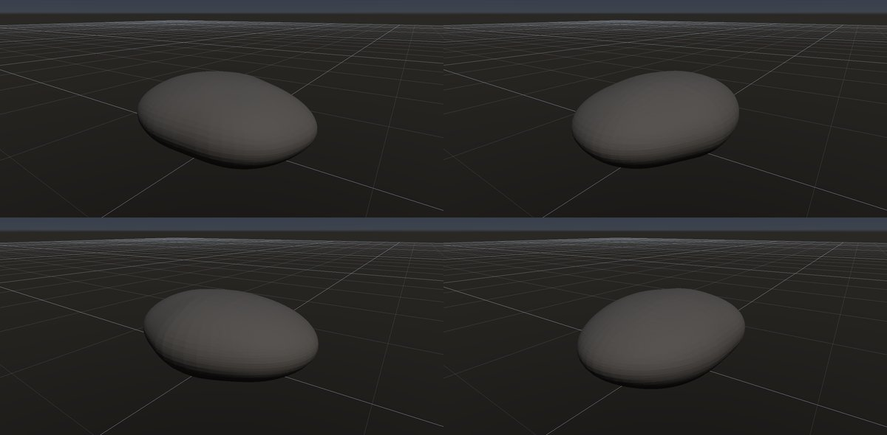

- 状態: ○
- レシピ: [`river-pebble`](../../examples/ai-recipes/river-pebble.rockgraph)
- 作り方: 平たい楕円体（Base Shape）を弱いノイズで歪ませ、Marching Tetrahedra でなめらかに。
- 課題: 形が楕円体に近く単調。
- 履歴:
  - 2026-10-01 初版。

### 丸い転石

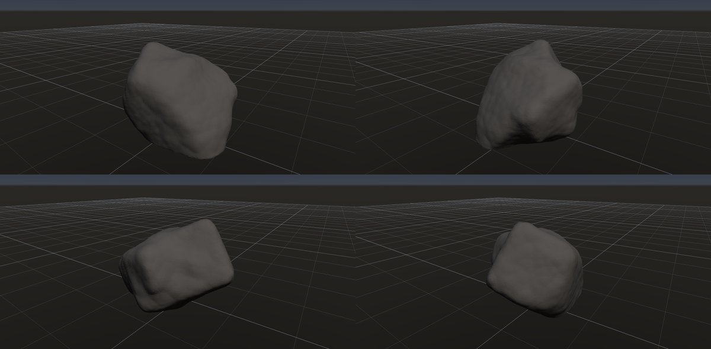

- 状態: ○
- レシピ: [`rounded-boulder`](../../examples/ai-recipes/rounded-boulder.rockgraph)
- 作り方: 塊に大きな面を少し作ってから Volume Smooth で丸め、セル状のノイズで浅いくぼみ。
- 課題: —
- 履歴:
  - 2026-10-01 初版。最初は原点中心の塊を切ってただのドーム形になった（→ 接地モード）。

### 花崗岩のシーティング

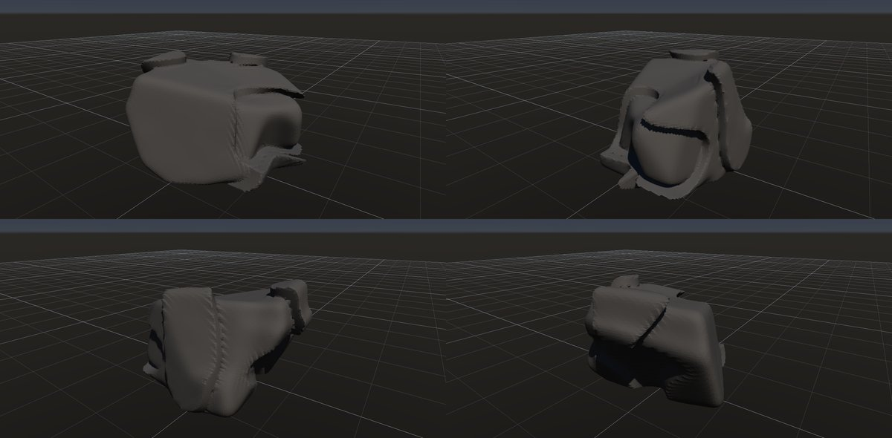

- 状態: △
- レシピ: [`granite-sheeting`](../../examples/ai-recipes/granite-sheeting.rockgraph)
- 作り方: 角張った塊に Volume Crack の割り方「表面に沿う殻」。外側の板がまだらに剥がれ落ちた段を作る。
- 課題: 剥がれた跡の平らな面にボクセルの格子模様が出る。段がもう少し厚く、縁が欠けているとよい。
- 履歴:
  - 2026-10-01 初版。最初の案（ならした距離場の等値面を殻にする）は、凸な形では殻が表面と交わらず、何も彫れなかった（体積が前後で同じだったことで気付いた）。外側の板の剥がれで見せる案に変えた。

### 花崗岩の岩峰

- 状態: △
- レシピ: [`granite-buttress`](../../examples/ai-recipes/granite-buttress.rockgraph)
- 手本: 木曽駒ケ岳（宝剣岳〜千畳敷）の花崗岩の岩峰。ユーザーが撮った写真（`docs/references/DSC08761`・`DSC08749`。Git の対象外）。急傾斜の節理で縦長の塔に割れ、凍結破砕で尖る。塔は同じ向きに傾き、根元でつながる。
- 作り方: 高さの違う塔 3 本を Random Boxes で別々に作り、それぞれ大きな平面（Plane Cuts の全体）で切って尖らせ、同じ傾きで並べて Volume Boolean の和でつなぐ。低い根元の塊も和にして大半を地面の下へ埋める。急傾斜（約 80°）と緩い横の Parallel Planes で浅い割れ目、節理と同じ 3 方向の局所の欠けで角を段状に落とす。高さ約 8.7 m。山グラフで斜面に撒く部品として使う想定。
- 課題: 根元の塊が見える向きでは台座に見える。塔の面が水晶のように平らすぎる向きがある。
- 履歴:
  - 2026-10-01 初版。縦長の塊 1 つを割れ目で塔に分ける案は、溝が格子に並んでレンガの柱になった（上が細らない）。全体を大きな平面で切ると高さが半分に縮んだ（水平に近い面が頂を削る）。塔を別々に作って和にする案に変えた。根元の塊を無くすと塔どうしが溶けて 1 つの塊になり、残して埋める形にした。割れ目は noise を上げると点線に途切れ、variation を下げると石積みの格子になるので、主な節理だけ幅を持たせ、横の節理は細く浅くした。
  - 2026-10-01 Volume Crack に有限の割れ目（長さ・割合・段違い）を足して使った。節理が途中で止まって段違いにずれ、格子の感じが減った。主な節理は間隔 1.1 → 0.7 m・長さ 0.3・割合 0.55・段違い 0.8、横の節理は長さ 0.15・割合 0.35。

### 黒曜石・フリント

- 状態: ○（形）
- レシピ: [`obsidian`](../../examples/ai-recipes/obsidian.rockgraph)
- 作り方: 楕円体を Plane Cuts の「曲がり」で切り、えぐれた貝殻状の剥離痕を重ねる。縁に局所の小さな剥離痕。
- 課題: ガラス質の見た目（素材）。剥離痕の同心円状のうねり（波紋）が無い。
- 履歴:
  - 2026-10-01 初版（G4 で Plane Cuts に曲がりを足した）。

## 堆積・火山の組織

### 礫岩

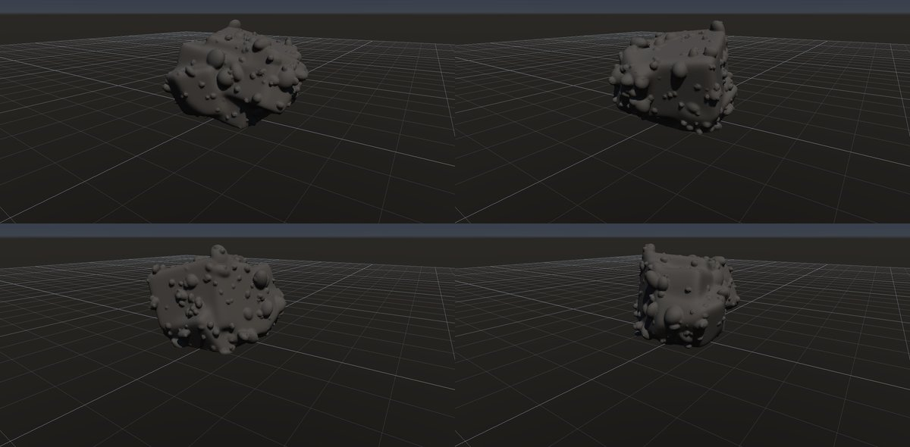

- 状態: ○（形）
- レシピ: [`conglomerate`](../../examples/ai-recipes/conglomerate.rockgraph)
- 作り方: 丸めた塊に Volume Scatter（楕円体・和）で大小の礫を半分ほど埋める。
- 課題: 礫と基質の色の違い（素材）。礫が少しイボのように見える。
- 履歴:
  - 2026-10-01 初版（G7 で Volume Scatter を足した）。

### 角礫岩

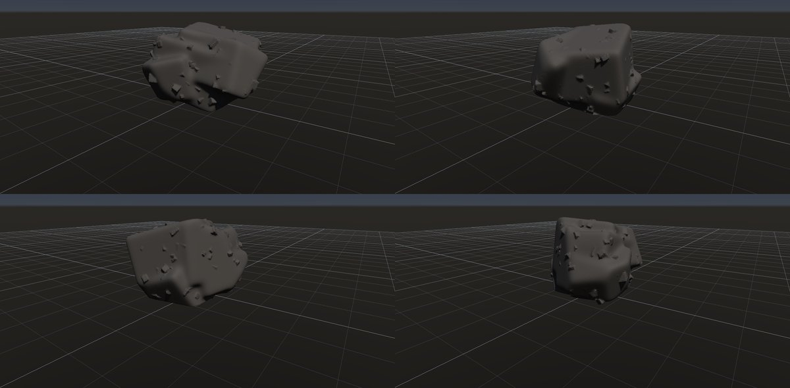

- 状態: △
- レシピ: [`breccia`](../../examples/ai-recipes/breccia.rockgraph)
- 作り方: 丸めた塊に Volume Scatter（箱・和）で角張った礫を浅く埋める。
- 課題: 形だけでは礫が見分けにくい。礫と基質の色の違い（素材）が要る。
- 履歴:
  - 2026-10-01 初版。最初は土台を丸めず、土台の薄い角が板のように突き出した。

### 多孔質の溶岩

- 状態: ○
- レシピ: [`vesicular-basalt`](../../examples/ai-recipes/vesicular-basalt.rockgraph)
- 作り方: 丸めた塊に Volume Scatter（楕円体・差）で気泡の穴を多数抜く。
- 課題: —
- 履歴:
  - 2026-10-01 初版。

## 風化・侵食の形

### 蜂の巣状の風化（タフォニ）

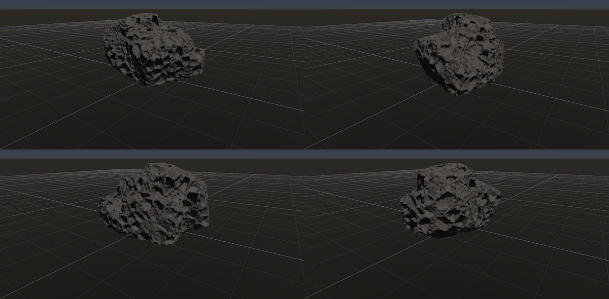

- 状態: ○
- レシピ: [`honeycomb`](../../examples/ai-recipes/honeycomb.rockgraph)
- 作り方: 丸めた塊に Volume Noise の種類「くぼみ」を粗・細の 2 段。
- 課題: 全面に均一に付く。実物は陰になる面や垂直な面に集中する。
- 履歴:
  - 2026-10-01 初版。最初は Volume Noise のセル状で、くぼみではなく泡状の膨らみになった（→ G1 で「くぼみ」を足した）。

### きのこ岩

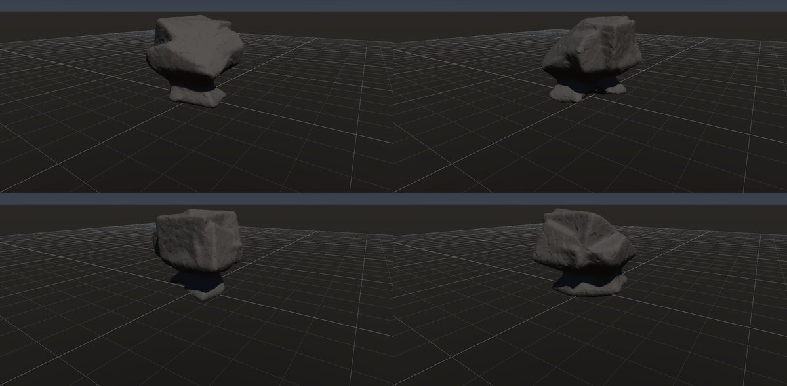

- 状態: ○
- レシピ: [`mushroom-rock`](../../examples/ai-recipes/mushroom-rock.rockgraph)
- 作り方: 接地させた塊の底の近くを Volume Undercut で削り、細い台座にする。
- 課題: —
- 履歴:
  - 2026-10-01 初版（G2 で Volume Undercut を足した）。最初は台座が断面ごと削り切られ、傘が宙に浮いたまま評価が成功した（→ 浮き・切り離しをエラーにした）。

### フードゥー

- 状態: ○
- レシピ: [`hoodoo`](../../examples/ai-recipes/hoodoo.rockgraph)
- 作り方: 縦長の塊に Volume Undercut の帯を 4 段重ね、Volume Terrace で層の筋。
- 課題: 頂に硬い帽子岩（キャップロック）が無い。
- 履歴:
  - 2026-10-01 初版。

### 羊背岩

- 状態: ○
- レシピ: [`roche-moutonnee`](../../examples/ai-recipes/roche-moutonnee.rockgraph)
- 作り方: 角張った塊の上流側（-X と上）だけを、Volume Smooth と Edge Wear の「集中する向き」で丸める。
- 課題: 氷河の擦痕（細い平行な溝）。ボクセルのセルより細いので素材のハイトで表す必要がある。
- 履歴:
  - 2026-10-01 初版（G5 で集中する向きを足した）。丸めた面の縁に薄いヒレが出ていたので、向きの重みをぼかした場の法線で決めるように直した。

### 玉ねぎ状風化・剥離ドーム

- 状態: 未
- 作り方の見込み: 丸い形に Volume Crack の「表面に沿う殻」（`granite-sheeting` の応用）。
- 履歴: —

### 石灰岩の溶食（縦溝）

- 状態: ×
- 課題: 斜面に沿って流れる丸い溝（リレンカレン）を作る手段が無い。鉛直の平面の割れ目では溝にならなかった。
- 履歴:
  - 2026-10-01 鉛直の Parallel Planes の浅い割れ目で試作し、溝がほとんど見えなかった。

### 風食

- 状態: 未
- 作り方の見込み: 「集中する向き」を風上へ（`roche-moutonnee` と同じ組み方）。
- 履歴: —

### 枕状溶岩

- 状態: 未
- 作り方の見込み: 丸めた袋状の塊を積む（Random Boxes を大きく丸める、Volume Boolean で足す）。
- 履歴: —

### 波食ノッチ

- 状態: 未
- 作り方の見込み: Volume Undercut の帯を 1 本。ただし今は形の高さに対する位置でしか指定できず、水面の高さ（ワールドの高さ）で決められない。
- 履歴: —

## 表面・色（素材）

### 片麻岩

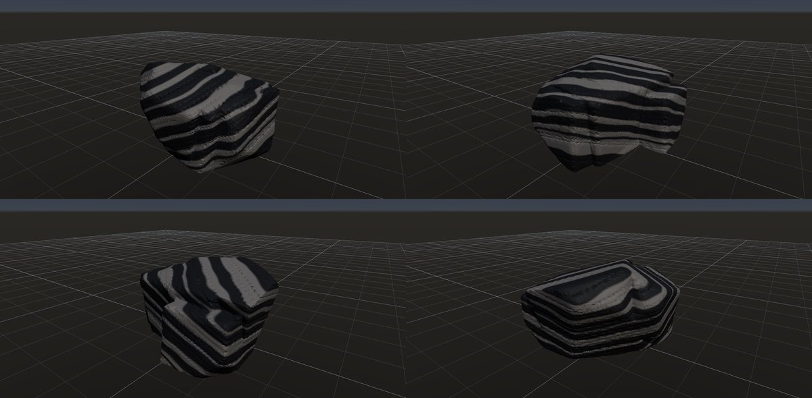

- 状態: ○
- レシピ: [`gneiss`](../../examples/ai-recipes/gneiss.rockgraph)
- 作り方: 同じ Parallel Planes で浅い割れ目と Structure Mask の縞を作り、暗い下地に明るい層を塗る（Surface の定数色）。
- 課題: 縞の幅がそろっていてシマウマ柄ぎみ。実物の縞は太さがばらつき、うねる。
- 履歴:
  - 2026-10-01 初版（G6 で Structure Mask を足した）。

### 大理石

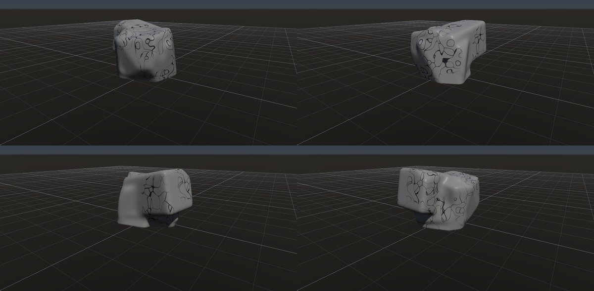

- 状態: △
- レシピ: [`marble`](../../examples/ai-recipes/marble.rockgraph)
- 作り方: 丸めた塊の白い下地に、Structure Mask の脈で暗い線を塗る。
- 課題: 網目（Voronoi の境界）の感じが残る。実物の脈は枝分かれし、太さが変わり、流れる向きがある。
- 履歴:
  - 2026-10-01 初版。最初は閉じた多角形の亀甲模様になった。ノイズで網目の一部だけを残すようにしたが、判定を逆に渡して「残す割合を上げると減る」不具合を作り、撮影で気付いて直した。

### 鉄錆・汚れの流れた筋

- 状態: ×
- 課題: 上から下へ流れた筋のマスク（流れの方向）が無い。
- 履歴: —
