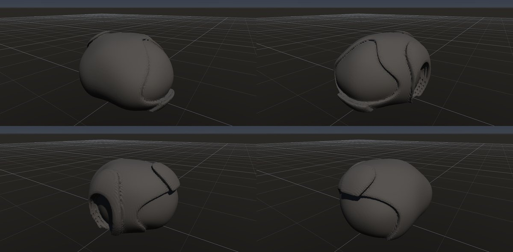
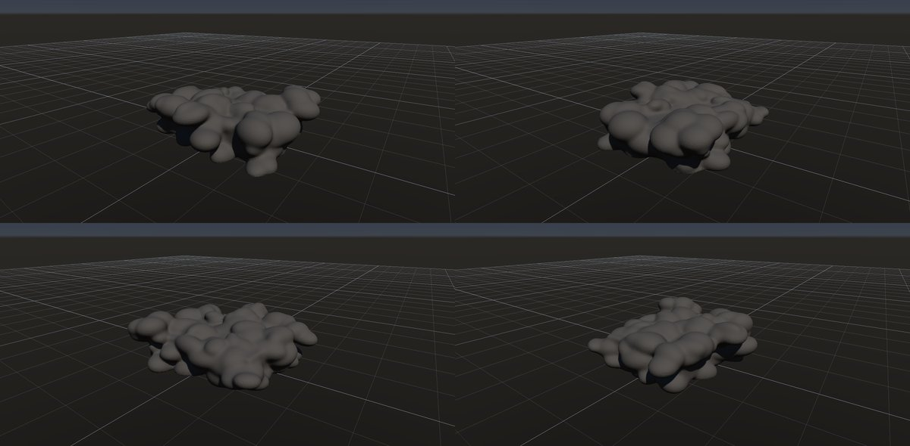
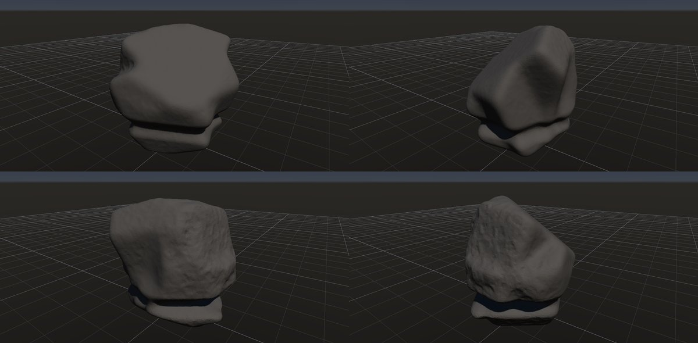
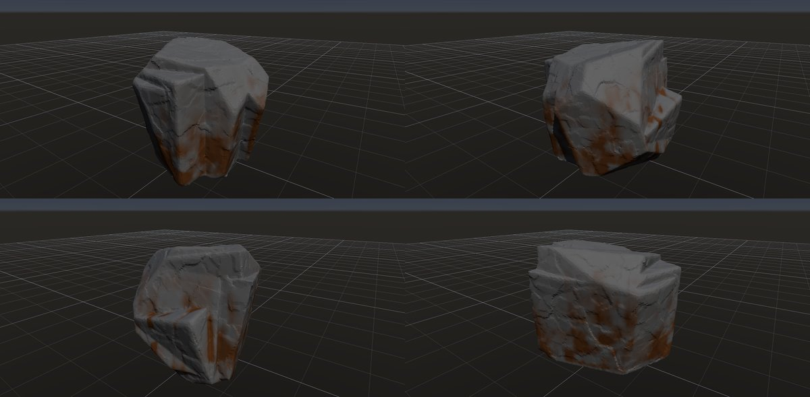

# 岩の研究ページ

作成日時: 2026-10-01 12:50
更新日時: 2026-10-03 00:10

「あらゆる種類の岩を作れること」を目標に、岩の種類ごとに今の出来・作り方・課題・改善の履歴を残すページ。一つずつ改善していく。足りないノードの整理（G 番号）は [岩の種類の網羅](../reference/rock-catalog.md)、組み方の手順は [skill](../../.agents/skills/rock-graph/SKILL.md)。

## 改善の進め方

1. 下の一覧から 1 種類を選ぶ（△ や × を優先）。
2. レシピ（`examples/ai-recipes/<名前>.rockgraph`）を直す。足りないノードがあれば、ノードを足すか直す。
3. `rock_cli eval` で数値（寸法・塊・空洞）を確かめ、`python tools/rock_research_shots.py <名前>` で画像を撮り直す。新しい種類のレシピを足したら、`examples/ai-recipes/templates.json` にも足す（アプリの「テンプレートから作成」に出る。テストが一覧とレシピ・画像の食い違いを検出する）。
4. この節の「状態」「課題」を書き換え、「履歴」に日付と何を変えたか（効いたこと・効かなかったこと）を追記する。[網羅](../reference/rock-catalog.md) の表の状態も合わせる。

レシピはどれも、アプリの「ファイル」→「テンプレートから作成…」（アセット欄の右クリックにもある）から複製して開ける。サムネイルはこのページの画像の左上の 1 方向。

画像はどれも 4 方向（左上から 35°・125°・215°・305°、見下ろし 20°）を 2×2 にまとめたもの。素材は付けていない（`gneiss` / `marble` だけ Surface の定数色）。

状態: ○ それらしく作れる / △ 作れるが不満が残る / × まだ作れない / 未 まだ試していない

## 一覧

| 岩 | 状態 | レシピ | 次に直したいこと |
| --- | --- | --- | --- |
| [塊状・節理で割れた岩](#塊状節理で割れた岩) | ○ | `blocky` | 節理面が大味 |
| [板状節理](#板状節理) | △ | `platy-joints` | 元の箱の面が一部残る・板の縁がのこぎり状 |
| [柱状節理](#柱状節理玄武岩) | ○ | `columnar` | 柱の頭の形・風化 |
| [片理（結晶片岩）](#片理結晶片岩) | ○ | `schist` | 斜めの細溝のボクセルの段差 |
| [スレート・頁岩](#スレート頁岩) | ○ | `slate` | 板が浮いて見える所 |
| [層理の段](#層理の段) | ○ | `layered-ledges` | — |
| [崖錐の角張った岩片](#崖錐の角張った岩片) | ○ | `talus-fragment` | — |
| [河原の丸石](#河原の丸石) | ○ | `river-pebble` | 形が単調 |
| [丸い転石](#丸い転石) | ○ | `rounded-boulder` | — |
| [花崗岩のシーティング](#花崗岩のシーティング) | △ | `granite-sheeting` | 平らな面のボクセルの格子模様 |
| [花崗岩の岩峰](#花崗岩の岩峰) | △ | `granite-buttress` | 裾に箱の四角い外周が残る |
| [黒曜石・フリント](#黒曜石フリント) | ○ | `obsidian` | ガラス質の素材 |
| [礫岩](#礫岩) | ○ | `conglomerate` | — |
| [角礫岩](#角礫岩) | ○ | `breccia` | 礫が基質に浮いて見える（礫どうしが接しない） |
| [多孔質の溶岩](#多孔質の溶岩) | ○ | `vesicular-basalt` | — |
| [蜂の巣状の風化（タフォニ）](#蜂の巣状の風化タフォニ) | ○ | `honeycomb` | — |
| [きのこ岩](#きのこ岩) | ○ | `mushroom-rock` | — |
| [フードゥー](#フードゥー) | ○ | `hoodoo` | 頂の硬い帽子岩 |
| [羊背岩](#羊背岩) | ○ | `roche-moutonnee` | 擦痕（素材のハイト） |
| [片麻岩](#片麻岩) | ○ | `gneiss` | 縞のシマウマ感 |
| [大理石](#大理石) | △ | `marble` | 網目の感じ |
| [玉ねぎ状風化・剥離ドーム](#玉ねぎ状風化剥離ドーム) | △ | `spheroidal-weathering` | 剥がれの縁の薄い板に穴が開く |
| [石灰岩の溶食（縦溝）](#石灰岩の溶食縦溝) | △ | `limestone-rills` | 溝が布のひだのよう。平行で細い溝にする |
| [風食](#風食) | △ | `wind-erosion` | 風上の面がえぐれて縁が残る。流線形にする |
| [枕状溶岩](#枕状溶岩) | △ | `pillow-lava` | 枕の表面の放射状の割れ目・ガラス質の縁 |
| [波食ノッチ](#波食ノッチ) | ○ | `wave-cut-notch` | 岩体の節理の面 |
| [鉄錆・汚れの流れた筋](#鉄錆汚れの流れた筋) | △ | `rust-streaks` | 筋が太くまだら。細く長い筋にする |

使い方の例（チュートリアル）は[末尾](#使い方の例)。岩の種類ではなく、ノードの組み方を見せる例。

---

## 形の骨格（成因・節理）

### 塊状・節理で割れた岩

- 状態: ○
- レシピ: [`blocky`](../../examples/ai-recipes/blocky.rockgraph)
- 作り方: Random Boxes の塊を Plane Cuts（主方向 3 系統）で切って節理面を作り、Volume Clip の接地で据える。小面のノイズと Edge Wear。
- 課題: 節理面が大きく平らで大味。面の数が少なく、角の欠けが乏しい。
- 履歴:
  - 2026-10-01 初版。最初は Random Boxes が原点中心のまま高さ 0 で切って半分が消え、平たい板になった（→ Volume Clip に接地モードを足した）。

### 板状節理

- 状態: △
- レシピ: [`platy-joints`](../../examples/ai-recipes/platy-joints.rockgraph)
- 作り方: 割ってから欠く（`granite-buttress` と同じ考え方）。箱の岩体を、扁平に伸ばした点の Voronoi（伸長 [4, 0.45, 4]、座標系を 30° 傾ける）で不規則な板に割る。Scatter Points の密度のむらで割れの多い所と少ない芯を作り、接地の Peel（大きさの効き 0.5・安定 0.4）で外周から板を抜き取る。To Volume でまとめ、継ぎ目の隙間を Volume Close（幅）で埋め、局所の欠け・小面のノイズ・角の摩耗。薄い板の重なりは三角形が多い（約 70 万）ので Decimate で 12 万に減らす。
- 課題: 元の箱の面が一部に残る（芯が箱の端に寄った側。点の seed で変わる）。板の縁と継ぎ目がのこぎり状に見える所がある（傾いた薄い板と格子の段）。Peel の欠ける順序は Voronoi Fracture のノード ID にもよるので、ノードの ID を振り直すと形が変わる（ID を変えただけで全ての板が崩れたことがある）。
- 履歴:
  - 2026-10-01 初版。最初は Box から始めて直方体が透けて見えたので、不規則な塊に変えた。
  - 2026-10-01 Volume Crack の有限の割れ目を使った。以前は全面に同じ溝が通って土嚢を積んだように見えた。割れ目が途中で止まり、縦の節理が段違いになって石らしくなった。縦の節理の間隔は 0.9 → 0.5 m に詰めた。
  - 2026-10-02 溝を彫る組み方をやめ、割ってから欠く組み方に作り直した。構造面（Parallel Planes の板と縦の節理）で割る案は、板が煉瓦のように揃ってまた石積みに見えた。扁平な点の Voronoi で割ると不規則な板が段になって張り出した。効いたのは密度のむら・Peel の大きさの効き・板の傾き。効かなかったこと: Peel に試作した「横からの侵食」（側面の露出で欠く順を決める）は、縁から内側へ横に食い込んで板が骨組みのように残り、取り消した。大きさの効きを下げると上から削れて平たくなった（高さ 1.8 → 0.8 m）。岩体を大きくすると箱の面がかえって広く残った。大きな波長のなめらかなノイズは薄い板を削り切った。板をずらす（Piece Transform のばらつき）と、傾いた板の継ぎ目が格子 1 つ分の隙間になって縁がのこぎり状になった。

### 柱状節理（玄武岩）

- 状態: ○
- レシピ: [`columnar`](../../examples/ai-recipes/columnar.rockgraph)
- 作り方: Box を縦（Y）に 16 倍伸ばした Voronoi で多角柱に割り、外面に接する片を除いて断面の多角形を外周に出す。柱を細らせて隙間（節理）を作り、一部の柱を下げて高さをばらつかせる。
- 課題: 柱の頭が平らで新しすぎる。柱の側面に横方向の割れ目（柱の節）が無い。
- 履歴:
  - 2026-10-01 初版。既存のノードの組み合わせだけで作れた。

### 片理（結晶片岩）

- 状態: ○
- レシピ: [`schist`](../../examples/ai-recipes/schist.rockgraph)
- 作り方: 薄い Layered Boxes を急傾斜に積み、同じ向きに伸ばした Voronoi で割って Peel で縁を欠く。同じ向きの Parallel Planes で浅い細溝、直交する面で節理。Volume Close で繋いでから Edge Wear。
- 課題: 斜めの細溝にボクセルの段差が出る（裏側で目立つ）。
- 履歴:
  - 2026-10-01 初版（`rock_flat_2` を参考に、最初に LLM が組んだ岩）。細溝で岩が 16 個の塊に分かれ、Edge Wear が最大の塊だけを残していた（→ 分かれた大きな塊を消さないように直した）。

### スレート・頁岩

- 状態: ○
- レシピ: [`slate`](../../examples/ai-recipes/slate.rockgraph)
- 作り方: 水平に近い薄い Layered Boxes（板厚 7 cm）を Peel で欠き、Volume Close で繋ぐ。
- 課題: 一部の板が浮いて見える。板の表面が平らすぎる。
- 履歴:
  - 2026-10-01 初版。

### 層理の段

- 状態: ○
- レシピ: [`layered-ledges`](../../examples/ai-recipes/layered-ledges.rockgraph)
- 作り方: Random Boxes の塊に Volume Terrace で水平に近い層の段。
- 課題: —
- 履歴:
  - 2026-10-01 初版。

### 崖錐の角張った岩片

- 状態: ○
- レシピ: [`talus-fragment`](../../examples/ai-recipes/talus-fragment.rockgraph)
- 作り方: 箱を大きな平面で強く切り（Plane Cuts）、局所の小さな欠けを多数。
- 課題: —
- 履歴:
  - 2026-10-01 初版。

### 河原の丸石

- 状態: ○
- レシピ: [`river-pebble`](../../examples/ai-recipes/river-pebble.rockgraph)
- 作り方: 平たい楕円体（Base Shape）を弱いノイズで歪ませ、Marching Tetrahedra でなめらかに。
- 課題: 形が楕円体に近く単調。
- 履歴:
  - 2026-10-01 初版。

### 丸い転石

- 状態: ○
- レシピ: [`rounded-boulder`](../../examples/ai-recipes/rounded-boulder.rockgraph)
- 作り方: 塊に大きな面を少し作ってから Volume Smooth で丸め、セル状のノイズで浅いくぼみ。
- 課題: —
- 履歴:
  - 2026-10-01 初版。最初は原点中心の塊を切ってただのドーム形になった（→ 接地モード）。

### 花崗岩のシーティング

- 状態: △
- レシピ: [`granite-sheeting`](../../examples/ai-recipes/granite-sheeting.rockgraph)
- 作り方: 角張った塊に Volume Crack の割り方「表面に沿う殻」。外側の板がまだらに剥がれ落ちた段を作る。
- 課題: 段がもう少し厚く、縁が欠けているとよい。剥がれた跡の面は内部の距離場の等値面なので、後段に Edge Wear を置くとわずかな粗さが強まり細かい縞になる（Edge Wear は殻より前に置く）。
- 履歴:
  - 2026-10-01 初版。最初の案（ならした距離場の等値面を殻にする）は、凸な形では殻が表面と交わらず、何も彫れなかった（体積が前後で同じだったことで気付いた）。外側の板の剥がれで見せる案に変えた。
  - 2026-10-01 Volume Crack の殻の不具合（内側の殻が剥がれない・剥がれた底の段）を直したら、内側の殻まで剥がれて深くえぐれたので、殻の枚数を 4 → 2 に減らした。格子模様のうち段の分は消えたが、斜めの縞が残った。
  - 2026-10-01 縞の原因を 3 つ直した。To Volume の重なった箱の内部の距離（箱の距離の最小で浅く歪む）を表面から測り直すようにし、Volume Noise の帯の境の値の跳びをなくし、Edge Wear を殻より前に移した（Edge Wear が剥がれた跡のわずかな粗さを強めていた）。縞はほぼ消えた。

### 花崗岩の岩峰

- 状態: △
- レシピ: [`granite-buttress`](../../examples/ai-recipes/granite-buttress.rockgraph)
- 手本: 木曽駒ケ岳（宝剣岳〜千畳敷）の花崗岩の岩峰。ユーザーが撮った写真（`docs/references/DSC08761`・`DSC08749`。Git の対象外）。急傾斜の節理で縦長の塔に割れ、凍結破砕で尖る。塔は同じ向きに傾き、根元でつながる。
- 作り方: 成因どおりに組む。大きめの岩体（Base Shape の箱）を、点の Voronoi で不規則な多面体のブロックに割る。分割の座標系を主な節理の向き（76°）に回し、伸長 [2.5, 1, 1.6] で節理面の方向に細長く・節理面に垂直に薄くする。Scatter Points の密度のむらで割れの多い帯と割れの少ない芯を作り、Piece Select の Peel（接地・大きさの効き）で外周の小さなブロックから抜き取る（凍結破砕。底からは欠かず、下のブロックに載っていない片は落ちる）。Piece Transform のばらつきでブロックを少しずつずらして傾け、To Volume でまとめる（ずれた隙間が段違いの継ぎ目になる）。局所の欠け・小面のノイズ・角の摩耗。割れの少ない芯が 1 本の塔として残る。Peel の「安定」で頭でっかちのブロックを落とす。上ほど細くするのは、Scatter Points の高さの勾配（上ほど節理が密で、頂が小さなブロックに割れる）と、Peel の側面の後退（上ほど長く側面から削られる。横へ削れる深さを頂で 4 m、底で 0 まで）。進行は 1 で、後退の上限まで削る。岩体は縦長の箱（10 × 15 × 8 m）、塔は高さ約 12.5 m で裾が広い。山グラフで斜面に撒く部品として使う想定。
- 課題: 裾に元の箱の四角い外周が残る所がある（底の後退が 0 のため）。ブロックの積み重なりが目立ち、一枚岩の塔らしさは弱い。塔は 1 本でよい（ユーザー判断）。
- 履歴:
  - 2026-10-01 初版。縦長の塊 1 つを割れ目で塔に分ける案は、溝が格子に並んでレンガの柱になった（上が細らない）。全体を大きな平面で切ると高さが半分に縮んだ（水平に近い面が頂を削る）。塔を別々に作って和にする案に変えた。根元の塊を無くすと塔どうしが溶けて 1 つの塊になり、残して埋める形にした。割れ目は noise を上げると点線に途切れ、variation を下げると石積みの格子になるので、主な節理だけ幅を持たせ、横の節理は細く浅くした。
  - 2026-10-01 Volume Crack に有限の割れ目（長さ・割合・段違い）を足して使った。節理が途中で止まって段違いにずれ、格子の感じが減った。主な節理は間隔 1.1 → 0.7 m・長さ 0.3・割合 0.55・段違い 0.8、横の節理は長さ 0.15・割合 0.35。
  - 2026-10-01 ユーザーの指摘（ひびが後付けに見える、構造から割れた感じが欲しい）で、組み方を作り直した。ひびを彫るのをやめ、節理で岩体をブロックに割って外側から抜き取る形にした。そのために Voronoi Fracture に Planes 入力（構造面で割る）、Parallel Planes に系統の連結、Peel に接地（底から欠かない・支えを失った片は落ちる）を足した。最初の Peel は底からも欠いて頭でっかちになり、次は頂のブロックが横の接触だけでぶら下がった。下のブロックに載っていることを支えの条件にして直した。
  - 2026-10-01 ユーザーの指摘（ブロックがそろいすぎて不自然。直方体ではなく、Voronoi のような多面体がずれている感じにしたい）で、構造面の分割を点の Voronoi に替えた。座標系を節理の向きに回して伸長し、節理の向きに細長い多面体にした。Piece Transform にばらつき（片ごとのずれ・傾き）を足してブロックをずらした。最初は元の箱の天面と側面が平らに残り石垣のように見えたので、岩体を奥行きも大きくして侵食を進めた。構造面で割る組み方（Voronoi Fracture の Planes 入力）は、層理・板状節理など規則的な割れ方の岩に使う。
  - 2026-10-01 ユーザーの指摘（塔のようなひと塊にまとまっていない）で、Scatter Points に密度のむら、Peel に大きさの効きを足した（割れの少ない所が硬い芯として残る、という成因）。最初は元の箱の天面が平らに残って箱に見えたので、岩体を縦長にし、大きさの効きを弱めて上からの侵食を進めた。進行を上げすぎると石を積んだケルンのように細くなった。楕円体の岩体は、メッシュが凸の判定（許容差 2e-7）を通らず使えなかった。
  - 2026-10-01 ユーザーの指摘（上に大きな塊が乗っていて重力に反して見える。上ほど細く鋭く尖るのが自然）で、Peel の接地に「安定」を足した。安定 0.3〜0.45 で細い尖塔、0.6 では裾の広いピラミッド形で高さ 9 m に下がった。0.45 を使った。
  - 2026-10-02 ユーザーの指摘（岩峰は上ほど細くなる。Voronoi の点を上ほど細かくしては）で、Scatter Points に高さの勾配を足した。勾配だけでは逆効果で、上の小さな片が大きさの効きで先に崩れて背が下がり（11.5 → 9〜10 m）、底の大きな片が箱型の裾に残った。Peel に「高さの効き」（上の片ほど横向きの露出面から先に欠く）を試したが、上の段が芯まで横に食われ背が 6〜7 m になり、取り消した。横へ削れる深さを高さに比例させる「側面の後退」で、裾が広く上ほど細い形になった（後退 3.5 m で 10.7 m）。高さの勾配 0.4 を足すと頂が小さな片で細く残り 12.5 m になった。後退があると進行は効かなくなる（上限で止まる）。

### 黒曜石・フリント

- 状態: ○（形）
- レシピ: [`obsidian`](../../examples/ai-recipes/obsidian.rockgraph)
- 作り方: 楕円体を Plane Cuts の「曲がり」で切り、えぐれた貝殻状の剥離痕を重ねる。縁に局所の小さな剥離痕。
- 課題: ガラス質の見た目（素材）。剥離痕の同心円状のうねり（波紋）が無い。
- 履歴:
  - 2026-10-01 初版（G4 で Plane Cuts に曲がりを足した）。

## 堆積・火山の組織

### 礫岩

- 状態: ○
- レシピ: [`conglomerate`](../../examples/ai-recipes/conglomerate.rockgraph)
- 作り方: 丸めた塊を接地してから Volume Scatter（楕円体・和）で大小の礫を半分ほど埋める。UV Unwrap の後、基質（砂色）を塗り、Volume Diff Mask（足した所。Before に接地後・礫を足す前の Volume、しきい値 0.008）で突き出た礫だけを灰色で塗る（Surface の定数色）。
- 課題: 礫が少しイボのように見える。
- 履歴:
  - 2026-10-01 初版（G7 で Volume Scatter を足した）。
  - 2026-10-02 礫と基質の色分けを Volume Diff Mask で付けた（新しいノードは不要だった）。接地を礫の前に移し、Before とメッシュの位置をそろえた。しきい値は小さい礫の突き出し（1.5 cm ほど）より小さくする。

### 角礫岩

- 状態: ○
- レシピ: [`breccia`](../../examples/ai-recipes/breccia.rockgraph)
- 作り方: 丸めた塊を接地してから Volume Scatter（箱・和、360 個）で角張った礫を浅く埋める。UV Unwrap の後、基質を塗り、Volume Diff Mask（足した所、しきい値 0.006）で突き出た角礫だけを暗い色で塗る。
- 課題: 礫どうしが接しないので、基質に礫が浮いて見える（実物の角礫岩は礫が密に接する）。
- 履歴:
  - 2026-10-01 初版。最初は土台を丸めず、土台の薄い角が板のように突き出した。
  - 2026-10-02 礫と基質の色分けを Volume Diff Mask で付け、礫を 160 → 360 個にした。

### 多孔質の溶岩

- 状態: ○
- レシピ: [`vesicular-basalt`](../../examples/ai-recipes/vesicular-basalt.rockgraph)
- 作り方: 丸めた塊に Volume Scatter（楕円体・差）で気泡の穴を多数抜く。
- 課題: —
- 履歴:
  - 2026-10-01 初版。

## 風化・侵食の形

### 蜂の巣状の風化（タフォニ）

- 状態: ○
- レシピ: [`honeycomb`](../../examples/ai-recipes/honeycomb.rockgraph)
- 作り方: 丸めた塊に Volume Noise の種類「くぼみ」を粗・細の 2 段。「向きに集中」で陰の面（-Z、やや下向き）に集め、日の当たる上面には付けない。
- 課題: —
- 履歴:
  - 2026-10-01 初版。最初は Volume Noise のセル状で、くぼみではなく泡状の膨らみになった（→ G1 で「くぼみ」を足した）。
  - 2026-10-02 Volume Noise に「向きに集中」を足し、陰の面にくぼみを集めた。上面は平滑なまま、片側だけが蜂の巣状になり、実物の分布に近づいた。

### きのこ岩

- 状態: ○
- レシピ: [`mushroom-rock`](../../examples/ai-recipes/mushroom-rock.rockgraph)
- 作り方: 接地させた塊の底の近くを Volume Undercut で削り、細い台座にする。
- 課題: —
- 履歴:
  - 2026-10-01 初版（G2 で Volume Undercut を足した）。最初は台座が断面ごと削り切られ、傘が宙に浮いたまま評価が成功した（→ 浮き・切り離しをエラーにした）。

### フードゥー

- 状態: ○
- レシピ: [`hoodoo`](../../examples/ai-recipes/hoodoo.rockgraph)
- 作り方: 縦長の塊に Volume Undercut の帯を 4 段重ね、Volume Terrace で層の筋。
- 課題: 頂に硬い帽子岩（キャップロック）が無い。
- 履歴:
  - 2026-10-01 初版。

### 羊背岩

- 状態: ○
- レシピ: [`roche-moutonnee`](../../examples/ai-recipes/roche-moutonnee.rockgraph)
- 作り方: 角張った塊の上流側（-X と上）だけを、Volume Smooth と Edge Wear の「集中する向き」で丸める。
- 課題: 氷河の擦痕（細い平行な溝）。ボクセルのセルより細いので素材のハイトで表す必要がある。
- 履歴:
  - 2026-10-01 初版（G5 で集中する向きを足した）。丸めた面の縁に薄いヒレが出ていたので、向きの重みをぼかした場の法線で決めるように直した。

### 玉ねぎ状風化・剥離ドーム

- 状態: △
- レシピ: [`spheroidal-weathering`](../../examples/ai-recipes/spheroidal-weathering.rockgraph)
- 作り方: 表面を少し揺らした楕円体（Base Shape）に、Volume Crack の「表面に沿う殻」を薄く 3 枚（間隔 0.03・剥がれ 0.6）。外側の殻ほどよく剥がれ、剥がれの縁に下の殻の割れ目が線として見える。剥離ドームは同じ組み方を大きな形で使う想定（未検証）。
- 課題: 剥がれの縁の薄い板に小さな穴が開く所がある。殻の厚さがどこも同じで、実物より規則的。
- 履歴:
  - 2026-10-01 初版。最初は表面全体に等高線のような縞が出た。原因は Volume Crack の殻の 2 つの不具合で、剥がれの処理が剥がれた底の面までしか値を直さず（底のすぐ下が元の深い値のまま）、さらにループが 1 枚目の殻で打ち切られて内側の殻が剥がれていなかった。直すと縞は消えた。Random Boxes を土台にすると、重なった箱の内部の面で殻の深さが歪むので、内部に面の無い Base Shape の楕円体にした。

### 石灰岩の溶食（縦溝）

- 状態: △
- レシピ: [`limestone-rills`](../../examples/ai-recipes/limestone-rills.rockgraph)
- 作り方: Random Boxes を Plane Cuts で割って傾いた大きな面を作り、丸めて接地。Volume Erode（流下。量 0.06、集中 4、筋の長さ 0.6、溝の幅 0.01、5 回、ばらつき 0.6・細かさ 16）で、表面を雨水が流れ下る筋を追って流れが集まる所を溝に彫る。細かいばらつきが筋を分けるきっかけになる。
- 課題: 溝が布のひだのように太くうねり、リレンカレンの細く平行な溝にならない。流れが集まる所を広く削るので、Plane Cuts の平らな面がなまって溶けたように見える。頂の尖り（ピナクル）は無い。
- 履歴:
  - 2026-10-01 鉛直の Parallel Planes の浅い割れ目で試作し、溝がほとんど見えなかった。
  - 2026-10-02 Volume Erode（流下）を足して溝を彫った。最初は底の縁に流れが溜まって段差になった（形の底で筋を終えるようにした）。集中 2 では全面が削れたので 3 にした。
  - 2026-10-02 集中 4・溝の幅 0.01・5 回・細かいばらつき（0.6、細かさ 16）にして、溝が少し細く縦に通るようになった。まだひだ状。

### 風食

- 状態: △
- レシピ: [`wind-erosion`](../../examples/ai-recipes/wind-erosion.rockgraph)
- 作り方: 風向き（-X から +X）に沿って細長い Random Boxes を Plane Cuts で割り、接地。Volume Erode（さらされた面。来る向き [-1, 0.15, 0]、量 0.14、集中 1.5、陰の距離 0.6、6 回）で風上の面を後退させ、角と縁を丸める。砂が最も当たる地面の近く（ワールドの高さ 0.3 m）を Volume Undercut（帯の基準 world）の帯で削り、細かなくぼみ（pits）を薄く、Edge Wear を風上に集中。
- 課題: 風上が斜めに削られた楔にはなるが、ヤルダンのような流線形（風上が鈍く丸く、風下へ細る）にはまだ遠い。足元の帯は目立たない。
- 履歴:
  - 2026-10-02 初版。Volume Edge Wear の量を 0.1 まで上げると、風上の面に不自然な角張った切れ込みと穴ができた（0.05 に戻した）。足元の帯の深さ 0.1 は岩を上下に切り離してエラーになった（0.075）。くぼみのノイズを全面に掛けると軽石のように見えるので薄くした。
  - 2026-10-02 Volume Erode を足して風上の面を後退させた。試作で 3 つの不具合を潰した: 向きを格子点の法線で読むと深い格子点ほど向きが違い段々になる（表面の点で読む）、重なった箱の内部の歪んだ距離が削った面に迷路のような段として出る（先に再距離化）、回の間に帯の外の内部の値が深いまま残って次の回の法線が壊れボクセルのゴミになる（両方向の再距離化）。量 0.14・集中 1.5 では面がえぐれすぎたので 0.1・1 にした。
  - 2026-10-02 Volume Noise の「向きに集中」で、くぼみ（pits）を風下（+X）に集めた（風上は砂で磨かれて平滑）。
  - 2026-10-02 えぐれの原因を切り分けた。Erode は立方体で一様に後退し角が丸まる正しい挙動で、くぼみは前段の Volume Smooth（向きに集中・半径 0.14）が面の中央を皿状にしていたもの（Smooth を外すと消えた）。Smooth を外し、Erode の重みを「横向きの面も半分削る」形にし、陰を 1 方向のレイから風上側 50° の円錐の開放度（16 本）に変えた（くぼみの中は閉じていて削れず、自己強化しない）。量 0.14・集中 1.5・6 回に戻した。

### 枕状溶岩

- 状態: △
- レシピ: [`pillow-lava`](../../examples/ai-recipes/pillow-lava.rockgraph)
- 作り方: 低い箱の台に、Volume Scatter（楕円体・和）で枕を 2 段（大 80 個・小 50 個）散らして覆う。「寝かせる割合」0.85 で枕の短い軸を上へ向け（自重で扁平になった袋）、なじませる幅 0.12 で下の枕に垂れたように繋ぐ。Volume Smooth を薄く掛け、接地。
- 課題: 枕の表面の放射状の割れ目とガラス質の縁（急冷縁）が無い。枕が丸すぎて、断面で見える「上に凸・下は下の枕の形に沿う」形の下側が出ない（なじませる幅で近づけているだけ）。壁状の露頭ではなく小さな山になる。
- 履歴:
  - 2026-10-02 初版。最初は球に近い楕円体が台の上に転がって泡のように見え、台の箱の角も見えた（→ Volume Scatter に「寝かせる割合」を足し、枕を増やして台を覆った）。なじませる幅 0.3 では枕が溶け合って輪郭が消えたので 0.12 にした。解像度 128 では突き出す分の格子が 256 点を超えたので 96。

### 波食ノッチ

- 状態: △
- レシピ: [`wave-cut-notch`](../../examples/ai-recipes/wave-cut-notch.rockgraph)
- 作り方: Random Boxes を Plane Cuts で割って丸め、先に接地。Volume Undercut の帯の基準を world にして、水面の高さ（ワールドの高さ 0.9 m）に帯を 1 本（幅 0.1・深さ 0.12・ばらつき 0.35）。水面の近くの小さなくぼみ（pits）を薄く掛け、Edge Wear。
- 課題: 岩体が丸く、海岸の岩の節理の面が弱い。
- 履歴:
  - 2026-10-02 初版。Volume Undercut に「帯の基準」（形の高さに対する位置 / ワールドの高さ）を足して作った。帯の幅・間隔は形の高さに対する比のまま。最初は Random Boxes 6 個・回転 12° で立方体に見えたので、9 個・回転 25°・Plane Cuts 16 面・Smooth 0.03 にした。
  - 2026-10-02 Volume Undercut と Volume Noise に「向きに集中」を足し、ノッチを波の当たる側（-X）だけ深く（集中 0.7・深さ 0.14）、くぼみも同じ側に集めた。全周に同じ深さの帯ではなくなり、○ にした。

## 表面・色（素材）

### 片麻岩

- 状態: ○
- レシピ: [`gneiss`](../../examples/ai-recipes/gneiss.rockgraph)
- 作り方: 同じ Parallel Planes で浅い割れ目と Structure Mask の縞を作り、暗い下地に明るい層を塗る（Surface の定数色）。
- 課題: 縞の幅がそろっていてシマウマ柄ぎみ。実物の縞は太さがばらつき、うねる。
- 履歴:
  - 2026-10-01 初版（G6 で Structure Mask を足した）。

### 大理石

- 状態: △
- レシピ: [`marble`](../../examples/ai-recipes/marble.rockgraph)
- 作り方: 丸めた塊の白い下地に、Structure Mask の脈で暗い線を塗る。
- 課題: 網目（Voronoi の境界）の感じが残る。実物の脈は枝分かれし、太さが変わり、流れる向きがある。
- 履歴:
  - 2026-10-01 初版。最初は閉じた多角形の亀甲模様になった。ノイズで網目の一部だけを残すようにしたが、判定を逆に渡して「残す割合を上げると減る」不具合を作り、撮影で気付いて直した。

### 鉄錆・汚れの流れた筋

- 状態: △
- レシピ: [`rust-streaks`](../../examples/ai-recipes/rust-streaks.rockgraph)
- 作り方: Random Boxes を Plane Cuts で割り、小面のノイズと Edge Wear、接地。Volume to Mesh → Decimate → UV Unwrap の後、灰色の下地を Apply Material し、錆色の Surface を Flow Mask（筋の長さ 0.6・幅 0.012・集中 1.5。Volume には接地後の Volume）× Noise Mask（Mask Combine の乗算、low 0.05・high 0.6）で塗る。
- 課題: 筋が太く、まだらが目立つ。実物の錆の筋は細く長く、鉄分の源（鉄の鉱物や節理）から始まる。筋の起点を指定する手段が無い。
- 履歴:
  - 2026-10-02 初版。Flow Mask を足して作った。最初は UV 展開後のメッシュを格子に変換しようとして「面の向きが不正」と診断された（→ Volume 入力を足し、接地後の Volume を繋ぐようにした）。

---

## 使い方の例

岩の種類ではなく、ノードの組み方を見せる例（チュートリアル）。テンプレートの一覧では「使い方の例」の分類に出る。ノードの note に手順を書いてある。

### 岩の隙間を土で埋める

- レシピ: [`soil-filled-gaps`](../../examples/ai-recipes/soil-filled-gaps.rockgraph)
- 手本: 那須朝日岳の、熱水変質した安山岩のブロックの間を土が埋めた露頭（ユーザーが撮った写真 `docs/references/nasu-asahidake/DSC00362`。Git の対象外）。
- 作り方: Voronoi で割ったブロックを Piece Transform のばらつきでずらして隙間を開け、接地させる（ここが土を詰める前の岩）。Volume Close（occlusion）で奥まった隙間を埋め、Volume Diff Mask（足した所、Before に接地の出力）で詰めた土だけを黄土色で塗る。
- 課題: Volume Close は遮蔽で埋めるので、オーバーハングの下も埋まる（上から落ちて溜まる土の形ではない）。
- 履歴:
  - 2026-10-02 初版。Volume Diff Mask を足して作った。最初は Close の距離 0.12・しきい値 0.6 で土が少なく（5.8 m³）、距離 0.25・しきい値 0.52・ブロックのずれを大きくして 10.7 m³ にした。土の色は詰めた所だけに付き、岩の面には漏れない。
