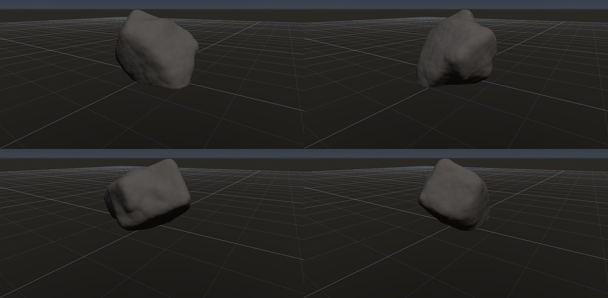
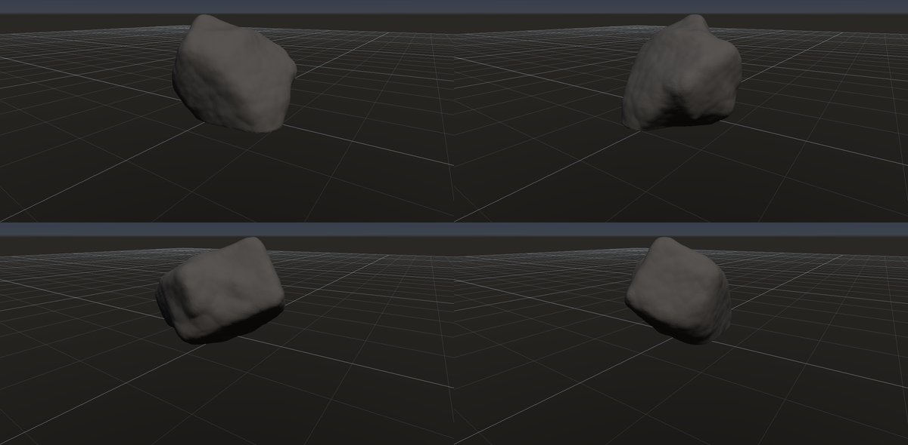

# 丸い転石

作成日時: 2026-10-01 12:50
更新日時: 2026-10-02 21:40

[岩の研究ページ](../rocks.md) の 1 項目。分類: 形の骨格（成因・節理）。レシピは [`rounded-boulder`](../../../examples/ai-recipes/rounded-boulder.rockgraph)（アプリの「テンプレートから作成」から複製して開ける）。

## 概要

風化や移動に伴う摩耗によって角が丸くなった、大きな独立した岩塊。丸さだけから成因は決められず、完全な球よりも、元の面や稜線を緩く残した形が対象になる。この研究では、重みのある非対称な輪郭、大きく滑らかな面、浅いくぼみを組み合わせる。

## 今の状態

- 状態: ○
- レシピ: [`rounded-boulder`](../../../examples/ai-recipes/rounded-boulder.rockgraph)
- 作り方: 塊に大きな面を少し作ってから Volume Smooth で丸め、セル状のノイズで浅いくぼみ。
- 課題: —

## 今の形

4 方向（左上から 35°・125°・215°・305°、見下ろし 20°）を 2×2 にまとめたもの。`python tools/rock_research_shots.py rounded-boulder` で撮り直す（latest.jpg を更新し、日時付きの経過の画像も残す）。

## 経過

何を変えて何が効いたか（効かなかったことも）。古い順。

- 2026-10-01 初版。最初は原点中心の塊を切ってただのドーム形になった（→ 接地モード）。

## 経過の画像

撮った順。コミットの日時と件名（Git の履歴から取り出したもの）。

### 2026-10-01 12:47 docs: 岩の研究ページを作り、種類ごとのスクリーンショットと改善の履歴を載せる

### 2026-10-01 15:01 fix: To Volume で重なった立体の内部の距離を測り直し、Volume Noise の内部の値の跳びをなくす

### 2026-10-01 17:53 fix: 全体表示で原点ではなくメッシュの範囲の中心を見る

