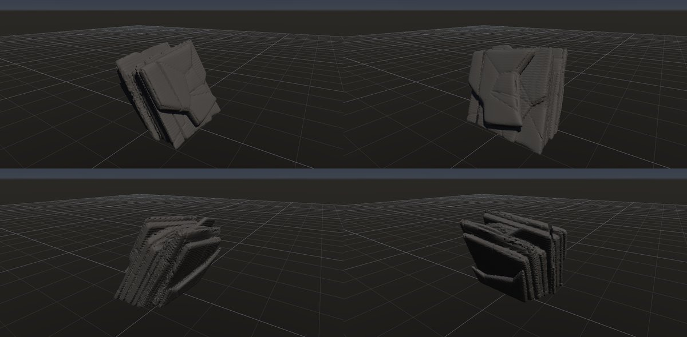

# 片理（結晶片岩）

作成日時: 2026-10-01 12:50
更新日時: 2026-10-02 21:51

## 概要

変成作用で雲母などの鉱物が一定の向きに並び、片理と呼ばれる面構造が発達した岩。割れやすい向きがあり、薄片状の縁や、うねる面が目立つ。この研究では、同じ向きに連なる薄い岩片と、それを横切る割れ目が作る形を扱う。[参考：NPSの結晶片岩](https://www.nps.gov/blca/learn/nature/minerals.htm)。

[岩の研究ページ](../rocks.md) の 1 項目。分類: 形の骨格（成因・節理）。レシピは [`schist`](../../../examples/ai-recipes/schist.rockgraph)（アプリの「テンプレートから作成」から複製して開ける）。

## 今の状態

- 状態: ○
- レシピ: [`schist`](../../../examples/ai-recipes/schist.rockgraph)
- 作り方: 薄い Layered Boxes を急傾斜に積み、同じ向きに伸ばした Voronoi で割って Peel で縁を欠く。同じ向きの Parallel Planes で浅い細溝、直交する面で節理。Volume Close で繋いでから Edge Wear。
- 課題: 斜めの細溝にボクセルの段差が出る（裏側で目立つ）。

## 今の形

4 方向（左上から 35°・125°・215°・305°、見下ろし 20°）を 2×2 にまとめたもの。`python tools/rock_research_shots.py schist` で撮り直す（latest.jpg を更新し、日時付きの経過の画像も残す）。

## 経過

何を変えて何が効いたか（効かなかったことも）。古い順。

- 2026-10-01 初版（`rock_flat_2` を参考に、最初に LLM が組んだ岩）。細溝で岩が 16 個の塊に分かれ、Edge Wear が最大の塊だけを残していた（→ 分かれた大きな塊を消さないように直した）。

## 経過の画像

撮った順。コミットの日時と件名（Git の履歴から取り出したもの）。

### 2026-10-01 12:47 docs: 岩の研究ページを作り、種類ごとのスクリーンショットと改善の履歴を載せる

### 2026-10-01 17:53 fix: 全体表示で原点ではなくメッシュの範囲の中心を見る

