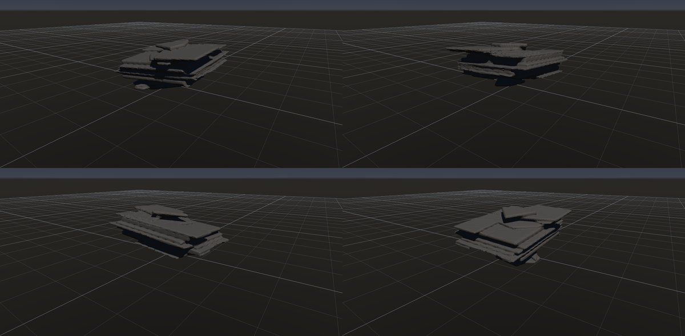
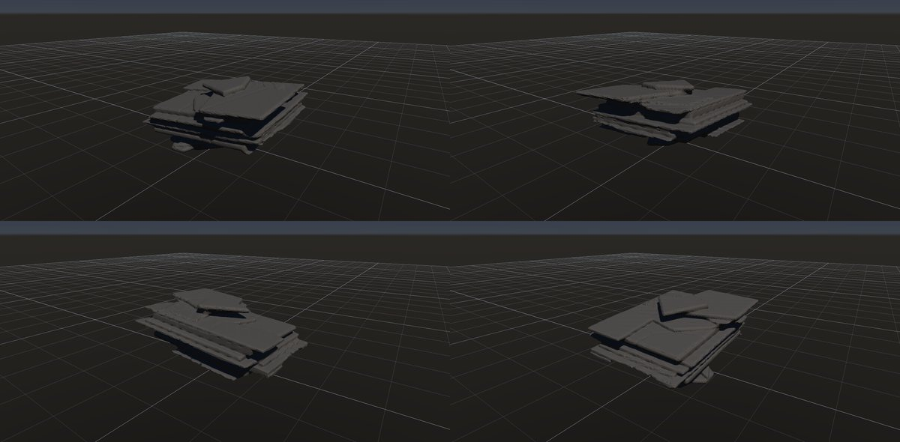

# スレート・頁岩

作成日時: 2026-10-01 12:50
更新日時: 2026-10-02 21:51

## 概要

頁岩は泥などが固まった堆積岩、スレート（粘板岩）は変成作用による劈開に沿って薄板状に割れやすい岩で、板になる理由は異なる。この研究では共通する薄い板状の外観を対象に、平らな広い面、不ぞろいな板の縁、段違いの重なりを扱う。[参考：BGSのスレート](https://webapps.bgs.ac.uk/bgsrcs/rcs_details.cfm?code=SLTE)。

[岩の研究ページ](../rocks.md) の 1 項目。分類: 形の骨格（成因・節理）。レシピは [`slate`](../../../examples/ai-recipes/slate.rockgraph)（アプリの「テンプレートから作成」から複製して開ける）。

## 今の状態

- 状態: ○
- レシピ: [`slate`](../../../examples/ai-recipes/slate.rockgraph)
- 作り方: 水平に近い薄い Layered Boxes（板厚 7 cm）を Peel で欠き、Volume Close で繋ぐ。
- 課題: 一部の板が浮いて見える。板の表面が平らすぎる。

## 今の形

4 方向（左上から 35°・125°・215°・305°、見下ろし 20°）を 2×2 にまとめたもの。`python tools/rock_research_shots.py slate` で撮り直す（latest.jpg を更新し、日時付きの経過の画像も残す）。

## 経過

何を変えて何が効いたか（効かなかったことも）。古い順。

- 2026-10-01 初版。

## 経過の画像

撮った順。コミットの日時と件名（Git の履歴から取り出したもの）。

### 2026-10-01 12:47 docs: 岩の研究ページを作り、種類ごとのスクリーンショットと改善の履歴を載せる

### 2026-10-01 17:53 fix: 全体表示で原点ではなくメッシュの範囲の中心を見る

