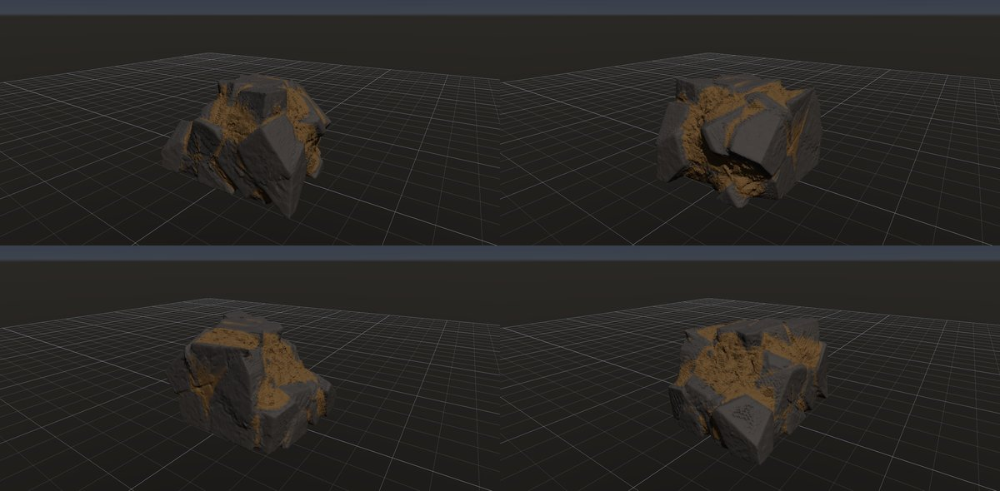

# 岩の隙間を土で埋める

作成日時: 2026-10-01 12:50
更新日時: 2026-10-03 04:00

[岩の研究ページ](../rocks.md) の 1 項目。分類: 使い方の例。レシピは [`soil-filled-gaps`](../../../examples/ai-recipes/soil-filled-gaps.rockgraph)（アプリの「テンプレートから作成」から複製して開ける）。

## 今の状態

- レシピ: [`soil-filled-gaps`](../../../examples/ai-recipes/soil-filled-gaps.rockgraph)
- 手本: 那須朝日岳の、熱水変質した安山岩のブロックの間を土が埋めた露頭（ユーザーが撮った写真 `docs/references/nasu-asahidake/DSC00362`。Git の対象外）。
- 作り方: Voronoi で割ったブロックを Piece Transform のばらつきでずらして隙間を開け、接地させる（ここが土を詰める前の岩）。Volume Close（occlusion）で奥まった隙間を埋め、Volume Diff Mask（足した所、Before に接地の出力）で詰めた土だけを黄土色で塗る。
- 課題: Volume Close は遮蔽で埋めるので、オーバーハングの下も埋まる（上から落ちて溜まる土の形ではない）。

## 今の形

4 方向（左上から 35°・125°・215°・305°、見下ろし 20°）を 2×2 にまとめたもの。`python tools/rock_research_shots.py soil-filled-gaps` で撮り直す（latest.jpg を更新し、日時付きの経過の画像も残す）。

## 経過

何を変えて何が効いたか（効かなかったことも）。古い順。

- 2026-10-02 初版。Volume Diff Mask を足して作った。最初は Close の距離 0.12・しきい値 0.6 で土が少なく（5.8 m³）、距離 0.25・しきい値 0.52・ブロックのずれを大きくして 10.7 m³ にした。土の色は詰めた所だけに付き、岩の面には漏れない。

## 経過の画像

撮った順。コミットの日時と件名（Git の履歴から取り出したもの）。

### 2026-10-02 05:42 feat: 後から足した所のマスク Volume Diff Mask と、使い方の例のテンプレートを足す

