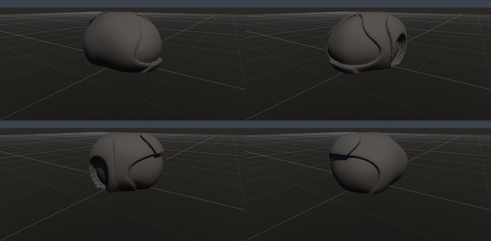
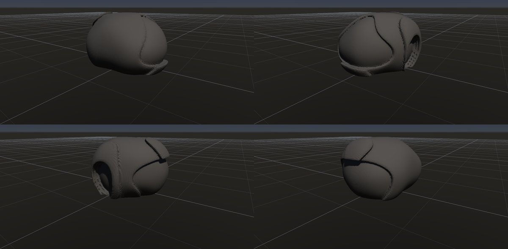

# 玉ねぎ状風化・剥離ドーム

作成日時: 2026-10-01 12:50
更新日時: 2026-10-02 21:51

## 概要

岩塊の外側から風化が進み、丸い芯の周囲に玉ねぎの皮のような層や剥離が現れる姿を扱う。特徴は、丸い全体形と、外側の殻が部分的に剥がれた段差。このページでは大きな剥離ドームも造形上の比較対象にするが、球状風化と大規模なシーティングを同じ成因とはみなさない。[参考：USGSの球状風化研究](https://pubs.usgs.gov/pp/0575c/report.pdf)、[剥離ドームの解説](https://www.usgs.gov/geology-and-ecology-of-national-parks/geology-yosemite-national-park)。

[岩の研究ページ](../rocks.md) の 1 項目。分類: 風化・侵食の形。レシピは [`spheroidal-weathering`](../../../examples/ai-recipes/spheroidal-weathering.rockgraph)（アプリの「テンプレートから作成」から複製して開ける）。

## 今の状態

- 状態: △
- レシピ: [`spheroidal-weathering`](../../../examples/ai-recipes/spheroidal-weathering.rockgraph)
- 作り方: 表面を少し揺らした楕円体（Base Shape）に、Volume Crack の「表面に沿う殻」を薄く 3 枚（間隔 0.03・剥がれ 0.6）。外側の殻ほどよく剥がれ、剥がれの縁に下の殻の割れ目が線として見える。剥離ドームは同じ組み方を大きな形で使う想定（未検証）。
- 課題: 剥がれの縁の薄い板に小さな穴が開く所がある。殻の厚さがどこも同じで、実物より規則的。

## 今の形

4 方向（左上から 35°・125°・215°・305°、見下ろし 20°）を 2×2 にまとめたもの。`python tools/rock_research_shots.py spheroidal-weathering` で撮り直す（latest.jpg を更新し、日時付きの経過の画像も残す）。

## 経過

何を変えて何が効いたか（効かなかったことも）。古い順。

- 2026-10-01 初版。最初は表面全体に等高線のような縞が出た。原因は Volume Crack の殻の 2 つの不具合で、剥がれの処理が剥がれた底の面までしか値を直さず（底のすぐ下が元の深い値のまま）、さらにループが 1 枚目の殻で打ち切られて内側の殻が剥がれていなかった。直すと縞は消えた。Random Boxes を土台にすると、重なった箱の内部の面で殻の深さが歪むので、内部に面の無い Base Shape の楕円体にした。

## 経過の画像

撮った順。コミットの日時と件名（Git の履歴から取り出したもの）。

### 2026-10-01 14:29 fix: Volume Crack の殻の剥がれが縞になる・内側の殻が剥がれない不具合を直す

### 2026-10-01 15:01 fix: To Volume で重なった立体の内部の距離を測り直し、Volume Noise の内部の値の跳びをなくす

### 2026-10-01 17:53 fix: 全体表示で原点ではなくメッシュの範囲の中心を見る

