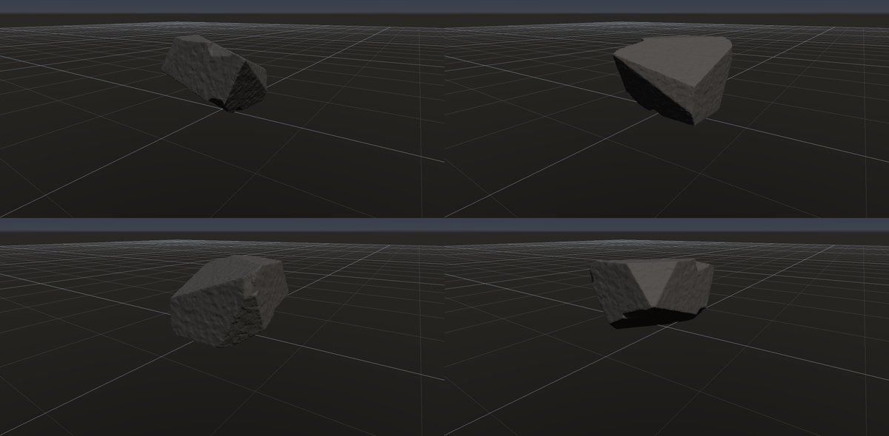
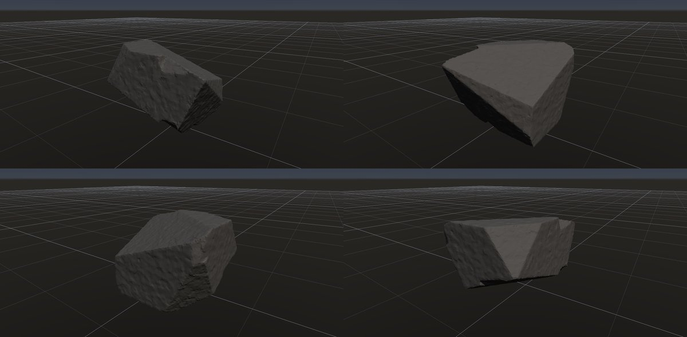

# 崖錐の角張った岩片

作成日時: 2026-10-01 12:50
更新日時: 2026-10-03 04:00

[岩の研究ページ](../rocks.md) の 1 項目。分類: 形の骨格（成因・節理）。レシピは [`talus-fragment`](../../../examples/ai-recipes/talus-fragment.rockgraph)（アプリの「テンプレートから作成」から複製して開ける）。

## 今の状態

- 状態: ○
- レシピ: [`talus-fragment`](../../../examples/ai-recipes/talus-fragment.rockgraph)
- 作り方: 箱を大きな平面で強く切り（Plane Cuts）、局所の小さな欠けを多数。
- 課題: —

## 今の形

4 方向（左上から 35°・125°・215°・305°、見下ろし 20°）を 2×2 にまとめたもの。`python tools/rock_research_shots.py talus-fragment` で撮り直す（latest.jpg を更新し、日時付きの経過の画像も残す）。

## 経過

何を変えて何が効いたか（効かなかったことも）。古い順。

- 2026-10-01 初版。

## 経過の画像

撮った順。コミットの日時と件名（Git の履歴から取り出したもの）。

### 2026-10-01 12:47 docs: 岩の研究ページを作り、種類ごとのスクリーンショットと改善の履歴を載せる

### 2026-10-01 17:53 fix: 全体表示で原点ではなくメッシュの範囲の中心を見る

