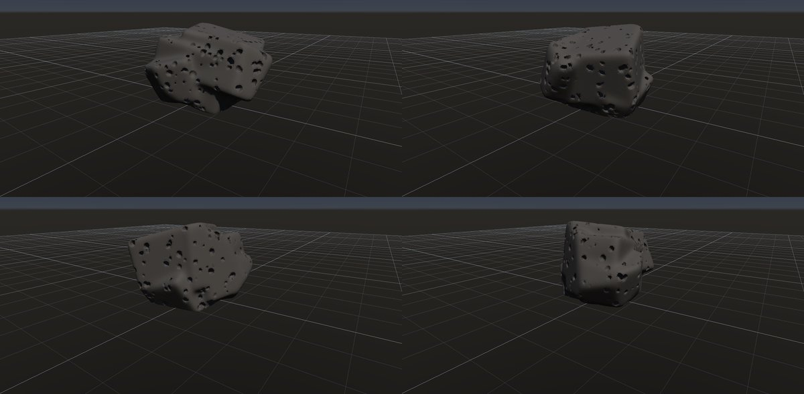
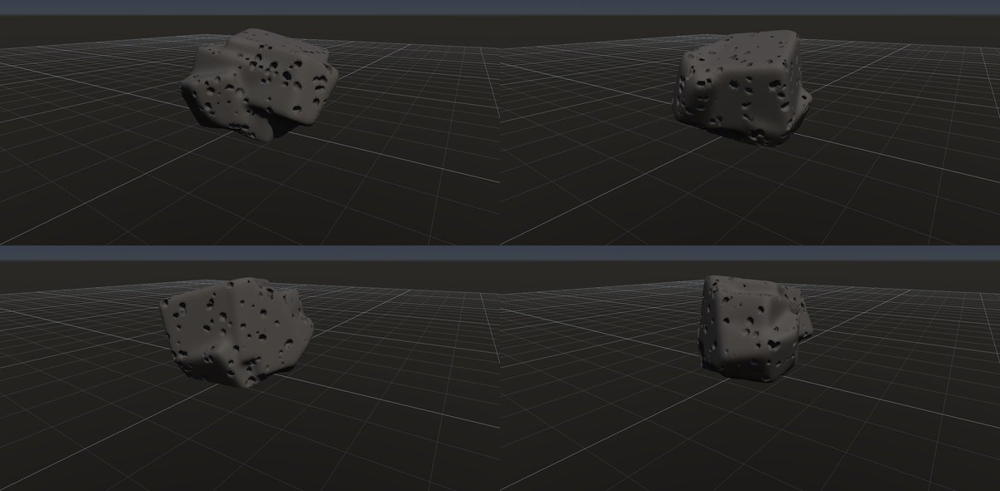
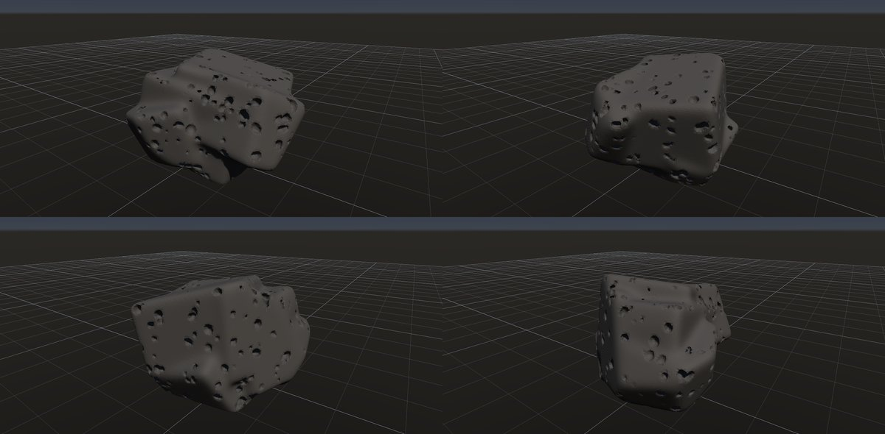

# 多孔質の溶岩

作成日時: 2026-10-01 12:50
更新日時: 2026-10-02 21:40

[岩の研究ページ](../rocks.md) の 1 項目。分類: 堆積・火山の組織。レシピは [`vesicular-basalt`](../../../examples/ai-recipes/vesicular-basalt.rockgraph)（アプリの「テンプレートから作成」から複製して開ける）。

## 概要

溶岩中のガスの泡が、固まった後も穴として残った岩。ここでは気泡の多い玄武岩質の溶岩を対象とする。穴は大小の丸形や伸びた形で、表面では開口したものや浅く切れたものが混在する。風化で後からできるタフォニとは成り立ちが異なる。[参考：NPSの火成岩の組織](https://www.nps.gov/subjects/geology/igneous.htm)。

## 今の状態

- 状態: ○
- レシピ: [`vesicular-basalt`](../../../examples/ai-recipes/vesicular-basalt.rockgraph)
- 作り方: 丸めた塊に Volume Scatter（楕円体・差）で気泡の穴を多数抜く。
- 課題: —

## 今の形

4 方向（左上から 35°・125°・215°・305°、見下ろし 20°）を 2×2 にまとめたもの。`python tools/rock_research_shots.py vesicular-basalt` で撮り直す（latest.jpg を更新し、日時付きの経過の画像も残す）。

## 経過

何を変えて何が効いたか（効かなかったことも）。古い順。

- 2026-10-01 初版。

## 経過の画像

撮った順。コミットの日時と件名（Git の履歴から取り出したもの）。

### 2026-10-01 12:47 docs: 岩の研究ページを作り、種類ごとのスクリーンショットと改善の履歴を載せる

### 2026-10-01 15:01 fix: To Volume で重なった立体の内部の距離を測り直し、Volume Noise の内部の値の跳びをなくす

### 2026-10-01 17:53 fix: 全体表示で原点ではなくメッシュの範囲の中心を見る

