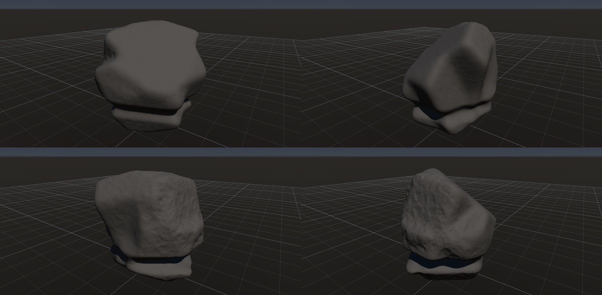

# 波食ノッチ

作成日時: 2026-10-01 12:50
更新日時: 2026-10-02 21:40

[岩の研究ページ](../rocks.md) の 1 項目。分類: 風化・侵食の形。レシピは [`wave-cut-notch`](../../../examples/ai-recipes/wave-cut-notch.rockgraph)（アプリの「テンプレートから作成」から複製して開ける）。

## 概要

波が当たる海岸の岩や崖の下部が削られ、横に続くくぼみになった地形。上部の岩が張り出し、その下に海面付近に沿う侵食帯が見える。この研究では、岩全体の丸まりよりも、水面の高さに対応する局所的なくぼみと、その上に残る岩体を重視する。[参考：USACEの海岸地形解説（図3-10）](https://www.publications.usace.army.mil/Portals/76/Publications/EngineerManuals/EM_1110-2-1810.pdf)。

## 今の状態

- 状態: ○
- レシピ: [`wave-cut-notch`](../../../examples/ai-recipes/wave-cut-notch.rockgraph)
- 作り方: Random Boxes を Plane Cuts で割って丸め、先に接地。Volume Undercut の帯の基準を world にして、水面の高さ（ワールドの高さ 0.9 m）に帯を 1 本（幅 0.1・深さ 0.12・ばらつき 0.35）。水面の近くの小さなくぼみ（pits）を薄く掛け、Edge Wear。
- 課題: 岩体が丸く、海岸の岩の節理の面が弱い。

## 今の形

4 方向（左上から 35°・125°・215°・305°、見下ろし 20°）を 2×2 にまとめたもの。`python tools/rock_research_shots.py wave-cut-notch` で撮り直す（latest.jpg を更新し、日時付きの経過の画像も残す）。

## 経過

何を変えて何が効いたか（効かなかったことも）。古い順。

- 2026-10-02 初版。Volume Undercut に「帯の基準」（形の高さに対する位置 / ワールドの高さ）を足して作った。帯の幅・間隔は形の高さに対する比のまま。最初は Random Boxes 6 個・回転 12° で立方体に見えたので、9 個・回転 25°・Plane Cuts 16 面・Smooth 0.03 にした。
- 2026-10-02 Volume Undercut と Volume Noise に「向きに集中」を足し、ノッチを波の当たる側（-X）だけ深く（集中 0.7・深さ 0.14）、くぼみも同じ側に集めた。全周に同じ深さの帯ではなくなり、○ にした。

## 経過の画像

撮った順。コミットの日時と件名（Git の履歴から取り出したもの）。

### 2026-10-02 18:18 feat: 枕状溶岩・波食ノッチ・風食のレシピと、寝かせる割合・帯のワールド基準を足す

### 2026-10-02 19:50 feat: Flow Mask を足し、Noise / Undercut に向きに集中を足し、礫を Diff Mask で色分けする

