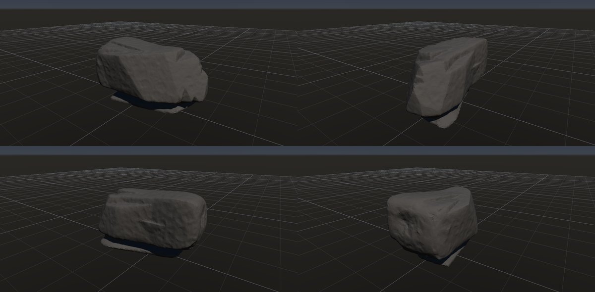
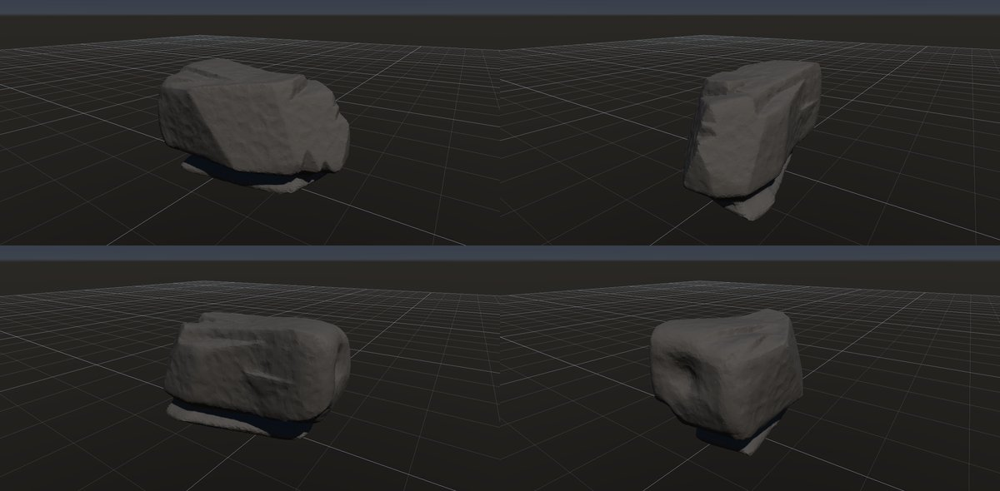
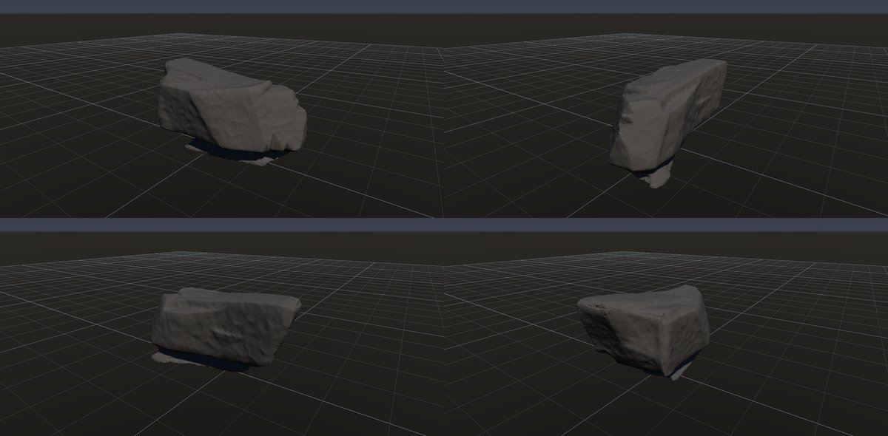

# 風食

作成日時: 2026-10-01 12:50
更新日時: 2026-10-02 21:40

[岩の研究ページ](../rocks.md) の 1 項目。分類: 風化・侵食の形。レシピは [`wind-erosion`](../../../examples/ai-recipes/wind-erosion.rockgraph)（アプリの「テンプレートから作成」から複製して開ける）。

## 概要

風に運ばれる砂などが岩に衝突し、面や溝を削り出した姿を扱う。岩石名ではなく侵食の形であり、風向きに対応する削られた面や細長いくぼみが特徴になる。この研究では、風上・風下で異なる輪郭と、向きのそろった表面の傷を対象とする。[参考：風上側の摩耗を調べた野外・実験研究](https://www.sciencedirect.com/science/article/pii/S0169555X08004340)。

## 今の状態

- 状態: △
- レシピ: [`wind-erosion`](../../../examples/ai-recipes/wind-erosion.rockgraph)
- 作り方: 風向き（-X から +X）に沿って細長い Random Boxes を Plane Cuts で割り、接地。Volume Erode（さらされた面。来る向き [-1, 0.15, 0]、量 0.14、集中 1.5、陰の距離 0.6、6 回）で風上の面を後退させ、角と縁を丸める。砂が最も当たる地面の近く（ワールドの高さ 0.3 m）を Volume Undercut（帯の基準 world）の帯で削り、細かなくぼみ（pits）を薄く、Edge Wear を風上に集中。
- 課題: 風上が斜めに削られた楔にはなるが、ヤルダンのような流線形（風上が鈍く丸く、風下へ細る）にはまだ遠い。足元の帯は目立たない。

## 今の形

4 方向（左上から 35°・125°・215°・305°、見下ろし 20°）を 2×2 にまとめたもの。`python tools/rock_research_shots.py wind-erosion` で撮り直す（latest.jpg を更新し、日時付きの経過の画像も残す）。

## 経過

何を変えて何が効いたか（効かなかったことも）。古い順。

- 2026-10-02 初版。Volume Edge Wear の量を 0.1 まで上げると、風上の面に不自然な角張った切れ込みと穴ができた（0.05 に戻した）。足元の帯の深さ 0.1 は岩を上下に切り離してエラーになった（0.075）。くぼみのノイズを全面に掛けると軽石のように見えるので薄くした。
- 2026-10-02 Volume Erode を足して風上の面を後退させた。試作で 3 つの不具合を潰した: 向きを格子点の法線で読むと深い格子点ほど向きが違い段々になる（表面の点で読む）、重なった箱の内部の歪んだ距離が削った面に迷路のような段として出る（先に再距離化）、回の間に帯の外の内部の値が深いまま残って次の回の法線が壊れボクセルのゴミになる（両方向の再距離化）。量 0.14・集中 1.5 では面がえぐれすぎたので 0.1・1 にした。
- 2026-10-02 Volume Noise の「向きに集中」で、くぼみ（pits）を風下（+X）に集めた（風上は砂で磨かれて平滑）。
- 2026-10-02 えぐれの原因を切り分けた。Erode は立方体で一様に後退し角が丸まる正しい挙動で、くぼみは前段の Volume Smooth（向きに集中・半径 0.14）が面の中央を皿状にしていたもの（Smooth を外すと消えた）。Smooth を外し、Erode の重みを「横向きの面も半分削る」形にし、陰を 1 方向のレイから風上側 50° の円錐の開放度（16 本）に変えた（くぼみの中は閉じていて削れず、自己強化しない）。量 0.14・集中 1.5・6 回に戻した。

## 経過の画像

撮った順。コミットの日時と件名（Git の履歴から取り出したもの）。

### 2026-10-02 18:18 feat: 枕状溶岩・波食ノッチ・風食のレシピと、寝かせる割合・帯のワールド基準を足す

### 2026-10-02 18:54 feat: 向きで削る量を変える侵食 Volume Erode を足す（G5）

### 2026-10-02 19:08 feat: Volume Erode のさらされた面を、横向きにも効く重みと風上側の円錐の開放度にする

### 2026-10-02 19:50 feat: Flow Mask を足し、Noise / Undercut に向きに集中を足し、礫を Diff Mask で色分けする

